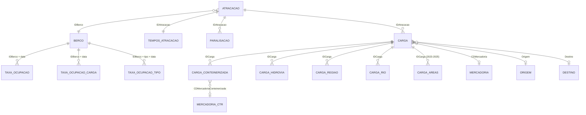

<div align="center">

# Atividade 01 - Dados e variáveis

**Teoria do Aprendizado Estatístico · Ciência de Dados · Fatec Rubens Lara**

Dicionário do banco escolhido para o semestre: para cada coluna, **nome**,
**descrição**, **tipo estatístico**, **domínio** e **tipo no R** - e o
dicionário operacional (joins, flags, volume, fluxo em R).


</div>

---

## Sobre a atividade

Primeira entrega sobre o Estatístico Aquaviário (ANTAQ / SDP, 2021-2025):
sair do metadado oficial e classificar o que o R realmente lê.

Para cada variável, a Aula 02 pede duas perguntas que não se misturam:

1. **O que ela é na estatística?** qualitativa nominal / ordinal, quantitativa discreta / contínua, identificador
2. **Como o R deve guardar?** `factor` / `ordered` / `integer` / `numeric` / `character` / `Date`-`POSIXct`

> **Meta:** um dicionário em que código não vira número (CEP, IMO, `CDTUP`,
> NCM) e cada tabela declara a **unidade amostral** antes de qualquer modelo.

---

## Material de referência

- [Aula 02 - Dados e Variáveis](../../MateriaisAulas/Aula%2002%20-%20Dados%20e%20Variáveis.PDF)
- [Aula 01 - Introdução ao Aprendizado Estatístico](../../MateriaisAulas/Aula%2001%20-%20Introdução%20ao%20Aprendizado%20Estatístico.PDF)
- [README da disciplina](../../readme.md)

O banco em si (`DatasetMovimentacaoPortuaria/`) fica só na máquina local
e não entra no GitHub.

---

## O que este documento cobre

| Parte | Conteúdo | Papel na Aula 02 |
|---|---|---|
| I - Tipos | unidade amostral; para cada coluna: nome, descrição, tipo, domínio (e tipo no R) | **Entrega pedida** (*traga o dicionário do banco*) |
| II - Banco | origem ANTAQ, modelo relacional, flags, volume, armadilhas, fluxo em R | Extra operacional para o semestre |

Colunas do dicionário pedidas no PDF: **nome | descrição | tipo | domínio** (a aula também cita observações). Este arquivo acrescenta **tipo no R**, porque o laboratório da mesma aula trabalha `factor` / `ordered` / `integer` / `double` / `character`.

**Regra da aula:** código não é número. Guardar `CDTUP` como `numeric` e
tirar média é erro. Pacote do laboratório: **base** (`str`, `summary`,
`factor`); `data.table::fread` só na leitura pelo volume do ANTAQ.

**Unidade amostral primeiro.** O banco não é uma tabela só: 481 mil escalas,
11,7 milhões de partidas, 68 milhões de linhas de conteúdo de contêiner.
Misturar níveis sem agregar quebra qualquer \(f\).

A Atividade 02 parte daqui: com os tipos certos, a Análise Exploratória mede qualidade,
típico versus extremo e o que **não** é i.i.d.

---

# Parte I - Dicionário de variáveis

Documento de trabalho da disciplina **Teoria do Aprendizado Estatístico** (Fatec Rubens Lara), no formato da **Aula 02 - Dados e variáveis** (Prof. Dr. João Paulo Ferreira de Mello): para cada coluna, **nome**, **descrição**, **tipo estatístico**, **domínio** e **tipo no R**.

> Um bom trabalho começa por um bom dicionário de variáveis.  
> Sem ele, cada coluna é um enigma - e a análise vira chute.

Banco: microdados do **Estatístico Aquaviário / SDP (ANTAQ)**, 2021-2025, em `DatasetMovimentacaoPortuaria/` (caminhos a partir da **raiz do repositório**; pasta local, fora do GitHub).  
Leitura em R: `sep = ";"`, `dec = ","`, encoding UTF-8. Pacote de referência da aula: **base**; para o volume deste banco, `data.table::fread` é o equivalente prático de `read.table`.

---

## 1. Como ler este dicionário

A Aula 02 separa duas perguntas que não devem ser misturadas:

| Pergunta | Resposta |
|---|---|
| O que a variável **é** na estatística? | qualitativa nominal / qualitativa ordinal / quantitativa discreta / quantitativa contínua |
| Como o **R deve guardar**? | `factor` / `ordered` / `integer` / `numeric` (`double`) / `character` / `Date`-`POSIXct` / `logical` |

O tipo estatístico decide o resumo, o gráfico e a técnica (barras e frequência para qualitativa; histograma e média para quantitativa; resposta quantitativa ⇒ regressão; qualitativa ⇒ classificação). O tipo no R decide se `summary()`, `lm()` e `table()` fazem sentido.

**Regra da aula (código não é número):** CEP, CPF, `cd_uf`, IMO, CNPJ, NCM, `CDTUP` e `IDBerco` são **rótulos**. Guardar como `numeric` e tirar média é erro. No R: `character` ou `factor`, nunca entra numa média.

Cada tabela abaixo declara a **unidade amostral** (o que é uma linha). No banco da ANTAQ há várias unidades - atracação, partida de carga, berço-dia, evento de paralisação. Não misture níveis sem agregar.

Colunas do dicionário (régua da aula, acrescida do tipo no R):

| Coluna | Significado |
|---|---|
| Variável | nome no arquivo (o que `names()` devolve) |
| Descrição | o que a coluna mede |
| Tipo | tipo estatístico da Aula 02 |
| Tipo no R | classe alvo depois da tipagem |
| Domínio / unidade | valores possíveis, códigos, unidade |
| Observações | faltantes, sentinelas, armadilhas de medição |

---

## 2. População, amostra e notação da Aula 01

- **População** de interesse: escalas e partidas de carga no sistema portuário brasileiro no recorte 2021-2025.
- **Amostra** neste repositório: o dump completo do SDP nesse período (censo operacional, não amostra aleatória). Inferência para “o Brasil portuário” é descritiva desse sistema, não de um sorteio i.i.d.
- Na tabela organizada: cada linha é uma observação; cada coluna é uma variável. São \(n\) observações e \(p\) variáveis. Os preditores \(X_1,\ldots,X_p\) e a resposta \(Y\) serão colunas desta tabela - **depois** de escolher a unidade amostral.

Há **várias tabelas fato**. O \(n\) muda com a unidade:

| Tabela | Uma linha é | \(n\) aproximado (2021-2025) |
|---|---|---|
| `Atracacao` | uma escala (embarcação × berço × ciclo) | ~481 mil |
| `TemposAtracacao` | os tempos daquela escala (1:1 com atracação) | ~481 mil |
| `TemposAtracacaoParalisacao` | um intervalo de interrupção | ~0,79 milhão |
| `Carga` | uma partida de carga da escala | ~11,7 milhões |
| `Carga_Conteinerizada` | um NCM (ou fração) dentro da partida conteinerizada | ~68 milhões |
| `Carga_Hidrovia` / `_Regiao` / `_Rio` | alocação da partida a uma via interior | milhões (subconjunto interior) |
| `CargaAreas` | área/empresa da partida (só 2023-2025) | ~6,7 milhões |
| `TaxaOcupacao*` | um berço em um dia | ~1,6 milhão |

---

## 3. Receita de tipagem em R (laboratório da Aula 02)

Aplica-se a **qualquer** tabela depois do `fread`:

```r
str(dados)                 # tipo e amostra de cada coluna
summary(dados)             # resumo coerente com o tipo
sapply(dados, class)

# 1) código guardado como número → factor (nunca média)
# dados$CDTUP <- factor(dados$CDTUP)

# 2) ordinal → factor ORDENADO (níveis na ordem certa)
# dados$Mes <- factor(dados$Mes,
#   levels = c("jan","fev","mar","abr","mai","jun",
#              "jul","ago","set","out","nov","dez"),
#   ordered = TRUE)

# 3) dicionário: nome | descricao | tipo | dominio   ← este arquivo
```

Leitura padrão deste banco:

```r
library(data.table)

ler_antaq <- function(arquivo) {
  fread(arquivo, sep = ";", dec = ",", encoding = "UTF-8",
        na.strings = c("", "n/a", "NA", "N/A"))
}
```

Datas de atracação: `lubridate::dmy_hms()` (o dicionário oficial cita ISO; o arquivo vem `dd/MM/yyyy HH:mm:ss`).  
Datas de paralisação: `lubridate::ymd_hms()`.

---

## 4. Atracação - `YYYYAtracacao.txt`

**Unidade amostral:** uma escala. Chave: `IDAtracacao`.  
**Partição temporal:** `Ano` e `Mes` referem-se à **desatracação**.

| Variável | Descrição | Tipo | Tipo no R | Domínio / unidade | Observações |
|---|---|---|---|---|---|
| `IDAtracacao` | Identificador da escala | identificador | `character` ou `integer` (chave, sem média) | inteiro positivo único no ano | PK. Não é preditor. |
| `CDTUP` | Código da instalação informante | qualitativa nominal | `factor` | UN/LOCODE `BR`+trigrama (porto organizado) ou `BR`+UF+nº (TUP) | **Código, não número.** |
| `IDBerco` | Código do berço | qualitativa nominal | `factor` | texto (ex. `NAT0103`, `RIO2C22`) | Alta cardinalidade. |
| `Berço` | Nome cadastral do berço | qualitativa nominal / texto | `character` | livre | Rótulo de `IDBerco`. |
| `Porto Atracação` | Nome do porto/terminal informante | qualitativa nominal | `factor` | livre | Cardinalidade menor que `CDTUP`. |
| `Coordenadas` | Longitude e latitude juntas | texto (a separar) | `character` → dois `numeric` | `lon,lat` em graus decimais | **Ordem lon, lat.** Natal: `-35.20,-5.77`. Não é quantitativa enquanto não separar. |
| `Apelido Instalação Portuária` | Apelido cadastral | qualitativa nominal | `character` | livre; muitas vezes vazio | Alto % de faltantes. |
| `Complexo Portuário` | Complexo ao qual o porto pertence | qualitativa nominal | `factor` | ex. Santos, Paranaguá - Antonina, Manaus | Bom agrupamento de baixa cardinalidade. |
| `Tipo da Autoridade Portuária` | Natureza jurídica da instalação | qualitativa nominal | `factor` | `Porto Organizado`, `Terminal Autorizado` | Dicionário oficial: Público/Privado. |
| `Data Atracação` | Chegada ao berço | quantitativa contínua (tempo) | `POSIXct` | `dd/MM/yyyy HH:mm:ss` | T0 do T2. |
| `Data Chegada` | Chegada à área / fundeio | quantitativa contínua (tempo) | `POSIXct` | idem | T0 do T1. |
| `Data Desatracação` | Saída do berço | quantitativa contínua (tempo) | `POSIXct` | idem | Define `Ano`/`Mes`. |
| `Data Início Operação` | Início da carga/descarga | quantitativa contínua (tempo) | `POSIXct` | idem; frequentemente `NA` | Vazio em Marinha, passageiro, reparo. |
| `Data Término Operação` | Fim da operação | quantitativa contínua (tempo) | `POSIXct` | idem; frequentemente `NA` | Idem. |
| `Ano` | Ano da desatracação | quantitativa discreta (calendário) ou qualitativa ordinal | `integer` ou `ordered` | 2021-2025 neste dump | Partição do arquivo. |
| `Mes` | Mês da desatracação | qualitativa ordinal | `ordered` | `jan < fev < … < dez` | Cabeçalho **sem acento**. Não usar `"%b"` com locale inglês. |
| `Tipo de Operação` | Finalidade da escala | qualitativa nominal | `factor` | Movimentação da Carga; Passageiro; Apoio; Marinha; Abastecimento; Reparo/Manutenção; Misto; Retirada de Resíduos | Códigos 1-8 no dicionário; no arquivo vêm os rótulos. |
| `Tipo de Navegação da Atracação` | Navegação da embarcação | qualitativa nominal | `factor` | Interior; Apoio Portuário; Cabotagem; Apoio Marítimo; Longo Curso | Códigos 1-5 no dicionário. |
| `Nacionalidade do Armador` | Nacionalidade do armador | qualitativa nominal | `factor` | `1` = brasileira; `2` = estrangeira; há `0` | **Não é quantidade.** Recodificar rótulos. `0` = Marinha / sem cadastro. |
| `FlagMCOperacaoAtracacao` | Escala entra na estatística de movimentação de carga | qualitativa nominal (indicadora) | `factor` ou `integer` 0/1 | `0`, `1` | Filtro de apuração, não preditor “ingênuo”. |
| `Terminal` | Terminal no porto organizado (ou o próprio TUP) | qualitativa nominal | `factor` | livre | |
| `Município` | Município da instalação | qualitativa nominal | `factor` | livre | |
| `UF` | Nome da unidade da federação | qualitativa nominal | `factor` | nomes por extenso | Prefira `SGUF` em modelos. |
| `SGUF` | Sigla da UF | qualitativa nominal | `factor` | `AC`…`TO` | Análogo ao `cd_uf` da aula. |
| `Região Geográfica` | Região do IBGE | qualitativa nominal | `factor` | Norte, Nordeste, Centro-Oeste, Sudeste, Sul | 5 níveis. |
| `Região Hidrográfica` | Região hidrográfica (ANA) | qualitativa nominal | `factor` | Amazônica, Tocantins-Araguaia, …; vazio no marítimo | Pode vir com espaço à esquerda (` trimws`). |
| `Instalação Portuária em Rio` | Instalação fluvial? | qualitativa nominal | `factor` | `Sim`, `Não` | |
| `Nº da Capitania` | Identificação nacional da embarcação | identificador | `character` | texto; vazio se há IMO | Não numérico. |
| `Nº do IMO` | Número IMO da embarcação | identificador | `character` | 7 dígitos; vazio no interior/apoio | **Rótulo.** Média de IMO não existe. |

Tipagem sugerida (após `fread`):

```r
ord_mes <- c("jan","fev","mar","abr","mai","jun","jul","ago","set","out","nov","dez")
atrac[, Mes := factor(Mes, levels = ord_mes, ordered = TRUE)]
atrac[, `Tipo de Operação` := factor(`Tipo de Operação`)]
atrac[, `Tipo de Navegação da Atracação` := factor(`Tipo de Navegação da Atracação`)]
atrac[, `Nacionalidade do Armador` := factor(
  `Nacionalidade do Armador`,
  levels = c(0, 1, 2),
  labels = c("nao_informado", "brasileira", "estrangeira")
)]
atrac[, FlagMCOperacaoAtracacao := as.integer(FlagMCOperacaoAtracacao)]
atrac[, c("lon","lat") := tstrsplit(Coordenadas, ",", type.convert = TRUE)]
```

---

## 5. Tempos da atracação - `YYYYTemposAtracacao.txt`

**Unidade amostral:** a mesma escala (`IDAtracacao`, relação 1:1).  
**Unidade de medida:** horas (contínuas, decimal com vírgula no arquivo).

| Variável | Descrição | Tipo | Tipo no R | Domínio / unidade | Observações |
|---|---|---|---|---|---|
| `IDAtracacao` | Chave da escala | identificador | `character` | PK/FK | Join com `Atracacao`. |
| `TEsperaAtracacao` | T1 - fundeio até atracação | quantitativa contínua | `numeric` | horas, ≥ 0 (idealmente) | Fila + canal. Cauda pesada. |
| `TEsperaInicioOp` | T2 - atracado até início da operação | quantitativa contínua | `numeric` | horas | `NA` se datas de operação vazias. |
| `TOperacao` | T3 - duração da operação | quantitativa contínua | `numeric` | horas | Denominador da **PMO**. Alvo clássico de regressão. |
| `TEsperaDesatracacao` | T4 - fim da operação até desatracação | quantitativa contínua | `numeric` | horas | |
| `TAtracado` | TA = T2+T3+T4 | quantitativa contínua | `numeric` | horas | Denominador da **PMG**. **Contém T3** - não usar como preditor de T3. |
| `TEstadia` | TE = T1+T2+T3+T4 | quantitativa contínua | `numeric` | horas | Idem: contém T3. |

Auditoria da identidade (Aula 02: checar o domínio):

```r
tempos[, TA_chk := TEsperaInicioOp + TOperacao + TEsperaDesatracacao]
tempos[, TE_chk := TEsperaAtracacao + TA_chk]
# median(abs(TAtracado - TA_chk), na.rm = TRUE)  # deve ser ~0
```

**Vazamento (Aula 01, predição):** para prever `TOperacao`, são proibidos `TAtracado`, `TEstadia` e qualquer diferença de datas que *seja* o próprio T3.

---

## 6. Paralisação - `YYYYTemposAtracacaoParalisacao.txt`

**Unidade amostral:** um intervalo de interrupção (1:N com a escala).

| Variável | Descrição | Tipo | Tipo no R | Domínio / unidade | Observações |
|---|---|---|---|---|---|
| `IDTemposDescontos` | Identificador do evento | identificador | `character` | sequencial | PK. |
| `IDAtracacao` | Escala afetada | identificador | `character` | FK | |
| `DescricaoTempoDesconto` | Motivo da paralisação | qualitativa nominal | `factor` | texto livre categorizado (Aguardando carga, Mudança de porão, Manobra, …) | Alta cardinalidade de rótulos; agrupe se for preditor. |
| `DTInicio` | Início do intervalo | quantitativa contínua (tempo) | `POSIXct` | `yyyy-MM-dd HH:mm:ss.ffffff` | Formato **diferente** da atracação. |
| `DTTermino` | Fim do intervalo | quantitativa contínua (tempo) | `POSIXct` | idem | Duração = término − início, em horas. |

Para PMO “líquida”, some durações por `IDAtracacao` e desconte de `TOperacao` (converta tudo para horas). Duração negativa = erro de digitação.

---

## 7. Carga - `YYYYCarga.txt`

**Unidade amostral:** uma partida de carga vinculada a uma escala. Uma escala de porta-contêineres gera milhares de linhas.  
**Chave:** `IDCarga`. **FK:** `IDAtracacao`.

Esta é a tabela em que a regra da aula “código não é número” mais se aplica (`Origem`, `Destino`, `CDMercadoria`).

| Variável | Descrição | Tipo | Tipo no R | Domínio / unidade | Observações |
|---|---|---|---|---|---|
| `IDCarga` | Identificador da partida | identificador | `character` | único | PK. |
| `IDAtracacao` | Escala | identificador | `character` | FK | Agrupa partidas da mesma escala (não i.i.d.). |
| `Origem` | Porto de embarque | qualitativa nominal | `factor` | código UN/LOCODE ou TUP; sentinelas `n/a`, `ZZZZ999`, `BR200` | Join com `Instalacao_Origem`. |
| `Destino` | Porto de desembarque | qualitativa nominal | `factor` | idem | Join com `Instalacao_Destino`. |
| `CDMercadoria` | NCM SH4 **ou** código de equipamento | qualitativa nominal | `factor` | 4 dígitos (`1201` soja) ou ISO 6346 (`22G0`, `45G0`) | Em conteinerizada costuma ser o **equipamento**, não o conteúdo. |
| `Tipo Operação da Carga` | Classificação da operação (IN RFB 800/2007 desde abr/2018) | qualitativa nominal | `factor` | Longo Curso Exportação/Importação, Cabotagem, Interior, Apoio, Abastecimento, Baldeação, Transbordo, … | Alta cardinalidade. |
| `Carga Geral Acondicionamento` | Carga geral solta ou conteinerizada | qualitativa nominal | `factor` | `Solta`, `Conteinerizada`; `NA` em granéis | |
| `ConteinerEstado` | Contêiner cheio ou vazio | qualitativa nominal | `factor` | `Cheio`/`Vazio` (dicionário: C/V) | Vazio: TEU > 0 e peso de carga ~ 0. |
| `Tipo Navegação` | Navegação da **partida** (origem×destino) | qualitativa nominal | `factor` | Interior, Apoio Portuário, Cabotagem, Apoio Marítimo, Longo Curso; há `Não Indentificado` | Grafia oficial com erro. |
| `FlagAutorizacao` | Interior em instalação autorizada ANTAQ | qualitativa nominal | `factor` | `S`/`N` | |
| `FlagCabotagem` | Marca o **transporte** de cabotagem (conta 1 vez) | qualitativa nominal (indicadora) | `integer` 0/1 | `0`,`1` | Evita dupla contagem origem+destino. |
| `FlagCabotagemMovimentacao` | Marca a **movimentação** de cabotagem (origem e destino) | qualitativa nominal (indicadora) | `integer` 0/1 | `0`,`1` | **Não** é o mesmo que `FlagCabotagem`. |
| `FlagConteinerTamanho` | Tamanho do contêiner | qualitativa ordinal | `ordered` ou `factor` | `20` < `40` < outros; `NA` se não for contêiner | 20' e 40' têm ordem natural. |
| `FlagLongoCurso` | Longo curso | qualitativa nominal | `integer` 0/1 | `0`,`1` | |
| `FlagMCOperacaoCarga` | Entra na apuração oficial | qualitativa nominal | `integer` 0/1 | `0`,`1` | Filtro de ouro para totais. |
| `FlagOffshore` | Carga de plataforma / bacia | qualitativa nominal | `integer` 0/1 | `0`,`1` | |
| `FlagTransporteViaInterioir` | Transporte em via interior | qualitativa nominal | `integer` 0/1 | `0`,`1` | Typo oficial (falta o “r”). |
| `Percurso Transporte em vias Interiores` | Percurso exclusivo em via interior | qualitativa nominal | `factor` | Internacional / Estadual / Interestadual / não identificado | `NA` fora do interior. |
| `Percurso Transporte Interiores` | Uso de via interior no todo ou em parte | qualitativa nominal | `factor` | longo curso / cabotagem / navegação interior em vias interiores | |
| `STNaturezaCarga` | Escala exclusiva de uma natureza? | qualitativa nominal | `factor` | `Exclusivo`, `Compartilhado` | Atributo da **escala**, repetido nas partidas. |
| `STSH2` | Escala exclusiva de um capítulo NCM? | qualitativa nominal | `factor` | `Exclusivo`, `Compartilhado` | Idem. |
| `STSH4` | Escala exclusiva de uma posição NCM? | qualitativa nominal | `factor` | `Exclusivo`, `Compartilhado` | Idem. |
| `Natureza da Carga` | Natureza física | qualitativa nominal | `factor` | Granel Sólido; Granel Líquido e Gasoso; Carga Geral; Carga Conteinerizada | 4 níveis. Alvo de classificação. |
| `Sentido` | Embarque ou desembarque | qualitativa nominal | `factor` | `Embarcados`, `Desembarcados`, `Não Informado` | Dicionário: 1/2. |
| `TEU` | Twenty-foot Equivalent Unit | quantitativa discreta (contagem em equivalentes) | `numeric` | 0, 1 (20'), 2 (40'), … | Zero se não for contêiner. Não some com toneladas. |
| `QTCarga` | Unidades (contêineres ou veículos) | quantitativa discreta | `numeric` | inteiro ≥ 0 | Zero em granéis. |
| `VLPesoCargaBruta` | Peso bruto | quantitativa contínua | `numeric` | toneladas, ≥ 0 | Contêiner cheio: **tara + conteúdo**. |

Filtro mínimo para estatística oficial de carga:

```r
carga_ok <- carga[FlagMCOperacaoCarga == 1]
```

Cabotagem - escolha **uma** das duas e declare no relatório:

```r
# transporte (uma vez por viagem)
carga_ok[FlagCabotagem == 1, sum(VLPesoCargaBruta, na.rm = TRUE)]
# movimentação portuária (origem + destino)
carga_ok[FlagCabotagemMovimentacao == 1, sum(VLPesoCargaBruta, na.rm = TRUE)]
```

---

## 8. Carga conteinerizada - `YYYYCarga_Conteinerizada.txt`

**Unidade amostral:** um item de conteúdo (NCM) de uma partida. Relação 1:N com `IDCarga`.  
**Não some** `VLPesoCargaConteinerizada` com `VLPesoCargaBruta` na mesma linha-mãe sem agregar.

| Variável | Descrição | Tipo | Tipo no R | Domínio / unidade | Observações |
|---|---|---|---|---|---|
| `IDCarga` | Partida-mãe | identificador | `character` | FK, **não único** nesta tabela | Agregar antes do join de volta. |
| `CDMercadoriaConteinerizada` | NCM SH4 do **conteúdo** | qualitativa nominal | `factor` | 4 dígitos NCM | Dimensão: `MercadoriaConteinerizada`. |
| `VLPesoCargaConteinerizada` | Peso **líquido** do conteúdo | quantitativa contínua | `numeric` | toneladas; pode ser 0 | Zero = vazio / sem conteúdo declarado. |

```r
ctr_agg <- ctr[, .(
  peso_liq_t = sum(VLPesoCargaConteinerizada, na.rm = TRUE),
  n_ncm      = uniqueN(CDMercadoriaConteinerizada)
), by = IDCarga]
```

---

## 9. Hidrovia, região hidrográfica e rio

Três tabelas irmãs. **Unidade:** alocação da partida (`IDCarga`) a um nome geográfico de via interior. `ValorMovimentado` em toneladas.

| Variável | Tabela | Tipo | Tipo no R | Domínio | Observações |
|---|---|---|---|---|---|
| `IDCarga` | as três | identificador | `character` | FK | Subconjunto interior. |
| `Hidrovia` | `Carga_Hidrovia` | qualitativa nominal | `factor` | nomes de hidrovias | |
| `Região Hidrográfica` | `Carga_Regiao` | qualitativa nominal | `factor` | regiões ANA | Homônima da coluna em Atracação, outro nível. |
| `Rio` | `Carga_Rio` | qualitativa nominal | `factor` | nomes de rios | |
| `ValorMovimentado` | as três | quantitativa contínua | `numeric` | toneladas | Peso da partida alocado à via; não é um “terceiro peso nacional”. |

---

## 10. Áreas de carga - `YYYYCargaAreas.txt` (2023-2025)

**Unidade:** área/empresa associada à partida. **Ausente em 2021-2022.**

| Variável | Descrição | Tipo | Tipo no R | Domínio / unidade | Observações |
|---|---|---|---|---|---|
| `IDCarga` | Partida | identificador | `character` | FK | |
| `Código da Área` | Código da área no porto (ou TUP) | qualitativa nominal | `factor` | texto/código ANTAQ | Dicionário: “Código de Área”. |
| `Nome da Área` | Nome da área ou “embarque/desembarque direto” | qualitativa nominal | `factor` | livre | Direto = sem armazenagem intramuros. |
| `n° CNPJ` | CNPJ da empresa da área | identificador | `character` | 14 dígitos, sem máscara | **Não é número.** Preservar zeros à esquerda. |
| `Empresa` | Razão social | qualitativa nominal | `factor` | livre | Dicionário oficial truncado; o microdado traz o nome. |

Painel 2021-2025 que use CNPJ/empresa ou corta 2021-2022, ou trata como `NA` estrutural.

---

## 11. Taxas de ocupação de berço

**Unidade amostral:** berço × dia (`IDBerco` + data). Dia completo = **1.440 minutos**.

Colunas comuns:

| Variável | Descrição | Tipo | Tipo no R | Domínio | Observações |
|---|---|---|---|---|---|
| `IDBerco` | Berço | qualitativa nominal | `factor` | FK com Atracação | Não join 1:1 com escala. |
| `DiaTaxaOcupacao` | Dia do mês | quantitativa discreta / ordinal de calendário | `integer` | 1-31 | |
| `MêsTaxaOcupacao` | Mês | qualitativa ordinal | `ordered` | `jan`…`dez` | |
| `AnoTaxaOcupacao` | Ano | quantitativa discreta | `integer` | 2021-2025 | |

Métricas (quantitativas contínuas em minutos, `numeric`):

| Arquivo | Variável | Significado |
|---|---|---|
| `TaxaOcupacao` | `TempoEmMinutosdias` | minutos ocupados, todos os tipos de operação |
| `TaxaOcupacaoComCarga` | `TempoEmMinutosdiasFlagCarga` | só operações com carga |
| `TaxaOcupacaoTOAtracacao` | `TempoEmMinutosdiasTOAtracacao` | minutos **por tipo** de operação (+ `DSTipoOperacaoAtracacaoTaxaOcupacao`, qualitativa nominal) |

Taxa do dia: \(TO_{b,d} = \text{minutos}_{b,d}/1440\). Zero = ocioso; 1.440 = 100% - não é erro. Agregação mensal: soma de minutos / \(1440 \times N_{\text{dias}}\), não média das taxas diárias se o alvo for fração do mês.

**Vazamento:** ocupação do **mesmo** dia da escala é contemporânea à espera T1. Use defasagem (D−1) se for preditor.

---

## 12. Dimensão mercadoria - `TabelasAuxiliares/Mercadoria.txt`

**Unidade:** um código `CDMercadoria` (SH4 ou equipamento).

| Variável | Descrição | Tipo | Tipo no R | Domínio | Observações |
|---|---|---|---|---|---|
| `CDMercadoria` | Chave | qualitativa nominal | `factor` | SH4 ou código ISO de contêiner | Join com `Carga`. |
| `CDNCMSH2` | Capítulo NCM (2 dígitos) | qualitativa nominal | `factor` | `01`-`99` ou `CT` | Agrupamento (~100 níveis). |
| `Tipo Conteiner` | Tipo do equipamento | qualitativa nominal | `factor` | CONVENCIONAL, HIGH CUBE, REFRIGERADO, TANQUE, … | Vazio se não for equipamento. |
| `Grupo de Mercadoria` | Nome do capítulo SH2 | qualitativa nominal | `factor` | texto | |
| `Mercadoria` | Nome da posição SH4 | qualitativa nominal | `character` | texto | Alta cardinalidade. |
| `Nomenclatura Simplificada Mercadoria` | Agrupamento ANTAQ | qualitativa nominal | `factor` | Soja, Milho, Minério de Ferro, Contêineres, … | Melhor *feature* que o SH4 cru. |

`MercadoriaConteinerizada.txt` tem a mesma lógica para o **conteúdo** (`CDMercadoriaConteinerizada`, grupo, nomenclatura simplificada). Não cruze as duas dimensões: em `Carga`, o código do contêiner é o do equipamento; o do conteúdo está na tabela conteinerizada.

---

## 13. Dimensão instalação de origem / destino

**Unidade:** um porto/terminal. Chaves `Origem` e `Destino` (conjuntos **não** idênticos).

| Variável (origem / destino) | Descrição | Tipo | Tipo no R | Domínio | Observações |
|---|---|---|---|---|---|
| `Origem` / `Destino` | Código | qualitativa nominal | `factor` | UN/LOCODE ou TUP | PK. |
| `Origem Nome` / `Nome Destino` | Nome | qualitativa nominal | `character` | livre | |
| `CDBigrama*` | País ISO-2 | qualitativa nominal | `factor` | `BR`, `CN`, `US`, … | |
| `CDTrigrama*` | Trigrama do porto | qualitativa nominal | `factor` | 3 letras; vazio em TUP | |
| `CDTUP*` | Código da instalação privada | qualitativa nominal | `factor` | `BR`+UF+nº | |
| `Rio *` | Rio da instalação | qualitativa nominal | `factor` | nome ou `Não se aplica` | |
| `Região Hidrográfica *` | Região hidrográfica | qualitativa nominal | `factor` | nome ou `Não se aplica` | |
| `UF.*` | UF | qualitativa nominal | `factor` | sigla ou `Não se aplica` | Estrangeiro ≠ UF. |
| `Cidade *` | Cidade | qualitativa nominal | `character` | nome; estrangeiro = `-` | Hífen é sentinela, não cidade. |
| `País *` | País | qualitativa nominal | `factor` | nome | |
| `Continente *` | Continente | qualitativa nominal | `factor` | América do Sul, Ásia, … | |
| `BlocoEconomico_*` | Bloco econômico | qualitativa nominal | `factor` | Mercosul, União Europeia, …; pode ser vazio | |

Sentinelas: `BR200` (terminais interiores), `ZZZZ999` (não informado).

---

## 14. Mapa compacto: tipo estatístico → tipo no R (Aula 02)

| Tipo estatístico | Neste banco (exemplos) | Tipo no R | Resumo | Gráfico |
|---|---|---|---|---|
| Qualitativa nominal | natureza, sentido, UF, navegação, flags | `factor` | `table`, moda | barras |
| Qualitativa ordinal | `Mes`; `FlagConteinerTamanho` (20 < 40) | `factor(..., ordered = TRUE)` | mediana de ranks, tabela | barras ordenadas |
| Quantitativa discreta | `TEU`, `QTCarga`, `DiaTaxaOcupacao` | `integer` / `numeric` | média, mediana, `table` se poucos valores | barras ou histograma |
| Quantitativa contínua | peso (t), T1-TE (h), minutos de ocupação | `numeric` | média, mediana, quantis, desvio | histograma, boxplot |
| Identificador / texto | `IDAtracacao`, IMO, CNPJ, NCM, `CDTUP` | `character` (ou `factor` se for preditor categórico) | contagem de distintos | - (não histograma) |
| Tempo calendário | datas de escala e de paralisação | `POSIXct` | min/max, diferenças em horas | linha temporal |

**Ligação com a Aula 01.** Escolhida a unidade amostral:

- \(Y\) quantitativa (`TOperacao`, `VLPesoCargaBruta`, taxa de ocupação) ⇒ **regressão**;
- \(Y\) qualitativa (`Natureza da Carga`, atraso T1 > τ, sentido) ⇒ **classificação**;
- sem \(Y\), só perfil de portos/mercadorias ⇒ **não supervisionado** (PCA, agrupamento).

---

## 15. Variáveis que *parecem* número e não são (exercício da aula)

A aula pede: *por que guardar `cd_uf` como número induz erro?* Neste banco os análogos são:

| Coluna | Se tratar como `numeric`… | Trate como |
|---|---|---|
| `CDTUP`, `IDBerco` | “média de berço” sem sentido | `factor` |
| `Nacionalidade do Armador` (0,1,2) | média 1,37 de nacionalidade | `factor` com rótulos |
| `SGUF` recodificado 11-53 | distância fictícia SP-AM | `factor` |
| `CDMercadoria` (`1201`, `2601`) | 2601 − 1201 = “diferença de NCM” | `factor` |
| `Nº do IMO`, `n° CNPJ` | IMO “maior” = navio “maior” | `character` |
| `FlagConteinerTamanho` (`20`,`40`) | aqui a ordem **existe**; média 28' não | `ordered` ou dummies |

Flags 0/1 podem ficar `integer` se forem preditores em regressão (dummy). Continuam sendo qualitativas nominais.

---

## 16. Checagem do dicionário no R (`str` / `summary`)

Depois de tipar, o laboratório da aula pede `str` e `summary`. Esperado:

```r
str(atrac)
# IDAtracacao: chr
# Mes: Ord.factor w/ 12 levels "jan"<"fev"<...<"dez"
# Tipo de Operação: Factor
# FlagMCOperacaoAtracacao: int 0/1
# Data Atracação: POSIXct
# lon, lat: num

summary(atrac$Mes)                 # contagem por mês, ordem calendário
summary(atrac$`Tipo de Operação`)  # frequências
summary(tempos$TOperacao)          # min, Q1, mediana, média, Q3, max, NA
```

Se `summary` de `CDTUP` imprimir média, a tipagem falhou.

---

## 17. Relação com o metadado oficial

Os arquivos em `DatasetMovimentacaoPortuaria/DicionarioMetadados/` descrevem o **significado** normativo. Este dicionário descreve o que o R **lê** e como **tipar**. Divergências conhecidas (nome no arquivo ≠ nome no metadado, rótulo ≠ código) estão na [Parte II, seção 11](#11-divergências-dicionário--microdados). Em conflito, prevalece o cabeçalho do microdado - e o recode fica registrado aqui.

---

## 18. Como citar no relatório da disciplina

> Dicionário de variáveis do Estatístico Aquaviário (ANTAQ/SDP), 2021-2025, elaborado segundo a régua da Aula 02 (nome, descrição, tipo estatístico, domínio, tipo no R). Unidade amostral declarada por tabela. Filtros de apuração: `FlagMCOperacaoCarga` / `FlagMCOperacaoAtracacao`.

Tarefa da aula: *traga o dicionário do banco que você escolheu*. Este arquivo é essa entrega, no nível do conjunto inteiro.

---

# Parte II - Dicionário operacional do banco ANTAQ

Origem, modelo relacional, flags de apuração, armadilhas e o encaixe nas tarefas clássicas de aprendizado estatístico. Leia **antes** de qualquer `fread()`.

Os microdados ficam em `DatasetMovimentacaoPortuaria/` **só na máquina local** (~4,6 GB) e **não entram no GitHub**. Caminhos neste texto são relativos à **raiz do repositório**.

---

## Sumário

1. [Contexto acadêmico](#1-contexto-acadêmico)
2. [Origem e natureza dos dados](#2-origem-e-natureza-dos-dados)
3. [Estrutura de pastas](#3-estrutura-de-pastas)
4. [Modelo relacional](#4-modelo-relacional)
5. [Ciclo temporal de uma escala](#5-ciclo-temporal-de-uma-escala)
6. [Volume, peso em disco e implicações de memória](#6-volume-peso-em-disco-e-implicações-de-memória)
7. [Convenções de arquivo (leitura em R)](#7-convenções-de-arquivo-leitura-em-r)
8. [Dicionário das tabelas fato](#8-dicionário-das-tabelas-fato)
9. [Tabelas auxiliares (dimensões)](#9-tabelas-auxiliares-dimensões)
10. [Dicionário de metadados oficial](#10-dicionário-de-metadados-oficial)
11. [Divergências dicionário × microdados](#11-divergências-dicionário--microdados)
12. [Flags de apuração (regra de ouro)](#12-flags-de-apuração-regra-de-ouro)
13. [Qualidade, vazamentos e armadilhas analíticas](#13-qualidade-vazamentos-e-armadilhas-analíticas)
14. [Unidades de análise](#14-unidades-de-análise)
15. [Uso na disciplina de aprendizado estatístico](#15-uso-na-disciplina-de-aprendizado-estatístico)
16. [Fluxo sugerido de trabalho em R](#16-fluxo-sugerido-de-trabalho-em-r)
17. [Inventário de arquivos](#17-inventário-de-arquivos)
18. [Como citar](#18-como-citar)
19. [Referências metodológicas](#19-referências-metodológicas)

---

## 1. Contexto acadêmico

A disciplina cobre os fundamentos do aprendizado estatístico - viés e variância, reamostragem, modelos lineares e regularizados, classificação, métodos baseados em árvores, SVM e aprendizado não supervisionado - com implementação em R (tradição próxima a *An Introduction to Statistical Learning*).

O dataset da ANTAQ **não** é um *toy dataset*. É um problema real, relacional, de grande volume e com dependência espacial-temporal. Isso força o aluno a tratar, de forma explícita:

- **unidade amostral** (atracação, partida de carga, berço-dia, porto-mês);
- **não i.i.d.** (várias cargas da mesma escala; várias escalas do mesmo berço/porto/mês);
- **vazamento temporal** (não misturar 2025 no treino se o teste for 2025);
- **alta cardinalidade** (portos, NCM SH4, rotas origem-destino);
- **definição operacional do alvo** (o que a ANTAQ chama de “movimentação” não é a soma crua de toneladas);
- **custo computacional** (a tabela de carga conteinerizada tem da ordem de 13-15 milhões de linhas **por ano**).

O material teórico permanece em `MateriaisAulas/` (Aula 01: introdução ao aprendizado estatístico; Aula 02: dados e variáveis - tipos, escalas de medida, unidade amostral). Os microdados, em `DatasetMovimentacaoPortuaria/` (pasta local, fora do Git). A Aula 02 é o pré-requisito direto deste dicionário: cada tabela da ANTAQ mistura numéricas (toneladas, TEU, horas), categóricas de baixa cardinalidade (natureza, sentido, flags) e categóricas de altíssima cardinalidade (porto, NCM, berço).

---

## 2. Origem e natureza dos dados

| Item | Descrição |
|---|---|
| Órgão produtor | **Agência Nacional de Transportes Aquaviários (ANTAQ)** |
| Produto estatístico | **Estatístico Aquaviário** |
| Sistema transacional de origem | **Sistema de Desempenho Portuário (SDP)** |
| Modelo de dados oficial | `DatasetMovimentacaoPortuaria/Relacionamentos/modelo_dados.png` (atualizado em **abril/2025**) |
| Recorte nesta pasta local | Anos-calendário **2021, 2022, 2023, 2024 e 2025** (fora do GitHub) |
| Critério de partição anual | **Ano e mês da desatracação** da embarcação (não da chegada nem da atracação) |
| Abrangência geográfica | Instalações portuárias brasileiras (portos organizados e terminais autorizados), com origens e destinos nacionais e internacionais |
| Unidade informante | Instalação portuária identificada por `CDTUP` |
| Formato | Texto (`.txt`) delimitado por **ponto e vírgula** (`;`) |
| Caráter | Dados abertos de órgão público federal; **citar a ANTAQ** em qualquer produto da disciplina |

Cadastros oficiais mencionados no dicionário da própria ANTAQ:

- Portos: `web.antaq.gov.br/portalv3/sdpv2servicosonline/ConsultarPorto.aspx`
- Berços: `.../ConsultarBerco.aspx`
- Mercadorias: `.../ConsultarMercadoria.aspx`
- Instalações portuárias: `.../ConsultarInstalacaoPortuaria.aspx`

Há dois conceitos que **não** devem ser misturados:

1. **Movimentação portuária** - toneladas (ou TEU) que passam pelo cais, na origem **e** no destino. Uma viagem de cabotagem Santos → Manaus conta duas vezes se o objetivo for movimentação.
2. **Transporte** - toneladas efetivamente deslocadas. A mesma viagem conta **uma** vez. A ANTAQ fornece flags específicas para cada apuração (seção 12).

---

## 3. Estrutura de pastas

```text
TeoriaAprendizadoEstatistico/
├── README.md                              # visão geral da disciplina
├── Atividades/
│   ├── atividade_01/dicionario_variaveis_amplo_completo.md
│   ├── atividade_02/
│   ├── atividade_03/
│   └── atividade_04/
├── MateriaisAulas/                        # PDFs da disciplina
└── DatasetMovimentacaoPortuaria/          # LOCAL - não vai para o GitHub
    ├── 2021/ … 2025/                      # tabelas fato, um diretório por ano
    ├── TabelasAuxiliares/                 # dimensões (mercadoria e instalações)
    ├── DicionarioMetadados/               # dicionário oficial (Atributo;Descrição)
    └── Relacionamentos/
        └── modelo_dados.png               # ER oficial ANTAQ (abr/2025)
```

### 3.1 Arquivos anuais (`YYYY/`)

Padrão de nome: `{YYYY}{NomeDaTabela}.txt`.

| Arquivo | Entidade | Chave principal | Presente em |
|---|---|---|---|
| `YYYYAtracacao.txt` | Escala da embarcação no berço | `IDAtracacao` | 2021-2025 |
| `YYYYCarga.txt` | Partida de carga da escala | `IDCarga` | 2021-2025 |
| `YYYYCarga_Conteinerizada.txt` | Mercadorias **dentro** do contêiner | `IDCarga` + NCM | 2021-2025 |
| `YYYYCarga_Hidrovia.txt` | Peso alocado a hidrovia | `IDCarga` + hidrovia | 2021-2025 |
| `YYYYCarga_Regiao.txt` | Peso alocado a região hidrográfica | `IDCarga` + região | 2021-2025 |
| `YYYYCarga_Rio.txt` | Peso alocado a rio | `IDCarga` + rio | 2021-2025 |
| `YYYYCargaAreas.txt` | Área / CNPJ / empresa no porto | `IDCarga` | **somente 2023-2025** |
| `YYYYTemposAtracacao.txt` | Tempos T1-T4, TA e TE (horas) | `IDAtracacao` | 2021-2025 |
| `YYYYTemposAtracacaoParalisacao.txt` | Intervalos de interrupção da operação | `IDTemposDescontos` | 2021-2025 |
| `YYYYTaxaOcupacao.txt` | Ocupação diária do berço (todas as operações) | `IDBerco` + dia | 2021-2025 |
| `YYYYTaxaOcupacaoComCarga.txt` | Ocupação diária restrita a operação com carga | `IDBerco` + dia | 2021-2025 |
| `YYYYTaxaOcupacaoTOAtracacao.txt` | Ocupação diária **por tipo** de operação | `IDBerco` + tipo + dia | 2021-2025 |

**Quebra estrutural:** `CargaAreas` **não existe** em 2021 nem em 2022. Qualquer painel 2021-2025 que use área, CNPJ ou empresa precisa (a) tratar 2021-2022 como omissos ou (b) restringir o recorte a 2023-2025.

### 3.2 Tabelas auxiliares (não particionadas por ano)

| Arquivo | Função | Ligação |
|---|---|---|
| `TabelasAuxiliares/Mercadoria.txt` | NCM SH4, SH2, grupo e nomenclatura simplificada ANTAQ | `Carga.CDMercadoria` |
| `TabelasAuxiliares/MercadoriaConteinerizada.txt` | Idem, para o **conteúdo** do contêiner | `Carga_Conteinerizada.CDMercadoriaConteinerizada` |
| `TabelasAuxiliares/Instalacao_Origem.txt` | Cadastro geopolítico do porto/terminal de embarque | `Carga.Origem` |
| `TabelasAuxiliares/Instalacao_Destino.txt` | Cadastro geopolítico do porto/terminal de desembarque | `Carga.Destino` |

As dimensões valem para todo o quinquênio. O conjunto de origens **não** é idêntico ao de destinos (daí duas tabelas).

---

## 4. Modelo relacional

O diagrama oficial da ANTAQ (abril/2025) está em:

`DatasetMovimentacaoPortuaria/Relacionamentos/modelo_dados.png`

Arquitetura em estrela com **dois fatos centrais** - `Atracacao` e `Carga` - ligados por `IDAtracacao`.



Cardinalidades observadas nos arquivos deste repositório:

| Relação | Cardinalidade | Comentário |
|---|---|---|
| Atracação → Tempos da atracação | **1:1** | o número de linhas coincide com `Atracacao` |
| Atracação → Carga | **1:N** | uma escala gera várias partidas (mercadorias, sentidos, NCMs) |
| Atracação → Paralisação | **1:N** | zero, um ou dezenas de intervalos (ex.: “Aguardando carga”, “Mudança de porão”) |
| Carga → Carga conteinerizada | **1:N** | o mesmo `IDCarga` se repete para cada NCM / fração de peso no contêiner |
| Carga → Hidrovia / Região / Rio | **1:N** (subconjunto) | preenchido para transporte em via interior |
| Carga → Áreas | **1:N** (2023-2025) | área de armazenagem ou embarque/desembarque direto |
| Berço → Taxa de ocupação | **1:N** | grade berço × dia do ano; muitos dias com 0 minutos |

Chaves de ligação (use-as em `merge` / `left_join`):

| De | Para | Chave |
|---|---|---|
| `Carga` | `Atracacao` | `IDAtracacao` |
| `TemposAtracacao` | `Atracacao` | `IDAtracacao` |
| `TemposAtracacaoParalisacao` | `Atracacao` | `IDAtracacao` |
| `Carga_Conteinerizada` | `Carga` | `IDCarga` |
| `Carga_Hidrovia`, `Carga_Regiao`, `Carga_Rio`, `CargaAreas` | `Carga` | `IDCarga` |
| `Carga` | `Mercadoria` | `CDMercadoria` |
| `Carga_Conteinerizada` | `MercadoriaConteinerizada` | `CDMercadoriaConteinerizada` |
| `Carga` | `Instalacao_Origem` | `Origem` |
| `Carga` | `Instalacao_Destino` | `Destino` |
| `TaxaOcupacao*` | `Atracacao` | `IDBerco` (não é 1:1; é berço-dia) |

`IDBerco` **não** é chave da atracação: o mesmo berço recebe milhares de escalas. As tabelas de ocupação não se juntam linha a linha com `Atracacao`; agregue ocupação no nível berço-dia (ou berço-mês) e só então relacione.

---

## 5. Ciclo temporal de uma escala

A ANTAQ decompõe a estadia em quatro intervalos consecutivos. Todos os tempos em `TemposAtracacao` estão em **horas** (decimal com vírgula no arquivo).

```text
  chegada ao fundeio          atracação         início op.        término op.       desatracação
        |                         |                  |                  |                  |
        |--------- T1 ------------|-------- T2 ------|------- T3 -------|------- T4 -------|
        |                    espera no berço      operação (PMO)     espera para sair      |
        |                                                                                  |
        |==================================== TE ==========================================|
                                  |================ TA = T2+T3+T4 ===============|
```

| Sigla no arquivo | Nome ANTAQ | Definição |
|---|---|---|
| `TEsperaAtracacao` | **T1** | Atracação − chegada ao fundeio. Inclui canal de acesso e fila por berço. |
| `TEsperaInicioOp` | **T2** | Início da operação − atracação. Navio já no berço, ainda sem carga/descarga. |
| `TOperacao` | **T3** | Término − início da operação. Base da **Prancha Média Operacional (PMO)**. |
| `TEsperaDesatracacao` | **T4** | Desatracação − término da operação. |
| `TAtracado` | **TA** | T2 + T3 + T4 (tempo no berço). Base da **Prancha Média Geral (PMG)**. |
| `TEstadia` | **TE** | T1 + T2 + T3 + T4 (fundeio até desatracação). |

Identidades para auditoria:

\[
TA = T2 + T3 + T4, \qquad TE = T1 + T2 + T3 + T4
\]

Datas de início/término de operação frequentemente vêm **vazias** em escalas da Marinha, passageiro, reparo etc. Nesses casos T2/T3/T4 (e portanto TA/TE) podem ser `NA` ou inconsistentes. Filtre `Tipo de Operação` e `FlagMCOperacaoAtracacao` antes de modelar tempos.

O atributo `Ano` / `Mes` da atracação refere-se à **desatracação**. Uma embarcação que atraca em 31/12/2024 e desatraca em 01/01/2025 entra no arquivo de **2025**, com `Mes = jan`.

---

## 6. Volume, peso em disco e implicações de memória

Tamanho total do dataset na pasta local: **≈ 4,61 GB** (4.721 MB) em disco, texto delimitado. Não versionado.

### 6.1 Peso em disco por ano (MB)

| Tabela | 2021 | 2022 | 2023 | 2024 | 2025 |
|---|---:|---:|---:|---:|---:|
| Atracacao | 25,7 | 27,7 | 30,7 | 35,1 | 38,4 |
| Carga | 418,6 | 404,8 | 386,6 | 430,2 | 431,9 |
| Carga_Conteinerizada | 245,1 | 246,7 | 250,3 | 280,4 | 258,7 |
| CargaAreas | - | - | 208,6 | 229,3 | 227,9 |
| Carga_Hidrovia | 22,2 | 22,3 | 19,5 | 28,5 | 30,3 |
| Carga_Regiao | 18,0 | 18,5 | 15,2 | 22,9 | 23,9 |
| Carga_Rio | 8,5 | 8,8 | 7,5 | 10,4 | 10,9 |
| TemposAtracacao | 7,7 | 8,3 | 9,2 | 10,6 | 11,5 |
| TemposAtracacaoParalisacao | 10,7 | 11,0 | 12,6 | 21,7 | 22,4 |
| TaxaOcupacao | 7,6 | 7,9 | 7,9 | 8,0 | 8,0 |
| TaxaOcupacaoComCarga | 7,6 | 7,8 | 7,9 | 8,0 | 8,0 |
| TaxaOcupacaoTOAtracacao | 13,1 | 14,1 | 14,4 | 15,0 | 14,3 |
| **Subtotal ano** | **≈ 785** | **≈ 778** | **≈ 970** | **≈ 1.100** | **≈ 1.086** |

Dimensões: `Mercadoria` 0,30 MB; `MercadoriaConteinerizada` 0,29 MB; `Instalacao_Origem` 0,35 MB; `Instalacao_Destino` 0,52 MB.

O salto de 2023 em diante (~200 MB/ano) é quase inteiramente `CargaAreas`.

### 6.2 Ordem de grandeza de linhas (incluindo cabeçalho)

| Tabela | 2021 | 2022 | 2023 | 2024 | 2025 |
|---|---:|---:|---:|---:|---:|
| Atracacao | ~79 mil | ~85 mil | ~94 mil | ~107 mil | ~116 mil |
| Carga | ~2,35 mi | ~2,28 mi | ~2,20 mi | ~2,44 mi | ~2,46 mi |
| Carga_Conteinerizada | ~13,1 mi | ~13,2 mi | ~13,3 mi | ~14,9 mi | ~13,8 mi |
| Carga_Hidrovia | ~0,58 mi | ~0,58 mi | ~0,50 mi | ~0,74 mi | ~0,78 mi |
| Carga_Regiao | ~0,36 mi | ~0,37 mi | ~0,31 mi | ~0,46 mi | ~0,48 mi |
| Carga_Rio | ~0,40 mi | ~0,41 mi | ~0,35 mi | ~0,49 mi | ~0,51 mi |
| CargaAreas | *inexistente* | *inexistente* | ~2,08 mi | ~2,28 mi | ~2,30 mi |
| TemposAtracacao | ~79 mil | ~85 mil | ~94 mil | ~107 mil | ~116 mil |
| TemposAtracacaoParalisacao | ~104 mil | ~107 mil | ~124 mil | ~225 mil | ~228 mil |
| TaxaOcupacao / ComCarga | ~313 mil | ~322 mil | ~324 mil | ~327 mil | ~327 mil |
| TaxaOcupacaoTOAtracacao | ~312 mil | ~341 mil | ~352 mil | ~366 mil | ~349 mil |

Dimensões (linhas com cabeçalho): Mercadoria **1.405**; MercadoriaConteinerizada **1.298**; Instalacao_Origem **3.557**; Instalacao_Destino **5.280**.

No quinquênio: da ordem de **~0,48 milhão de atracações**, **~11,7 milhões de partidas de carga** e **~68 milhões de linhas de carga conteinerizada**.

### 6.3 Memória em R

Texto em disco **não** é o consumo em RAM. `data.table::fread` costuma ocupar da ordem de **1,5× a 3×** o tamanho do arquivo, conforme tipos. Implicações práticas:

- `Carga` de um ano (~400 MB em disco) → planeje **1-1,5 GB** em RAM.
- `Carga_Conteinerizada` de um ano (~250-280 MB, porém **13-15 milhões de linhas**) → planeje **1+ GB** só para essa tabela.
- Empilhar 2021-2025 de `Carga_Conteinerizada` em um único `data.frame` base **não é viável** em máquina típica de estudante (8-16 GB).
- `read.csv()` da base R é inaceitável neste volume. Use `data.table::fread` ou `vroom`/`readr` com `col_select`.
- Prefira `select =` no `fread`, filtros na leitura, agregação por porto/mês/NCM ou amostragem estratificada.

O ano de 2025 contém desatracações até **dezembro/2025** (recorte completo neste dump).

---

## 7. Convenções de arquivo (leitura em R)

Todos os `.txt` seguem o padrão de extração da ANTAQ.

| Aspecto | Convenção observada | Implicação em R |
|---|---|---|
| Separador | `;` | `sep = ";"` / `delim = ";"` |
| Decimal | vírgula (`34452,28`, `0,6666…`) | `dec = ","` no `fread`; `locale(decimal_mark = ",")` no `readr` |
| Texto com `;` interno | campos entre aspas duplas | o parser precisa honrar aspas (padrão do `fread`) |
| Datas em Atracação | `dd/MM/yyyy HH:mm:ss` | `lubridate::dmy_hms()` - o dicionário cita ISO, o arquivo **não** é ISO |
| Datas em Paralisação | `yyyy-MM-dd HH:mm:ss.ffffff` | `lubridate::ymd_hms()` |
| Mês | abreviação PT: `jan fev mar abr mai jun jul ago set out nov dez` | fator ordenado; **não** usar `"%b"` com locale `en_US` |
| Encoding | UTF-8 (acentos de `Berço`, `Município` presentes) | `encoding = "UTF-8"`; se aparecer `ç`, tentar `Latin-1` |
| Ausentes | campo vazio `;;` | viram `NA` |
| Sentinelas | `n/a`, `Não Informado`, `ZZZZ999`, `-` em cidade estrangeira | normalizar **antes** de juntar dimensões |
| Coordenadas | um único campo `lon,lat` em graus decimais | **não** é lat,lon. Natal: `-35.20,-5.77` (longitude, latitude) |
| CNPJ | 14 dígitos, sem máscara | `02709449004065`; tratar como texto para preservar zeros à esquerda |

Cabeçalhos usam espaços e acentos (`Porto Atracação`, `n° CNPJ`). No `data.table` isso é legal, mas em fórmulas de `lm`/`glm` prefira renomear para `snake_case` (`check.names = TRUE` no `fread` gera `Porto.Atracaçao` etc. - decida um padrão e documente).

Leitura mínima (atracação de um ano):

```r
library(data.table)
library(lubridate)

atrac <- fread(
  file = "DatasetMovimentacaoPortuaria/2024/2024Atracacao.txt",
  sep = ";",
  encoding = "UTF-8",
  dec = ",",
  na.strings = c("", "n/a", "NA")
)

cols_data <- c(
  "Data Atracação", "Data Chegada", "Data Desatracação",
  "Data Início Operação", "Data Término Operação"
)
for (cc in cols_data) atrac[, (cc) := dmy_hms(get(cc))]
```

Separar coordenadas:

```r
atrac[, c("lon", "lat") := tstrsplit(Coordenadas, ",", type.convert = TRUE)]
```

---

## 8. Dicionário das tabelas fato

Os nomes abaixo são os **cabeçalhos reais dos microdados** (o que o R lerá). Onde o dicionário oficial usa outro rótulo, isso está na seção 11.

### 8.1 Atracação - `YYYYAtracacao.txt` (29 atributos)

Cada linha é uma **escala**: uma embarcação, um berço, um ciclo chegada → desatracação.

| Atributo no arquivo | Tipo sugerido | Papel | Descrição |
|---|---|---|---|
| `IDAtracacao` | inteiro | PK | Identificador único da escala |
| `CDTUP` | texto | código da instalação informante | Porto organizado: UN/LOCODE `BR`+trigrama (`BRNAT`, `BRSSZ`). Terminal privado: `BR`+UF+número (`BRSP006`, `BRAM088`) |
| `IDBerco` | texto | FK ocupação | Código do berço (ex.: `NAT0103`, `RIO2C22`, `BRAM0885001`) |
| `Berço` | texto | rótulo | Nome cadastral do berço |
| `Porto Atracação` | texto | rótulo | Nome do porto/terminal informante |
| `Coordenadas` | texto | geo | `longitude,latitude` em graus decimais |
| `Apelido Instalação Portuária` | texto | rótulo | Apelido (muitas vezes vazio) |
| `Complexo Portuário` | texto | agrupamento | Ex.: `Santos`, `Paranaguá - Antonina`, `Manaus`, `Vila do Conde - Belém` |
| `Tipo da Autoridade Portuária` | fator | 2 níveis no arquivo | `Porto Organizado` ou `Terminal Autorizado` (dicionário: Porto Público / Porto Privado) |
| `Data Atracação` | datetime | T0 do berço | Chegada ao berço |
| `Data Chegada` | datetime | T0 do fundeio | Chegada à área do porto |
| `Data Desatracação` | datetime | define Ano/Mês | Saída do berço |
| `Data Início Operação` | datetime | início T3 | Frequentemente vazio em Marinha/passageiro/reparo |
| `Data Término Operação` | datetime | fim T3 | Idem |
| `Ano` | inteiro | partição | Ano da **desatracação** |
| `Mes` | fator ordenado | partição | Mês da desatracação (`jan`…`dez`). Cabeçalho **sem acento** |
| `Tipo de Operação` | fator | finalidade da escala | Ver lista abaixo |
| `Tipo de Navegação da Atracação` | fator | navegação da embarcação | Interior, Apoio Portuário, Cabotagem, Apoio Marítimo, Longo Curso |
| `Nacionalidade do Armador` | inteiro | 0, 1, 2 | Dicionário: 1 = brasileira, 2 = estrangeira. Há `0` (Marinha e casos sem cadastro) |
| `FlagMCOperacaoAtracacao` | 0/1 | apuração | `1` = a escala entra na estatística de movimentação de carga |
| `Terminal` | texto | instalação no porto | Terminal arrendado/público (porto organizado) ou o próprio TUP |
| `Município` | texto | geo | Município do informante |
| `UF` | texto | geo | Nome da unidade da federação |
| `SGUF` | texto | geo | Sigla (`SP`, `RJ`, `PA`, …) |
| `Região Geográfica` | fator | geo | Norte, Nordeste, Sudeste, Sul, Centro-Oeste |
| `Região Hidrográfica` | texto | geo fluvial | Muitas vezes vazio no marítimo; no fluvial pode vir com espaço à esquerda (` Amazônica`) |
| `Instalação Portuária em Rio` | Sim/Não | geo | Instalação fluvial |
| `Nº da Capitania` | texto | ID da embarcação | Capitania dos Portos; usado quando não há IMO |
| `Nº do IMO` | texto | ID da embarcação | Número IMO (7 dígitos). Vazio em embarcações interiores/apoio |

**Tipo de Operação** (dicionário, códigos 1-8; no arquivo vêm os rótulos):

1. Movimentação da Carga  
2. Passageiro  
3. Apoio  
4. Marinha  
5. Abastecimento  
6. Reparo/Manutenção  
7. Misto  
8. Retirada de Resíduos  

**Tipo de Navegação** (códigos 1-5): Navegação Interior, Apoio Portuário, Cabotagem, Apoio Marítimo, Longo Curso.

Para modelar desempenho de carga, o recorte usual é:

```r
atrac[FlagMCOperacaoAtracacao == 1 & `Tipo de Operação` == "Movimentação da Carga"]
```

### 8.2 Carga - `YYYYCarga.txt` (27 atributos)

Tabela **central** para tonelagem, TEU, sentido e natureza. Cada linha é uma **partida** vinculada a uma escala. Uma escala de navio porta-contêineres gera milhares de partidas.

| Atributo | Tipo sugerido | Descrição |
|---|---|---|
| `IDCarga` | inteiro (PK) | Identificador da partida |
| `IDAtracacao` | inteiro (FK) | Liga com Atracação |
| `Origem` | texto (FK) | Código do porto de **embarque** |
| `Destino` | texto (FK) | Código do porto de **desembarque** |
| `CDMercadoria` | texto (FK) | NCM SH4 (4 dígitos, ex. `1201` soja, `2601` minérios de ferro) **ou** código próprio de equipamento (`22G0`, `45G0`, `CA01`) |
| `Tipo Operação da Carga` | fator | Até mar/2018: Apoio, Transbordo, Movimentação. Desde abr/2018: alinhado à **IN RFB 800/2007** (Longo Curso Exportação/Importação, Cabotagem, Interior, Apoio, Abastecimento, Baldeação, …) |
| `Carga Geral Acondicionamento` | fator | `Solta` ou `Conteinerizada` (quando carga geral); vazio em granéis |
| `ConteinerEstado` | fator | `Cheio` / `Vazio` (dicionário cita C/V) |
| `Tipo Navegação` | fator | Derivado de origem e destino. Pode aparecer `Não Indentificado` (grafia oficial, com erro) |
| `FlagAutorizacao` | S/N | Interior em instalações autorizadas pela ANTAQ (`S`/`N`) |
| `FlagCabotagem` | 0/1 | **Transporte** de cabotagem - evita dupla contagem origem+destino |
| `FlagCabotagemMovimentacao` | 0/1 | **Movimentação portuária** de cabotagem - conta origem e destino |
| `FlagConteinerTamanho` | fator | `20`, `40` ou outros; vazio se não for contêiner |
| `FlagLongoCurso` | 0/1 | Navegação de longo curso |
| `FlagMCOperacaoCarga` | 0/1 | `1` = entra na apuração oficial de movimentação/transporte |
| `FlagOffshore` | 0/1 | Carga de bacia sedimentar / plataforma |
| `FlagTransporteViaInterioir` | 0/1 | Grafia oficial **sem o “r”** de Interior. `1` = via interior |
| `Percurso Transporte em vias Interiores` | fator | Interior Internacional / Estadual / Interestadual / percurso não identificado |
| `Percurso Transporte Interiores` | fator | Longo curso em vias interiores, cabotagem em vias interiores, navegação interior |
| `STNaturezaCarga` | fator | `Exclusivo` ou `Compartilhado` na escala (produtividade por natureza) |
| `STSH2` | fator | Exclusivo/compartilhado por **capítulo** NCM |
| `STSH4` | fator | Exclusivo/compartilhado por **posição** NCM |
| `Natureza da Carga` | fator | Granel Sólido; Granel Líquido e Gasoso; Carga Geral; Carga Conteinerizada |
| `Sentido` | fator | No arquivo: `Embarcados`, `Desembarcados`, `Não Informado` |
| `TEU` | numérico | Twenty-foot Equivalent Unit. `1` para 20', `2` para 40'. Zero se não for contêiner |
| `QTCarga` | numérico | Unidades (contêineres ou automóveis). Zero em granéis |
| `VLPesoCargaBruta` | numérico (t) | Peso bruto em **toneladas**. Contêiner cheio: **tara + conteúdo** |

Códigos `Origem`/`Destino` especiais observados: `n/a`, `BR200` (terminais interiores), `ZZZZ999` (não informado).

`CDMercadoria` para carga conteinerizada costuma ser o **tipo ISO 6346 do equipamento** (`22G0` = 20' dry van, `45G0` = 40' high cube, `22R0` reefer…), não o NCM da mercadoria. O NCM do conteúdo está em `Carga_Conteinerizada`.

### 8.3 Carga conteinerizada - `YYYYCarga_Conteinerizada.txt` (3 atributos)

Detalha o **conteúdo** do contêiner. Um `IDCarga` tem **N linhas** (vários NCMs e/ou várias frações de peso). Esta é a tabela mais longa do repositório.

| Atributo | Descrição |
|---|---|
| `IDCarga` | FK para Carga (não é único nesta tabela) |
| `CDMercadoriaConteinerizada` | NCM SH4 da mercadoria acondicionada (ex. `8549`, `3902`, `1201`) |
| `VLPesoCargaConteinerizada` | **Peso líquido** em toneladas (sem tara). Pode ser `0` (contêiner vazio) |

**Não some** este peso com `VLPesoCargaBruta`: um é líquido do conteúdo, o outro é bruto (com tara). Se precisar do conteúdo por escala, agregue primeiro:

```r
ctr <- fread(".../2024Carga_Conteinerizada.txt", sep = ";", dec = ",", encoding = "UTF-8")
ctr_agg <- ctr[, .(peso_liq_t = sum(VLPesoCargaConteinerizada, na.rm = TRUE), n_ncm = uniqueN(CDMercadoriaConteinerizada)), by = IDCarga]
```

Juntar `Carga_Conteinerizada` em `Carga` **sem agregar** explode o peso (cada NCM replica a linha-mãe).

### 8.4 Hidrovia, região hidrográfica e rio

Três tabelas irmãs, aplicáveis ao transporte em via interior. A mesma `IDCarga` pode aparecer nas três.

| Arquivo | Colunas | Dimensão |
|---|---|---|
| `YYYYCarga_Hidrovia.txt` | `IDCarga`, `Hidrovia`, `ValorMovimentado` | Hidrovia (ex.: Hidrovia do Baixo Tocantins) |
| `YYYYCarga_Regiao.txt` | `IDCarga`, `Região Hidrográfica`, `ValorMovimentado` | Região hidrográfica (ex.: Tocantins-Araguaia, Amazônica) |
| `YYYYCarga_Rio.txt` | `IDCarga`, `Rio`, `ValorMovimentado` | Rio (ex.: Pará, Amazonas) |

`ValorMovimentado` está em **toneladas**. Não é um terceiro conceito de peso: é o peso da partida **alocado** à via. Use para recortes amazônicos/hidroviários, não para reconstruir o total nacional (o total nacional sai de `Carga` com as flags corretas).

### 8.5 Áreas de carga - `YYYYCargaAreas.txt` (2023-2025, 5 atributos)

| Atributo no arquivo | Descrição |
|---|---|
| `IDCarga` | FK para Carga |
| `Código da Área` | Área no porto organizado ou código ANTAQ do terminal autorizado |
| `Nome da Área` | Nome da área; pode ser embarque/desembarque **direto** quando a carga não passa por armazenagem intramuros |
| `n° CNPJ` | CNPJ da empresa da área (14 dígitos, sem máscara) |
| `Empresa` | Razão social |

O dicionário chama o segundo campo de “Código de Área”; o arquivo usa **“Código da Área”**. O campo `Empresa` no dicionário oficial está **truncado**.

Há CNPJs de operadores relevantes (ex. Transpetro `02709449004065` no Terminal Aquaviário de São Sebastião). Para a disciplina, trate CNPJ como identificador de operador - não como dado pessoal.

### 8.6 Tempos da atracação - `YYYYTemposAtracacao.txt`

Identidade **1:1** com `Atracacao`. Tempos em horas, decimal longo (ex. `37,95000000007`). Ver seção 5.

| Atributo | Unidade | Uso típico |
|---|---|---|
| `IDAtracacao` | chave | join |
| `TEsperaAtracacao` | h | fila / congestionamento (alvo de regressão ou classificação de atraso) |
| `TEsperaInicioOp` | h | prontidão operacional no berço |
| `TOperacao` | h | denominador da PMO |
| `TEsperaDesatracacao` | h | demurrage / janela de saída |
| `TAtracado` | h | denominador da PMG; ocupação do berço pela escala |
| `TEstadia` | h | tempo total percebido pelo armador |

### 8.7 Paralisações - `YYYYTemposAtracacaoParalisacao.txt`

| Atributo | Descrição |
|---|---|
| `IDTemposDescontos` | PK sequencial do evento |
| `IDAtracacao` | FK |
| `DescricaoTempoDesconto` | Motivo (ex.: `Aguardando carga`, `Mudança de porão`, `Manobra de embarcação`) |
| `DTInicio` / `DTTermino` | Início e fim (`yyyy-MM-dd HH:mm:ss.ffffff`) |

Uma escala pode ter dezenas de eventos de poucos minutos. Para PMO, a metodologia ANTAQ **desconta** paralisações de T3. Se o alvo for tempo operacional “líquido”, some `(DTTermino - DTInicio)` por `IDAtracacao` e subtraia de `TOperacao` (com cuidado de unidade: paralisação está em datetime, T3 em horas).

O volume dessa tabela **dobra** de 2023 para 2024-2025 (~124 mil → ~225 mil linhas), sinal de mudança de preenchimento e/ou de operação - não interprete o salto como “o dobro de problemas” sem checar cobertura.

### 8.8 Taxas de ocupação de berço

Granularidade **berço × dia**. Dia completo = **1.440 minutos**. Zero = berço ocioso naquele dia; 1.440 = ocupado as 24 h.

| Arquivo | Métrica |
|---|---|
| `YYYYTaxaOcupacao.txt` | `TempoEmMinutosdias` - minutos ocupados, **todos** os tipos de operação |
| `YYYYTaxaOcupacaoComCarga.txt` | `TempoEmMinutosdiasFlagCarga` - só operações **com carga** |
| `YYYYTaxaOcupacaoTOAtracacao.txt` | `TempoEmMinutosdiasTOAtracacao` + `DSTipoOperacaoAtracacaoTaxaOcupacao` - por tipo |

Demais colunas comuns: `IDBerco`, `DiaTaxaOcupacao` (1-31), `MêsTaxaOcupacao` (`jan`…`dez`), `AnoTaxaOcupacao`.

Taxa de ocupação do berço \(b\) no dia \(d\):

\[
TO_{b,d} = \frac{\text{minutos}_{b,d}}{1440}
\]

Agregação mensal/anual: soma de minutos no numerador e \(1440 \times N_{\text{dias}}\) no denominador. **Não** tire a média aritmética das taxas diárias se o interesse for fração do mês (dias com 0 puxam a média; a soma de minutos é a estatística correta).

`TaxaOcupacaoTOAtracacao` tem mais linhas porque o mesmo berço-dia se parte por tipo de operação (Apoio, Movimentação da Carga, Marinha, …).

---

## 9. Tabelas auxiliares (dimensões)

### 9.1 Mercadoria - `TabelasAuxiliares/Mercadoria.txt` (1.405 linhas)

Classificação **NCM** (Nomenclatura Comum do Mercosul) truncada no Sistema Harmonizado:

| Atributo | Conteúdo |
|---|---|
| `CDMercadoria` | SH4 (4 dígitos) **ou** código de equipamento |
| `CDNCMSH2` | Capítulo SH2 (2 dígitos) ou `CT` para contêineres |
| `Tipo Conteiner` | Preenchido só quando a “mercadoria” é o próprio equipamento (CONVENCIONAL, HIGH CUBE, REFRIGERADO, TANQUE, OPENTOP, PLATAFORMA, …) |
| `Grupo de Mercadoria` | Nome do capítulo NCM (ex. `Cereais`, `Minérios, escórias e cinzas`) |
| `Mercadoria` | Nome da posição SH4 |
| `Nomenclatura Simplificada Mercadoria` | Agrupamento **próprio da ANTAQ** (ex. `Milho`, `Soja`, `Minério de Ferro`, `Contêineres`, `Animais Vivos`) |

O SH4 tem cardinalidade alta (~1.400). A nomenclatura simplificada e o SH2 são *features* mais tratáveis em modelos lineares e árvores.

Códigos que **não** são NCM numérico:

- tipos ISO de contêiner (`22G0`, `45G0`, `12R0`, `20T0`, `R9G9`, …) com `CDNCMSH2 = CT`;
- transações especiais (`9797` bagagem, `9898` mala diplomática).

### 9.2 Mercadoria conteinerizada - `TabelasAuxiliares/MercadoriaConteinerizada.txt` (1.298 linhas)

| Atributo | Conteúdo |
|---|---|
| `CDMercadoriaConteinerizada` | SH4 do conteúdo |
| `CDGrupoMercadoriaConteinerizada` | SH2 |
| `Grupo Mercadoria Conteinerizada` | Nome do capítulo |
| `Mercadoria Conteinerizada` | Nome da posição |
| `Nomenclatura Simplificada Mercadoria Conteinerizada` | Agrupamento ANTAQ |

Inclui também códigos de caminhão (`CM01`-`CM12`) e transações especiais. Use esta dimensão **só** com `Carga_Conteinerizada`, nunca com `Carga.CDMercadoria` (lá o código do contêiner é o do **equipamento**).

### 9.3 Instalação de origem e de destino

Cadastro geopolítico. Chaves: `Origem` e `Destino`.

| Origem | Destino | Conteúdo |
|---|---|---|
| `Origem` | `Destino` | Código (UN/LOCODE ou TUP ANTAQ) |
| `Origem Nome` | `Nome Destino` | Nome do porto/terminal |
| `CDBigramaOrigem` | `CDBigramaDestino` | País ISO-2 (`BR`, `CN`, `US`, `IN`, …) |
| `CDTrigramaOrigem` | `CDTrigramaDestino` | Trigrama do porto público/internacional |
| `CDTUPOrigem` | `CDTUPDestino` | Código da instalação privada |
| `Rio Origem` | `Rio Destino` | Rio; marítimo = `Não se aplica` |
| `Região Hidrográfica Origem` | `Região Hidrográfica Destino` | Região hidrográfica; marítimo = `Não se aplica` |
| `UF.Origem` | `UF.Destino` | Sigla da UF; estrangeiro = `Não se aplica` |
| `Cidade Origem` | `Cidade Destino` | Município; estrangeiro = `-` |
| `País Origem` | `País Destino` | País |
| `Continente Origem` | `Continente Destino` | Continente |
| `BlocoEconomico_Origem` | `BlocoEconomico_Destino` | Mercosul, União Europeia, … (pode ser vazio) |

Códigos especiais: `BR200` (Terminais Interiores), `ZZZZ999` (Não Informado). Há portos de todos os continentes (longo curso: Índia, Libéria, Rússia, China, EUA, África do Sul, Reino Unido, …).

**Join:** `Carga$Origem` → `Instalacao_Origem$Origem`; `Carga$Destino` → `Instalacao_Destino$Destino`. Códigos órfãos (`n/a`) não encontram dimensão - use `all.x = TRUE` e contabilize o não casamento.

---

## 10. Dicionário de metadados oficial

Em `DatasetMovimentacaoPortuaria/DicionarioMetadados/` há 16 arquivos `Metadados*.txt` no formato `Atributo;Descrição`. São a fonte normativa dos **significados**. Não são a fonte dos **nomes de coluna** dos microdados (seção 11).

| Arquivo de metadados | Tabela correspondente |
|---|---|
| `MetadadosAtracacao.txt` | `YYYYAtracacao.txt` |
| `MetadadosCarga.txt` | `YYYYCarga.txt` |
| `MetadadosCargaConteinerizada.txt` | `YYYYCarga_Conteinerizada.txt` |
| `MetadadosCargaHidrovia.txt` | `YYYYCarga_Hidrovia.txt` |
| `MetadadosCargaRegiao.txt` | `YYYYCarga_Regiao.txt` |
| `MetadadosCargaRio.txt` | `YYYYCarga_Rio.txt` |
| `MetadadosCargaAreas.txt` | `YYYYCargaAreas.txt` |
| `MetadadosTemposAtracacao.txt` | `YYYYTemposAtracacao.txt` |
| `MetadadosTemposAtracacaoParalisacao.txt` | `YYYYTemposAtracacaoParalisacao.txt` |
| `MetadadosTaxaOcupacao.txt` | `YYYYTaxaOcupacao.txt` |
| `MetadadosTaxaOcupacaoComCarga.txt` | `YYYYTaxaOcupacaoComCarga.txt` |
| `MetadadosTaxaOcupacaoTOAtracacao.txt` | `YYYYTaxaOcupacaoTOAtracacao.txt` |
| `MetadadosMercadoria.txt` | `TabelasAuxiliares/Mercadoria.txt` |
| `MetadadosMercadoriaConteiner.txt` | `TabelasAuxiliares/MercadoriaConteinerizada.txt` |
| `MetadadosInstalacaoOrigem.txt` | `TabelasAuxiliares/Instalacao_Origem.txt` |
| `MetadadosInstalacaoDestino.txt` | `TabelasAuxiliares/Instalacao_Destino.txt` |

---

## 11. Divergências dicionário × microdados

O dicionário descreve o modelo conceitual; os arquivos anuais trazem os nomes e os valores **efetivamente exportados**. Recodificar “no escuro” a partir do dicionário quebra joins e filtros.

| Tema | Dicionário | Arquivo real |
|---|---|---|
| Mês da atracação | `Mês` | `Mes` |
| Autoridade | Porto Público / Porto Privado | `Porto Organizado` / `Terminal Autorizado` |
| Sentido | Desembarque (1) / Embarque (2) | `Desembarcados` / `Embarcados` / `Não Informado` |
| Natureza | Granel Sólido, Granel Líquido, Carga Geral, Carga Conteinerizada | `Granel Sólido`, `Granel Líquido e Gasoso`, `Carga Geral`, `Carga Conteinerizada` |
| Estado do contêiner | C / V | frequentemente `Cheio` (e o análogo vazio) |
| Código da área | `Código de Área` | `Código da Área` |
| Flag via interior | nome correto | `FlagTransporteViaInterioir` (typo persistente no SDP) |
| Tipo de navegação da carga | lista 1-5 | também `Não Indentificado` |
| Nacionalidade do armador | 1 ou 2 | também `0` |
| Origem/destino | códigos de porto | também `n/a` |
| Formato de data da atracação | `yyyy-MM-dd hh:mm:ss` | `dd/MM/yyyy HH:mm:ss` |
| Coordenadas | “latitude e longitude” | ordem no campo: **longitude, latitude** |
| `Empresa` em CargaAreas | descrição truncada no `.txt` de metadados | razão social completa no microdado |

Sempre faça `unique()` / `table(useNA = "ifany")` após a leitura e **antes** de escrever o recode.

---

## 12. Flags de apuração (regra de ouro)

A maior fonte de erro em trabalhos com este dataset é **somar `VLPesoCargaBruta` sem filtrar flags**.

| Flag | `1` / `S` significa | Use quando o objetivo for |
|---|---|---|
| `FlagMCOperacaoCarga` | a partida entra na apuração oficial | qualquer total de movimentação/transporte de carga |
| `FlagMCOperacaoAtracacao` | a escala entra na apuração de carga | amostrar escalas “de carga” (PMO, TE, ocupação com carga) |
| `FlagCabotagem` | conta a viagem doméstica **uma vez** (transporte) | toneladas-quilômetro, fluxos O/D, “quanto se transportou” |
| `FlagCabotagemMovimentacao` | conta origem **e** destino | ranking de portos, throughput de cais |
| `FlagLongoCurso` | comércio exterior / longo curso | exportação/importação |
| `FlagOffshore` | origem em plataforma / bacia | petróleo e gás offshore |
| `FlagTransporteViaInterioir` | via interior | Amazônia, hidrovia, rio |
| `FlagAutorizacao` | interior em instalação autorizada ANTAQ | excluir (ou incluir) fontes fora do SDP |

Receitas mínimas:

```r
# Movimentação portuária (throughput do cais)
carga[FlagMCOperacaoCarga == 1, sum(VLPesoCargaBruta, na.rm = TRUE)]

# Transporte em cabotagem (sem dupla contagem)
carga[FlagMCOperacaoCarga == 1 & FlagCabotagem == 1, sum(VLPesoCargaBruta, na.rm = TRUE)]

# Movimentação de cabotagem nos portos (origem + destino)
carga[FlagMCOperacaoCarga == 1 & FlagCabotagemMovimentacao == 1, sum(VLPesoCargaBruta, na.rm = TRUE)]
```

`FlagCabotagem == 1` e `FlagCabotagemMovimentacao == 1` **não** são intercambiáveis. Documente no relatório qual das duas usou.

Apoio, Marinha, abastecimento e resíduos tendem a ter `FlagMCOperacaoCarga == 0`. Deixá-los no total mistura operação logística com carga comercial.

---

## 13. Qualidade, vazamentos e armadilhas analíticas

1. **Dupla contagem da cabotagem.** Cada viagem doméstica gera registro na origem e no destino. Sem as flags da seção 12, o Brasil “transporta” o dobro.
2. **Apoio, Marinha, abastecimento, resíduos.** Datas de operação vazias; tempos NA; `Nacionalidade do Armador = 0`. Filtre conforme o alvo.
3. **Ano = desatracação.** Série mensal deve usar `Ano`+`Mes` da atracação, não a data de chegada.
4. **Peso bruto vs. líquido.** Bruto em `Carga` (com tara no contêiner); líquido em `Carga_Conteinerizada`.
5. **TEU vs. toneladas.** Não misture unidades. Contêiner vazio: TEU > 0 e peso de carga ~0.
6. **Alta cardinalidade.** `CDMercadoria`, `CDTUP`, `Origem`, `Destino` e berços explodem dummies. Prefira nomenclatura simplificada, SH2, complexo portuário ou região.
7. **Coordenadas em um campo, ordem lon/lat.**
8. **Espaços à esquerda** em região hidrográfica (` Amazônica`, `  Tocantins-Araguaia`). Use `trimws()`.
9. **CNPJ** só dígitos; matriz e filiais coexistem. Mantenha como `character`.
10. **Painel de áreas desbalanceado:** 2021-2022 sem `CargaAreas`.
11. **Dependência hierárquica.** Linhas de carga da mesma escala **não são i.i.d.** Se o modelo for na partida, use efeitos de agrupamento (porto, `IDAtracacao`) e **validação cruzada em bloco**.
12. **Tempos extremos.** Fila de vários dias (clima, berço ocupado, janela de maré) gera cauda pesada. Candidatos: `log1p`, winsorização, modelo de quantis ou de extremos. Não apague outliers sem olhar o porto/mês.
13. **Ocupação 1.440.** Berço 100% ocupado no dia; não é erro de digitação.
14. **Carga conteinerizada 1:N.** Agregue por `IDCarga` antes de voltar para `Carga`.
15. **Vazamento de alvo (data leakage).** Não use `TEstadia` para “prever” `TOperacao` (TA/TE **contêm** T3). Não use `Data Desatracação` como preditor de tempo de operação se ela é posterior ao evento. Não use ocupação do **mesmo** dia da escala como se fosse conhecida na chegada - é contemporânea.
16. **Vazamento temporal.** Misturar 2021-2025 aleatoriamente em treino/teste ignora sazonalidade da safra (soja, milho, açúcar) e mudanças operacionais. Prefira *hold-out* temporal: treino 2021-2023, validação 2024, teste 2025.
17. **STNaturezaCarga / STSH2 / STSH4.** São atributos da **escala**, repetidos em todas as partidas daquela escala. Não os trate como variação intra-escala.
18. **PMO e peso.** Prancha = toneladas (ou TEU) / T3. Calcule na unidade da **escala** (some partidas da mesma `IDAtracacao`), nunca na linha de carga isolada, senão o denominador T3 se replica.
19. **Join com dimensões.** `all.x = TRUE` e meça a taxa de *match*. Códigos novos de TUP ou NCM podem não estar na dimensão estática.
20. **Paralisação vs. T3.** Somar paralisações sem converter unidade (segundos vs. horas) gera T3 “líquido” negativo. Converta tudo para horas.

Esses pontos são **metodologia**, não rodapé. Um modelo com cabotagem duplicada ou com T3 vazado em TE não é um modelo de aprendizado estatístico - é um artefato.

---

## 14. Unidades de análise

Escolha **uma** unidade, agregue até ela e só então treine. Misturar níveis (prever T3 da escala com preditores da linha de NCM sem agregar) é o erro mais comum depois das flags.

| Unidade | Como obter | N típico (1 ano) | Uso |
|---|---|---|---|
| Atracação (escala) | `Atracacao` ⋈ `TemposAtracacao` ⋈ carga agregada | ~80-120 mil | regressão de T3/TE; classificação de atraso (T1 alto) |
| Partida de carga | `Carga` filtrada por flags ⋈ dimensões | ~2,2-2,5 mi | classificação de natureza/sentido; composição de fluxos |
| Porto-mês | `group_by(CDTUP, Ano, Mes)` | poucos milhares | série, *forecast* de throughput |
| Complexo-mês | `group_by(Complexo Portuário, Ano, Mes)` | centenas | comparação de hubs (Santos, Paranaguá, Itaqui, Itaguaí, …) |
| Berço-dia | tabelas de taxa de ocupação | ~310-330 mil | ocupação, gargalo, clustering de berços |
| Rota O/D | `Origem` × `Destino` × natureza | alta, esparsa | grafos, comércio exterior, cabotagem |
| Conteúdo do contêiner | `Carga_Conteinerizada` ⋈ NCM | **13-15 mi** | composição da carga; **amostrar ou agregar** |
| Operador (CNPJ) | `CargaAreas` 2023-2025 | milhares de empresas | concentração de mercado no porto organizado |

Para PMO da escala \(i\):

\[
\mathrm{PMO}_i = \frac{\sum_{c \in i} \text{peso}_c}{T3_i}
\]

com partidas filtradas por `FlagMCOperacaoCarga == 1`. Análogo em TEU para terminal de contêineres.

---

## 15. Uso na disciplina de aprendizado estatístico

O dataset admite praticamente todos os capítulos de um curso de teoria do aprendizado estatístico, **desde que** o alvo, a unidade e a partição temporal estejam explícitos.

### 15.1 Hipótese estatística (o que o modelo assume)

As linhas **não** são i.i.d.:

- partidas da mesma `IDAtracacao` compartilham berço, clima, equipe e T3;
- escalas do mesmo `IDBerco` / `CDTUP` / mês compartilham congestionamento;
- a série mensal de soja em Santos é fortemente sazonal.

Consequências: erros-padrão de `lm` clássico são otimistas; K-fold aleatório vaza informação do mesmo porto/mês para o teste. Use:

- *hold-out* temporal;
- *blocked CV* por porto ou por mês;
- cluster-robust SE (`sandwich`) ou modelos mistos (`lme4::lmer`) se a inferência for o objetivo;
- *target encoding* de porto **só no fold de treino**.

### 15.2 Pré-processamento obrigatório

- ETL com `data.table` (ou `vroom` + `dplyr`).
- `lubridate` para datas; `Mes` como fator `jan < fev < … < dez`.
- `trimws` e recode das flags para `0/1` numérico.
- Partição temporal **antes** de qualquer normalização/PCA/*one-hot* (o vocabulário de portos do treino não deve “ver” o teste além do combinado combinável).
- Log em pesos e tempos (`log1p`) após inspecionar histogramas.

### 15.3 Tarefas supervisionadas (sugestões)

| Tarefa | Alvo | Unidade | Preditores (conhecíveis *ex ante* ou no início da escala) | Métodos em R |
|---|---|---|---|---|
| Regressão | `TOperacao` (T3) ou `TEstadia` (TE) | escala | natureza dominante, TEU/peso esperado, navegação, complexo, mês, tipo de operação | `lm`, `glmnet`, `mgcv`, `rpart`, `ranger`/`randomForest` |
| Regressão | `TEsperaAtracacao` (T1) | escala | complexo, mês, tipo de navegação, ocupação **defasada** do berço (D−1, não D0) | idem; cauda pesada → quantis (`quantreg`) |
| Regressão | peso da escala | escala | porto, navegação, natureza, sentido | `glmnet` com dummies de complexo |
| Classificação binária | atraso (`T1 > τ`), τ p.ex. 6 h ou 12 h | escala | complexo, mês, tipo, ocupação recente | logístico, LASSO, boosting |
| Classificação multiclasse | `Natureza da Carga` | partida (ou moda da escala) | porto, O/D (país/continente), navegação, mês | `nnet`, `glmnet` multinomial, árvores |
| Classificação | sentido embarque/desembarque | partida | rota, NCM simplificado | logístico / árvores |
| Regularização | qualquer alvo com dezenas/centenas de portos ou SH2 | - | *one-hot* + `glmnet` (ridge, LASSO, elastic-net) | ilustra viés-variância na prática |
| Não linearidade | T3 vs. peso | escala | splines / GAM / árvores | cap. “beyond linearity” |

**Preditores proibidos** para T3: `TAtracado`, `TEstadia`, `TEsperaDesatracacao` (posteriores ou contendo o alvo); `Data Término Operação` − `Data Início Operação` (é o próprio T3).

### 15.4 Tarefas não supervisionadas

- PCA / biplot do perfil de cargas por complexo (participação das quatro naturezas + SH2 principais).
- *k-means* / hierárquico de complexos ou de berços (vetor de ocupação mensal + mix de natureza).
- Redução da matriz porto × mercadoria (NMF / PCA em matriz esparsa).

Padronize (`scale`) antes de distâncias euclidianas. Toneladas de minério e TEU de contêiner não estão na mesma métrica.

### 15.5 Séries e ocupação

- Throughput mensal (t e TEU) por complexo, 60 pontos (5 anos × 12 meses) - pequeno para deep learning, adequado para decomposição clássica, `forecast::auto.arima` / `fable`, ou regressão com dummies de mês.
- Sazonalidade agrícola (soja 1º semestre no Arco Norte e Santos; milho 2º semestre; açúcar no Sudeste/Sul).
- Taxa de ocupação média de berço como covariável defasada de T1.

### 15.6 Recortes didáticos (protótipos rápidos)

Antes de abrir `Carga_Conteinerizada`, restrinja:

- um complexo (`Santos`, `Paranaguá - Antonina`, `Rio de Janeiro -  Niterói`, `Vila do Conde - Belém`, `Manaus`);
- um ano (`2024`);
- `FlagMCOperacaoAtracacao == 1` e `Tipo de Operação == "Movimentação da Carga"`;
- natureza única (ex. só granel sólido, ou só conteinerizada).

Isso reduz o problema a dezenas de milhares de escalas - adequado para `lm`/`glmnet`/`rpart` em script R.

### 15.7 Pacotes R alinhados à disciplina

`data.table`, `tidyverse`, `lubridate`, `ggplot2`, `caret` ou `tidymodels`, `glmnet`, `mgcv`, `rpart`, `rpart.plot`, `randomForest`/`ranger`, `e1071`, `nnet`, `pROC`, `cluster`, `factoextra`, `sandwich`, `lme4`, `knitr`/`rmarkdown`.

---

## 16. Fluxo sugerido de trabalho em R

1. Ler **somente** `Atracacao` + `TemposAtracacao` de **um** ano. Análise Exploratória de tempos, tipos de operação e complexos (`summary`, histogramas em log, `table`).
2. Filtrar `FlagMCOperacaoAtracacao == 1`.
3. Ler `Carga` do mesmo ano; filtrar `FlagMCOperacaoCarga == 1`; agregar por `IDAtracacao` (peso, TEU, natureza modal, sentido).
4. `merge` na escala. Checar identidades TA = T2+T3+T4 e TE = T1+…+T4.
5. Juntar dimensões de instalação (UF, país, continente do O/D) e mercadoria **já agregada** (SH2 / nomenclatura simplificada da natureza dominante).
6. Fixar unidade, alvo, preditores permitidos e partição temporal. Escrever isso no relatório **antes** de ajustar o primeiro modelo.
7. Só então, se o problema exigir conteúdo de contêiner, ler `Carga_Conteinerizada` com `select` e agregar por `IDCarga`.
8. Documentar cada filtro de flag - é parte da metodologia.

Esqueleto de junção escala-carga-tempos (um ano):

```r
library(data.table)

ano  <- 2024
base <- "DatasetMovimentacaoPortuaria"

atrac  <- fread(file.path(base, ano, paste0(ano, "Atracacao.txt")),
                sep = ";", dec = ",", encoding = "UTF-8")
tempos <- fread(file.path(base, ano, paste0(ano, "TemposAtracacao.txt")),
                sep = ";", dec = ",", encoding = "UTF-8")
carga  <- fread(file.path(base, ano, paste0(ano, "Carga.txt")),
                sep = ";", dec = ",", encoding = "UTF-8")

carga_ok <- carga[FlagMCOperacaoCarga == 1]
agg <- carga_ok[, .(
  peso_t      = sum(VLPesoCargaBruta, na.rm = TRUE),
  teu         = sum(TEU, na.rm = TRUE),
  n_partidas  = .N,
  natureza    = Natureza_da_Carga[which.max(tabulate(factor(Natureza_da_Carga)))]
), by = IDAtracacao]

# se o cabeçalho tiver espaços:
# natureza = `Natureza da Carga`[which.max(tabulate(factor(`Natureza da Carga`)))]

dt <- merge(atrac, tempos, by = "IDAtracacao")
dt <- merge(dt, agg, by = "IDAtracacao", all.x = TRUE)
dt <- dt[FlagMCOperacaoAtracacao == 1]

# auditoria dos tempos
dt[, TA_chk := TEsperaInicioOp + TOperacao + TEsperaDesatracacao]
dt[, TE_chk := TEsperaAtracacao + TA_chk]
```

Para vários anos, itere `ano` em `2021:2025` e `rbindlist(fill = TRUE)`, lembrando que `CargaAreas` só existe de 2023 em diante (`fill = TRUE` evita quebrar o bind).

Amostragem estratificada se a máquina não aguentar a carga completa:

```r
set.seed(2026)
# 10% das escalas, depois inner join na carga
ids <- atrac[FlagMCOperacaoAtracacao == 1, sample(IDAtracacao, .N * 0.10)]
carga_s <- carga[IDAtracacao %in% ids]
```

Estratificar por `Complexo Portuário` e `Mes` se o interesse for representar o país, não um único hub.

---

## 17. Inventário de arquivos

```text
TeoriaAprendizadoEstatistico/
├── README.md
├── Atividades/
│   ├── atividade_01/dicionario_variaveis_amplo_completo.md
│   ├── atividade_02/
│   ├── atividade_03/
│   └── atividade_04/
├── MateriaisAulas/
│   ├── Aula 01 - Introdução ao Aprendizado Estatístico.PDF
│   ├── Aula 02 - Dados e Variáveis.PDF
│   ├── Aula 03 - Análise Exploratória e Variáveis Aleatórias.PDF
│   ├── Aula 04 - Regressão Linear.PDF
│   └── Aula 05 - Classificação e Regressão Logística.PDF
└── DatasetMovimentacaoPortuaria/          # LOCAL - ~4,61 GB, fora do Git
    ├── Relacionamentos/
    │   └── modelo_dados.png             # ER oficial ANTAQ, abr/2025
    ├── DicionarioMetadados/             # 16 × Metadados*.txt
    ├── TabelasAuxiliares/               # 4 dimensões
    │   ├── Mercadoria.txt               # 1.405 linhas
    │   ├── MercadoriaConteinerizada.txt # 1.298 linhas
    │   ├── Instalacao_Origem.txt        # 3.557 linhas
    │   └── Instalacao_Destino.txt       # 5.280 linhas
    ├── 2021/                            # 11 tabelas; sem CargaAreas
    ├── 2022/                            # 11 tabelas; sem CargaAreas
    ├── 2023/                            # 12 tabelas
    ├── 2024/                            # 12 tabelas
    └── 2025/                            # 12 tabelas
```

Total aproximado: **79 arquivos** de dados (fatos + dimensões + metadados + diagrama), **≈ 4,61 GB**, além dos PDFs em `MateriaisAulas/`.

`MateriaisAulas/` contém os PDFs da disciplina já disponibilizados (Aulas 01, 02 e 03) e deve receber os roteiros seguintes ao longo do semestre. Use a Aula 02 para classificar cada coluna deste dataset (quantitativa contínua, discreta, qualitativa ordinal/nominal, identificador) **antes** de escolher o modelo.

---

## 18. Como citar

> Agência Nacional de Transportes Aquaviários (ANTAQ). *Estatístico Aquaviário: microdados de atracação, carga, tempos de operação e ocupação de berço*. Sistema de Desempenho Portuário (SDP). Anos 2021-2025. Modelo de dados atualizado em abril de 2025. Dados abertos. Arquivos locais deste repositório.

No relatório da disciplina declare, em um parágrafo só:

- unidade de análise;
- anos utilizados;
- filtros `FlagMCOperacaoCarga` / `FlagMCOperacaoAtracacao` / cabotagem;
- exclusão ou não de Marinha, apoio, abastecimento;
- se `CargaAreas` entrou (logo, se 2021-2022 foram cortados);
- esquema de partição treino/validação/teste.

Sem isso, toneladas e métricas de modelo não são comparáveis entre grupos.

---

## 19. Referências metodológicas

- ANTAQ - Estatístico Aquaviário e Sistema de Desempenho Portuário (SDP).
- **PMO (Prancha Média Operacional):** toneladas (ou TEU) da escala / **T3**.
- **PMG (Prancha Média Geral):** toneladas (ou TEU) da escala / **TA**.
- Movimentação vs. transporte em cabotagem: par `FlagCabotagem` / `FlagCabotagemMovimentacao`.
- Tipo de operação da carga a partir de abril de 2018: Instrução Normativa RFB nº 800, de 27 de dezembro de 2007.
- Mercadorias: NCM / Sistema Harmonizado (SH2 capítulo, SH4 posição).
- Equipamento de contêiner: códigos de tipo ISO 6346 (quando `CDMercadoria` não é NCM).
- Identificação de navio: número **IMO** (internacional) ou número da **Capitania dos Portos** (doméstico/interior).
- James, Witten, Hastie, Tibshirani - *An Introduction to Statistical Learning* (laboratórios em R): o encaixe sugerido na seção 15 segue a ordem regressão → classificação → reamostragem → regularização → não linearidade → árvores → SVM → não supervisionado.

---

*Documento gerado a partir da inspeção dos microdados locais, do dicionário oficial e do modelo relacional ANTAQ (abril/2025). Em conflito entre dicionário e arquivo, prevalece o cabeçalho do microdado - e o relatório deve registrar o recode.*
