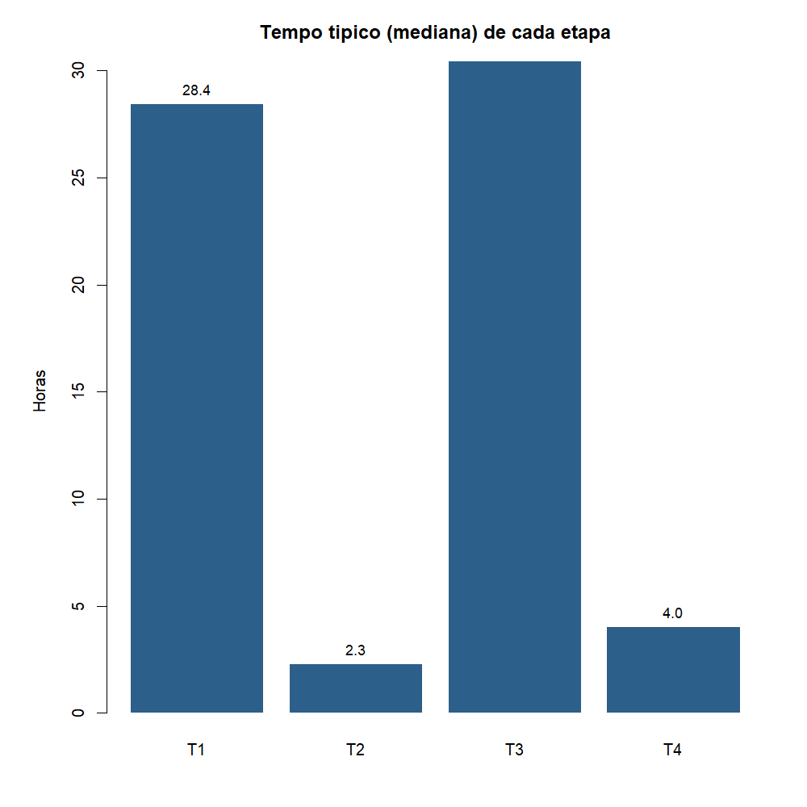
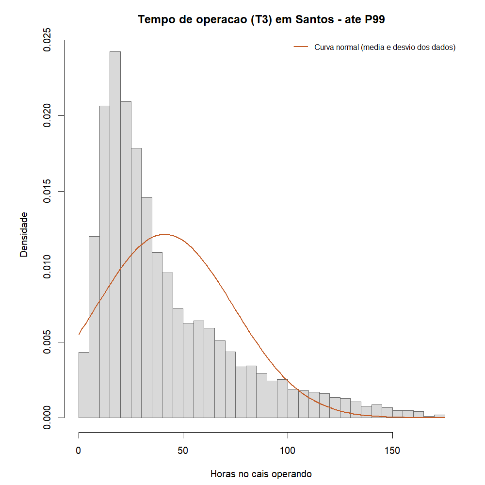
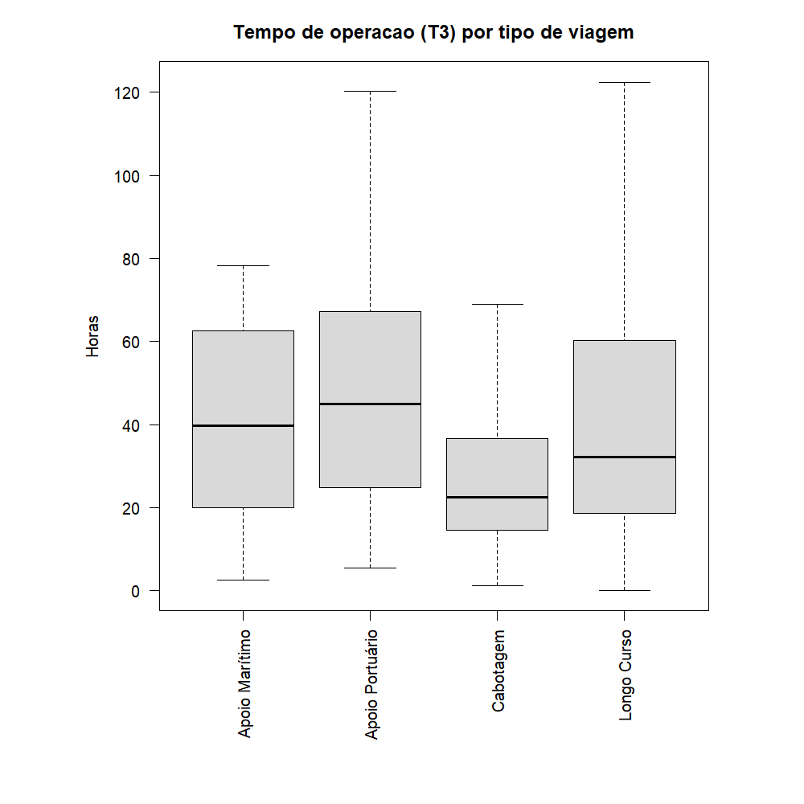
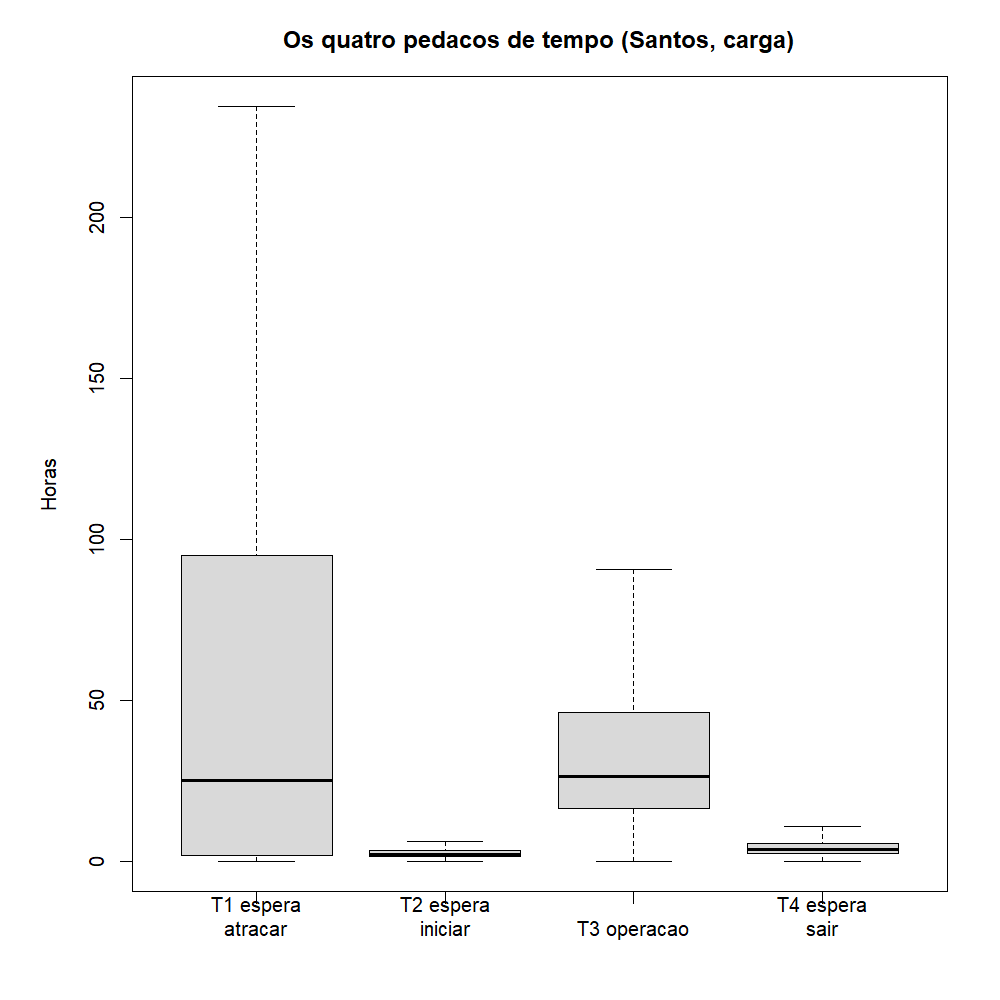
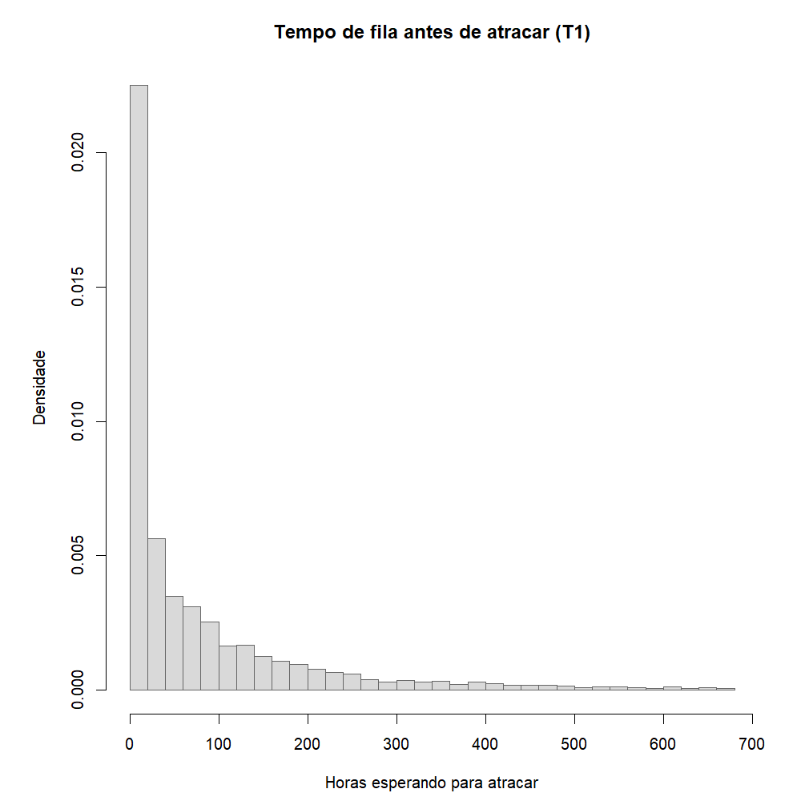

# Atividade 02B - Análise exploratória segmentada (entrega)

**Teoria do Aprendizado Estatístico · Fatec Rubens Lara**

Esta é a versão **enxuta** da EDA, a que apresentamos como entrega principal
da Aula 03. O foco é só um: os **tempos do navio** no porto de Santos
(espera, atracação, operação e desatracação).

A exploração larga do banco (carga, geografia, inventário etc.) ficou na
pasta A, como rascunho inicial:
[análise ampla](../analise_exploratoria_ampla_inicial/analise_exploratoria_ampla_inicial.md).
Foi nela que vimos que os tempos mereciam um estudo à parte. Aqui
fechamos o funil.

---

## Em poucas palavras

Quando um navio chega a Santos para carregar ou descarregar, o banco
registra quanto tempo ele gasta em cada etapa:

| Código | O que é, em linguagem simples |
|---|---|
| **T1** | Tempo na fila, ainda sem atracar (esperando vaga no cais) |
| **T2** | Já atracou, mas ainda não começou a operar |
| **T3** | Tempo de fato carregando ou descarregando |
| **T4** | Terminou a operação e espera para sair do cais |
| **TA** | Soma do tempo no cais: T2 + T3 + T4 |
| **TE** | Tempo total desde a chegada até sair: T1 + T2 + T3 + T4 |

A pergunta desta entrega: **como se comportam esses tempos?** Onde está o
atraso típico? A distribuição parece “normal” (sino) ou tem cauda longa?
Isso importa antes de qualquer regressão (Atividade 03).

---

## Recorte dos dados

- Ano **2024**
- Complexo portuário de **Santos**
- Só escalas de **movimentação de carga** (navio veio para carga/descarga)
- \(n = 5.739\) escalas com tempo de operação (T3) preenchido

Leitura em R: `sep = ";"`, `dec = ","`. Script dos gráficos:
[`gerar_graficos.R`](gerar_graficos.R).

Material da aula:
[Aula 03](../../../MateriaisAulas/Aula%2003%20-%20Análise%20Exploratória%20e%20Variáveis%20Aleatórias.PDF).

---

## 1. Tempo típico de cada etapa (mediana)

A **mediana** é o valor do “meio”: metade dos navios ficou abaixo, metade
acima. Em tempos de porto ela fala melhor que a média, porque alguns casos
extremos puxam a média para cima.

| Etapa | Mediana (h) | Média (h) | P95 (h) | % faltante |
|---|---:|---:|---:|---:|
| T1 (fila para atracar) | 28,4 | 86,3 | 387,5 | 1,4 |
| T2 (espera para começar) | 2,3 | 3,3 | 9,5 | 12,3 |
| T3 (operação) | 30,4 | 42,8 | 118,7 | 0,0 |
| T4 (espera para sair) | 4,0 | 5,4 | 15,0 | 1,4 |
| TA (tempo no cais) | 39,3 | 51,6 | 131,6 | 0,1 |
| TE (estadia total) | 84,1 | 137,5 | 450,7 | 1,3 |



**O que isso diz.** Em Santos, o navio “do meio” gasta cerca de **um dia e
meio** na fila (T1 ≈ 28 h) e cerca de **um dia e quarto** operando (T3 ≈ 30 h).
T2 e T4 são bem menores (horas, não dias). A média de T1 (86 h) é muito
maior que a mediana: existem filas longas que distorcem a média. Por isso
não dá para resumir a fila só com a média.

Conferência rápida: a identidade TA = T2+T3+T4 bate no dump (erro mediano
praticamente zero). O dicionário da ANTAQ está coerente aqui.

---

## 2. Forma do tempo de operação (T3)

O laboratório da Aula 03 pede olhar uma variável contínua, fazer histograma
com densidade e comparar com a curva normal.

```r
par(pty = "s")
summary(T3); sd(T3, na.rm = TRUE)
hist(T3_cap, breaks = 40, prob = TRUE)
curve(dnorm(x, mean = mean(T3_cap), sd = sd(T3_cap)), add = TRUE)
```



**Comentário.** A massa fica concentrada em tempos menores e existe uma
cauda longa à direita. A curva normal (mesma média e desvio) não acompanha
esse formato. Em uma frase:

> O tempo de operação (T3) em Santos é **assimétrico à direita** (média
> maior que a mediana) e lembra mais uma distribuição do tipo
> **exponencial / cauda longa** do que uma normal em forma de sino.

Isso já avisa a Atividade 03: trabalhar T3 “cru” em um `lm` sem transformar
é arriscado; `log1p(T3)` ajuda.

Também pedimos o boxplot da mesma variável, agora separado por tipo de
viagem (relação entre duas variáveis):



**Comentário.** O tempo de operação muda conforme o tipo de navegação
(longo curso, cabotagem etc.). Misturar tudo como se fosse a mesma coisa
esconde regimes diferentes.

---

## 3. Os quatro pedaços juntos (T1 a T4)



No desenho (sem os extremos mais absurdos), T1 e T3 dominam a história.
T2 e T4 são “tempos de transição”. Quem quiser reduzir atraso no porto
precisa olhar **fila (T1)** e **operação (T3)**; não só um deles.

---

## 4. A fila antes de atracar (T1)



T1 também é assimétrico: muitos navios esperam pouco ou moderado, e uma
minoria espera muitos dias (P95 perto de 16 dias). Fila não é um atraso
fixo; tem dias “normais” e dias de congestionamento.

---

## 5. Faltantes (o que falta preenchido)

```r
colSums(is.na(dt[, .(T1, T2, T3, T4, TA, TE)]))
```

No recorte Santos carga 2024, T3 está completo nas 5.739 linhas usadas.
T2 tem ~12% de falta (navio atracou sem registrar bem o início da
operação). T1 e T4 ficam em torno de 1%. Não dá para “tapar” T2 com a
média global sem pensar no tipo de operação.

---

## 6. O que isso prepara para a regressão (Atividade 03)

Daqui saímos com três avisos práticos:

1. O alvo natural de modelo é o **tempo de operação (T3)** (ou seu log).
2. A distribuição é assimétrica: média ≠ mediana; normal não descreve bem.
3. T1, T2 e T4 ajudam a entender o processo, mas **não** devem entrar como
   preditores de T3 se a ideia é prever operação sem “vazar” o próprio
   ciclo de tempos (TA e TE também não).

A regressão linear da Atividade 03 parte desse recorte (Santos, carga,
tempos) e tenta explicar T3 com informações da escala que não são o
próprio cronômetro.

---

## 7. Pedido da Aula 03 (checklist curto)

| O que o PDF pediu | Onde está |
|---|---|
| `summary` / faltantes | Seções 1 e 5 |
| Histograma com `prob = TRUE` + normal | Seção 2 / fig. 01 |
| Relação entre duas variáveis | Seção 2 / fig. 02 |
| Gráficos quadrados (`par(pty = "s")`) comentados | Figs. 01 e 02 |
| Frase sobre a forma da distribuição | Seção 2 |

---

*Dados: ANTAQ / SDP, complexo Santos, 2024. Citar a ANTAQ. Script em R base
(+ `data.table` só na leitura).*
