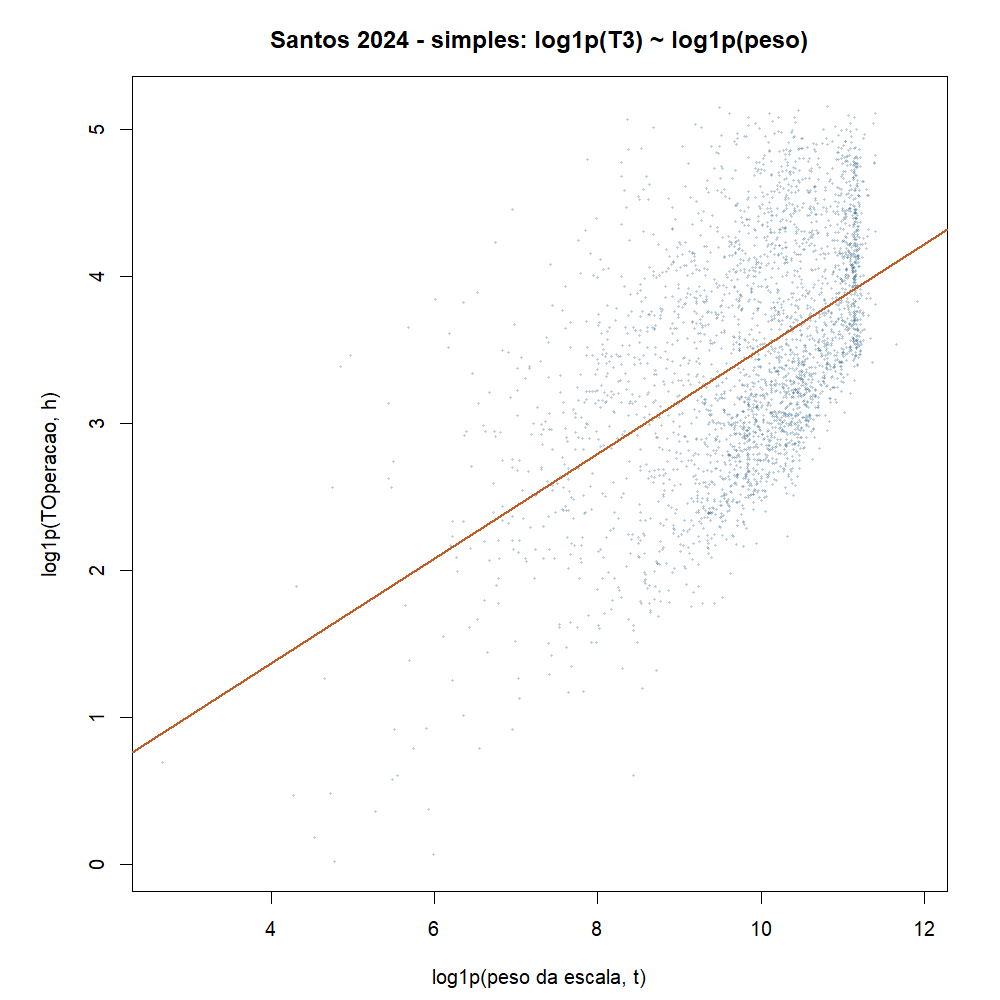
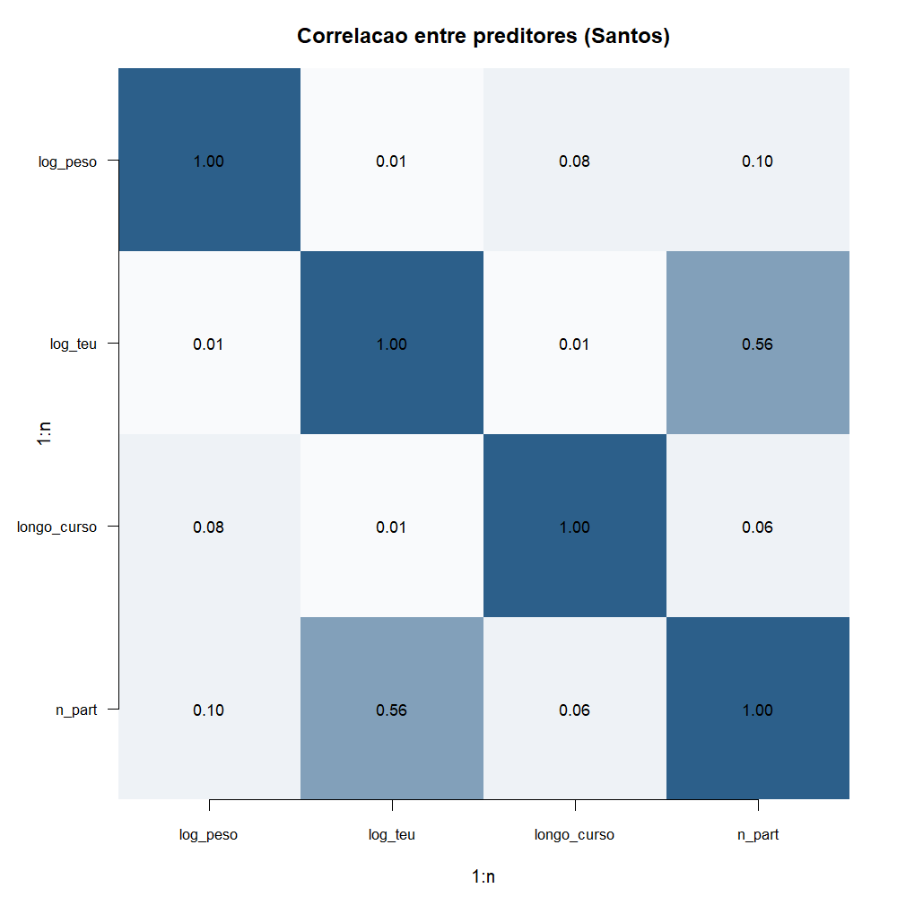

# Atividade 03 - Regressão linear

**Teoria do Aprendizado Estatístico · Fatec Rubens Lara**

Esta atividade continua a EDA **segmentada** (tempos do navio em Santos).
Lá vimos que o tempo de operação (T3) é assimétrico e central no processo.
Aqui tentamos **explicar** esse tempo com regressão linear simples e
múltipla, como pede a Aula 04.

Entrega de referência da EDA:
[análise segmentada](../atividade_02/analise_exploratoria_segmentada_entrega/analise_exploratoria_segmentada_entrega.md).

---

## O que queremos saber

Depois que o navio atraca em Santos para movimentar carga, ele gasta um
tempo no cais **operando** (carregando ou descarregando). Esse tempo é o
**T3**.

Pergunta:

> Dá para estimar o T3 olhando o **peso** da carga da escala, se há
> **contêineres** e se a viagem é **internacional** (longo curso)?

Regressão linear, neste trabalho, é só isso: uma reta (ou várias pistas
juntas) que liga o tempo de operação a essas informações.

| Termo técnico | Em português simples |
|---|---|
| Y (resposta) | O que queremos explicar: tempo de operação (T3), em log |
| X (preditor) | Pista usada para explicar Y |
| \(R^2\) | Quanto da variação de Y o modelo “pega” (0 = nada, 1 = tudo) |
| Resíduo | Erro: real menos o que o modelo chutou |
| Longo curso | Viagem internacional |
| TEU | Medida de volume de contêiner |

---

## Recorte (igual à EDA segmentada)

- Santos, 2024, movimentação de carga
- T3 preenchido, peso da escala > 0
- Cortamos T3 acima do P99 (casos extremos de cadastro)
- \(n = 5.681\) escalas

Não usamos T1, T2, T4, TA nem TE como preditores: fazem parte do mesmo
relógio da escala e “vazariam” a resposta.

Script: [`gerar_modelo.R`](gerar_modelo.R).
Aula: [Aula 04 - Regressão Linear](../../MateriaisAulas/Aula%2004%20-%20Regressão%20Linear.PDF).

---

## 1. Modelo simples:

```r
m_simples <- lm(log1p(T3) ~ log1p(peso), data = esc_m)
summary(m_simples)
```

Ajustamos:

\[
\widehat{\log(1+\mathrm{T3})} = -0{,}059 + 0{,}356 \cdot \log(1+\mathrm{peso})
\]

- \(R^2 = 0{,}26\)
- Coeficiente do peso ≈ **0,36**

**Interpretação.** O sinal positivo diz que, em média,
**escala mais pesada tende a demorar mais na operação**. Só o peso explica
cerca de **26%** da variação do tempo (na escala log). Ajuda, mas não basta.



A reta sobe com o peso, mas os pontos se espalham bastante em volta dela.
Ou seja: a tendência existe; o navio individual ainda varia muito.

---

## 2. Será que as pistas se repetem? (correlação)

Antes da regressão múltipla, a aula avisa sobre preditores muito parecidos
entre si (multicolinearidade). Olhamos a correlação entre as pistas
numéricas:

| | log(peso) | log(TEU) | longo curso | nº partidas |
|---|---:|---:|---:|---:|
| log(peso) | 1,00 | 0,01 | 0,08 | 0,10 |
| log(TEU) | 0,01 | 1,00 | 0,01 | 0,56 |
| longo curso | 0,08 | 0,01 | 1,00 | 0,06 |
| nº partidas | 0,10 | 0,56 | 0,06 | 1,00 |



Peso e TEU quase não se correlacionam (\(r \approx 0{,}01\)): podem entrar juntos.
Número de partidas anda junto com TEU (\(r \approx 0{,}56\)): deixamos partidas de
fora para não repetir a mesma informação.

---

## 3. Modelo múltiplo: peso + TEU + longo curso

```r
m_multi <- lm(log1p(T3) ~ log1p(peso) + log1p(teu) + longo_curso, data = esc_m)
```

\[
\widehat{y} = 0{,}121 + 0{,}357\,\log(1+\mathrm{peso}) - 0{,}109\,\log(1+\mathrm{TEU}) + 0{,}175\,\mathrm{longo\_curso}
\]

| Pista | Coeficiente | Leitura prática |
|---|---:|---|
| Peso | +0,36 | Mais toneladas ⇒ mais tempo de operação |
| TEU | -0,11 | Dado o peso, mais contêiner ⇒ tempo um pouco menor no ajuste |
| Longo curso | +0,18 | Viagem internacional ⇒ tempo um pouco maior |

### Comparando \(R^2\)

| Modelo | \(R^2\) |
|---|---:|
| Só peso | 0,26 |
| Peso + TEU + longo curso | **0,52** |

Com as três pistas o modelo “pega” cerca de **metade** da variação do
tempo. Melhorou bastante em relação ao peso sozinho.

---

## 4. Gráfico de resíduos

```r
par(pty = "s")
plot(fitted(m_multi), resid(m_multi))
abline(h = 0, lty = 2)
```


**Comentário.** Os erros ficam em torno de zero, sem uma curva gritante no
meio. Ainda assim há espalhamento: o modelo erra, e às vezes erra bastante.
Serve como **primeiro modelo** (baseline), não como previsão certinha de
horário de saída.

---

## 5. Uma previsão concreta

Cenário: viagem **internacional**, peso na mediana (~24.283 t), **sem**
contêiner (TEU = 0).

```r
predict(m_multi, newdata = novo, interval = "prediction", level = 0.95)
```

| Resultado | Valor |
|---|---:|
| Tempo de operação estimado | **~48 horas** (~2 dias) |
| Intervalo 95% (em horas) | ~16 h a ~143 h |

O número central é útil como ordem de grandeza. O intervalo largo mostra a
incerteza que a EDA já sugeria (cauda longa).

---

## 6. Conclusão

Na EDA segmentada vimos que T3 é o miolo do tempo no cais e que a
distribuição não é normal. Nesta regressão:

1. Mais peso ⇒ mais tempo de operação.
2. Incluir TEU e longo curso sobe o \(R^2\) de 0,26 para 0,52.
3. As pistas escolhidas não estão fortemente coladas uma na outra.
4. Para um navio “típico” internacional sem contêiner, estimamos cerca de
   dois dias de operação, com muita margem de erro.

Isso cumpre o pedido da Aula 04: modelo, interpretação de coeficiente,
\(R^2\) e gráfico de resíduos comentado, além da correlação entre preditores
e uma previsão.

---

## Como rodar de novo

```r
# Rscript Atividades/atividade_03/gerar_modelo.R
```

Pacote da aula: **base** (`lm`, `summary`, `plot`, `abline`, `predict`, `cor`).
`data.table` só na leitura do arquivo ANTAQ.

*Fonte: ANTAQ, Santos 2026.*
