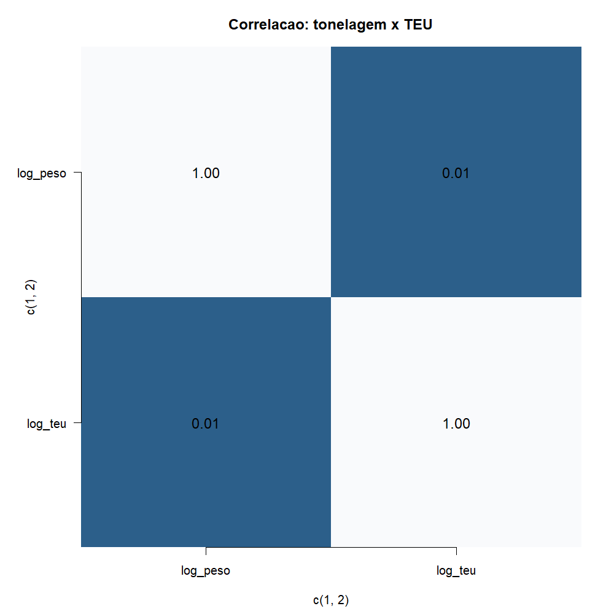
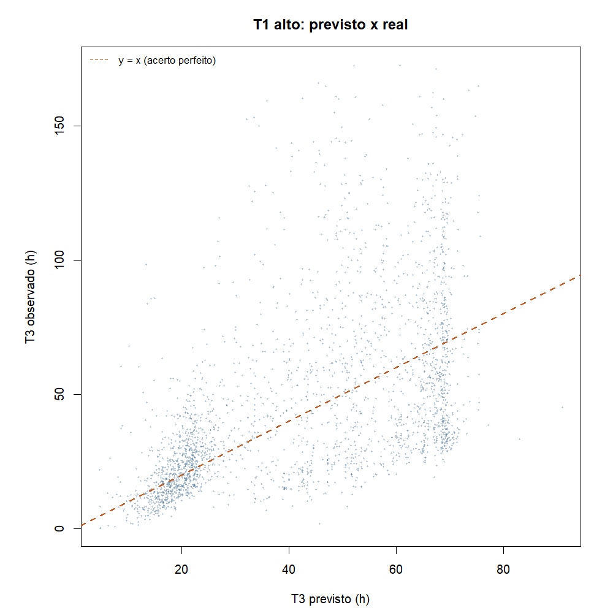
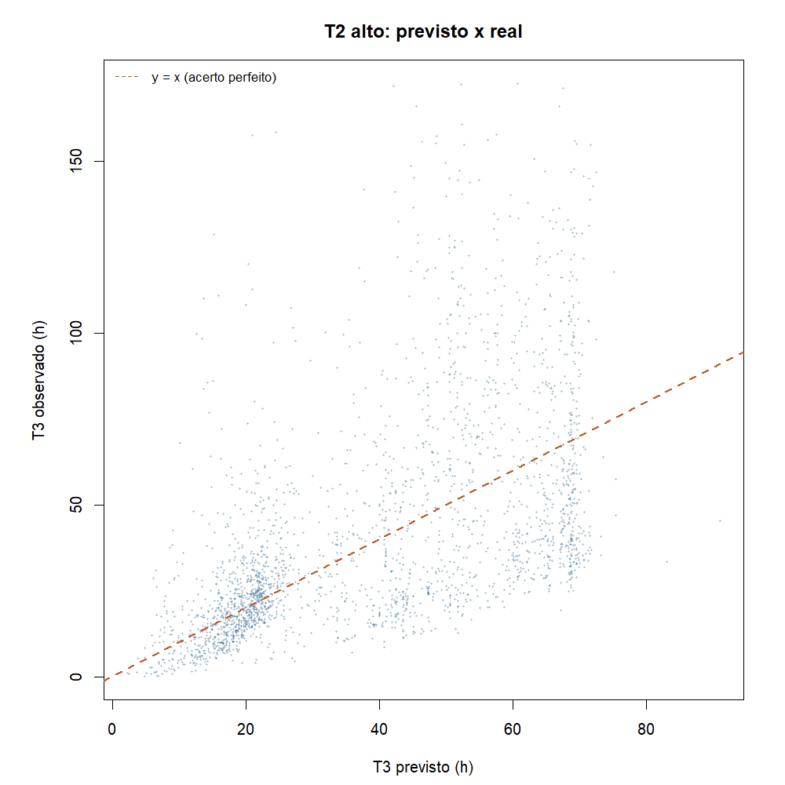

# Atividade 03 - Regressão linear e previsão de T3

**Teoria do Aprendizado Estatístico · Fatec Rubens Lara · Aula 04**

Continua a Análise Exploratória segmentada em Santos:
[02B](../atividade_02/analise_exploratoria_segmentada_entrega.md).

Primeiro ajustamos uma regressão para explicar o tempo de operação (T3) com
tonelagem e TEU. Depois usamos a mesma reta para prever T3 de navios que
ainda estão na fila (T1) ou esperando no berço (T2), como no desenho do
caderno: marca o ponto no eixo, sobe na reta e lê a previsão.

Scripts: [`modelo_regressao_linear_t3.R`](modelo_regressao_linear_t3.R) e
[`modelo_previsao_fila_t3.R`](modelo_previsao_fila_t3.R).
Pacote da aula: base (`lm`, `summary`, `plot`, `predict`, `cor`);
`data.table` só na leitura.

---

## Recorte

- Santos, 2024, movimentação de carga
- T3 preenchido, peso da escala > 0
- T3 acima do P99 cortado
- \(n = 5.681\) escalas

| Código | Significado |
|---|---|
| T1 | Fila, esperando atracar |
| T2 | Já atracou, esperando começar a operação |
| T3 | Tempo operando (nossa resposta Y) |
| Tonelagem | Peso bruto agregado da escala (t) |
| TEU | Volume de contêiner agregado |

T1, T2, T4, TA e TE não entram como preditores porque fazem parte do mesmo
relógio da escala. Na previsão em fila, T1 e T2 só servem para escolher
quais navios entram no exercício.

---

<a id="regressao-t3"></a>

## 1. Regressão: T3 ~ tonelagem + TEU

### Pergunta

> Dá para estimar T3 olhando a tonelagem e o TEU da escala?

| Papel | Variável |
|---|---|
| Y | `log1p(T3)` |
| X₁ | `log1p(peso)` |
| X₂ | `log1p(teu)` |

### Modelo simples (só tonelagem)

```r
m_simples <- lm(log1p(T3) ~ log1p(peso), data = esc_m)
```

\[
\widehat{\log(1+\mathrm{T3})} \approx -0{,}06 + 0{,}36 \cdot \log(1+\mathrm{peso})
\]

- \(R^2 \approx 0{,}26\)
- Mais toneladas tendem a dar mais tempo de operação.


### Tonelagem e TEU se repetem?

| | log(peso) | log(TEU) |
|---|---:|---:|
| log(peso) | 1,00 | 0,01 |
| log(TEU) | 0,01 | 1,00 |



\(r \approx 0{,}01\). Quase independentes, dá para colocar os dois juntos.

### Modelo múltiplo

```r
m_multi <- lm(log1p(T3) ~ log1p(peso) + log1p(teu), data = esc_m)
```

\[
\widehat{\log(1+\mathrm{T3})} \approx 0{,}22 + 0{,}36\,\log(1+\mathrm{peso}) - 0{,}11\,\log(1+\mathrm{TEU})
\]

| Preditor | Coef. | Leitura |
|---|---:|---|
| Tonelagem | +0,36 | mais peso, mais T3 |
| TEU | −0,11 | com o mesmo peso, mais contêiner puxa T3 um pouco para baixo no ajuste |

| Modelo | \(R^2\) |
|---|---:|
| Só tonelagem | 0,26 |
| Tonelagem + TEU | 0,51 |

Incluir TEU ajuda bastante, mas metade da variação ainda fica de fora. A Análise Exploratória
(02B) já tinha mostrado cauda longa.


Os resíduos ficam em torno de zero, sem padrão forte, mas espalhados. Serve
como primeiro modelo, não como horário fechado.

### Previsão escrita

Marco um \(x_0\) (peso), subo na reta, leio \(\hat{y}\) e volto para horas
com `expm1()`.


| Cenário | Peso | TEU | T3 previsto |
|---|---:|---:|---:|
| Mediano, sem contêiner | ~24.283 t | 0 | ~47 h |
| Leve com contêiner (P25) | ~11.362 t | moderado | ~14 h |
| Pesado (P90) | ~66.396 t | alto | ~28 h |

Com peso e TEU dá para ter uma ordem de grandeza do T3. O intervalo continua
largo porque a distribuição é assimétrica.

---

<a id="previsao-t1-t2"></a>

## 2. Previsão de T3 na fila (T1 e T2)

Na chegada ao porto costuma-se saber peso e TEU, mas ainda não se sabe T3.
Aqui reaplicamos a mesma reta a navios que passaram por fila ou espera longa
no histórico de 2024.

Modelo:

\[
\widehat{\log(1+\mathrm{T3})} = 0{,}22 + 0{,}36\,\log(1+\mathrm{peso}) - 0{,}11\,\log(1+\mathrm{TEU})
\]

```r
m <- lm(log1p(T3) ~ log1p(peso) + log1p(teu), data = esc_m)
esc[, T3_pred := expm1(predict(m, newdata = esc))]
```

T1 e T2 não entram na fórmula. Só recortam os grupos.

### Quem está em T1 ou T2?

| Grupo | Critério | \(n\) |
|---|---|---:|
| Fila longa (T1) | T1 ≥ mediana (~28 h) | 2.802 |
| Espera no berço (T2) | T2 ≥ mediana (~2,3 h) | 2.501 |

### Navios com T1 alto



| | Mediana |
|---|---:|
| T3 observado | ~36 h |
| T3 previsto | ~44 h |
| Erro médio absoluto | ~20 h |

O modelo superestima um pouco quem ficou muito tempo na fila. T1 não entra
na conta, mas anda junto com atrasos que peso e TEU não pegam sozinhos.

Exemplo: navio com T1 ≈ 1.036 h, peso ~56 mil t. Previsão ~63 h, real ~46 h.
A ordem de grandeza bate, mas não daria para prometer horário só com a carga.

### Navios com T2 alto



| | Mediana |
|---|---:|
| T3 observado | ~32 h |
| T3 previsto | ~38 h |
| Erro médio absoluto | ~19 h |

Exemplo: T2 ≈ 62 h, peso ~21,5 mil t. Previsão ~45 h, real ~118 h. Ajuda como
estimativa grossa, não como agenda.


---

## Conclusão

1. T3 se explica em parte com tonelagem e TEU (\(R^2\) de 0,26 para 0,51).
2. Três cenários escritos mostram como usar a reta na prática.
3. A mesma reta antecipa T3 para navios em T1 ou T2, com erro médio perto
   de 20 h.
4. Para saber se “vai operar uns dois dias?”, o modelo ainda ajuda antes do
   T3 começar, mas não substitui o cronograma do porto.

Cumpre a Aula 04: modelo, coeficiente, \(R^2\), resíduos, previsão comentada
e uso do modelo em navios na fila.

---

## Como reproduzir

```r
Rscript Atividades/atividade_03/modelo_regressao_linear_t3.R
Rscript Atividades/atividade_03/modelo_previsao_fila_t3.R
```

*Fonte: ANTAQ, Santos 2024.*
