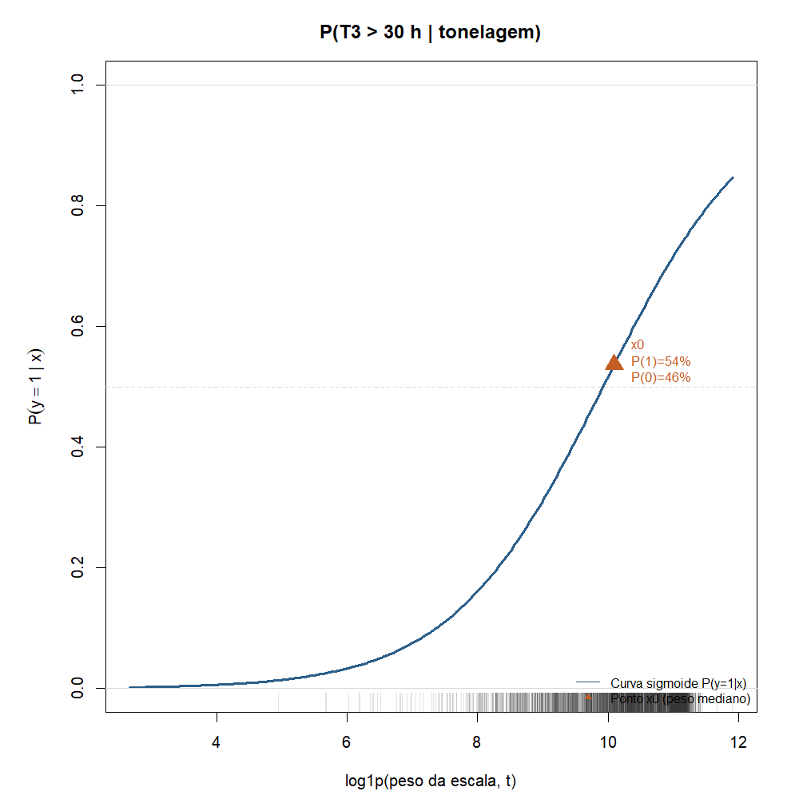
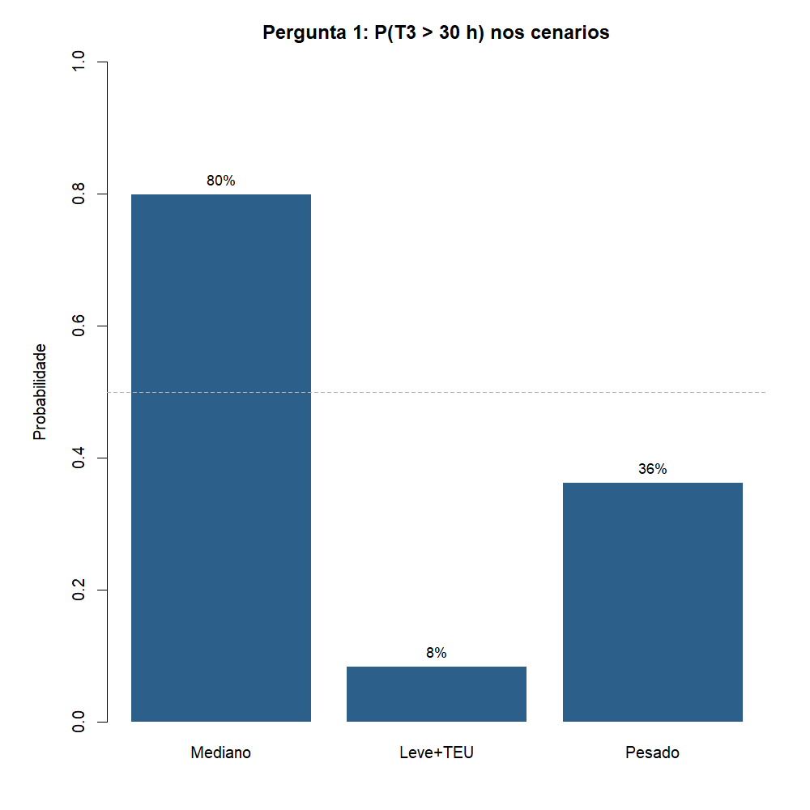

# Atividade 04 - Regressão logística

**Teoria do Aprendizado Estatístico · Fatec Rubens Lara · Aula 05**

---

## O funil: do macro ao micro

Este `.md` fecha a sequência que montamos no semestre. Cada atividade
documenta uma etapa do funil:


| #   | Etapa                                  | O que fizemos                                                                                                                                                                                 |
| --- | -------------------------------------- | --------------------------------------------------------------------------------------------------------------------------------------------------------------------------------------------- |
| 01  | Base inteira                           | [Dicionário](../atividade_01/dicionario_variaveis_amplo_completo.md): tipos, joins, unidade amostral                                                                                          |
| 02A | Exploração ampla Exploração Segmentada | [EDA larga](../atividade_02/analise_exploratoria_ampla_completa.md): inventário, carga, geografia                                                                                             |
| 02B | Tempos do Navio                        | [EDA segmentada](../atividade_02/analise_exploratoria_segmentada_entrega.md): T1, T2, **T3**, T4                                                                                              |
| 03  | Só T3 (contínuo)                       | [Regressão de T3 ~ peso + TEU](../atividade_03/regressao_linear_e_previsao_t3.md#1-regressão-t3--tonelagem--teu); [Previsão de T3 para navios em T1 e T2](../atividade_03/regressao_linear_e_previsao_t3.md#2-previsão-de-t3-na-fila-t1-e-t2) |
| 04  | Só T3 (binário)                        | **Esta entrega**: as [duas perguntas](#as-duas-perguntas-de-horas-para-simnão) da Ativ. 03 em sim/não                                                                                         |


Começamos com o banco ANTAQ todo, entendemos a estrutura, exploramos de
perto, segmentamos nos tempos de atracação e, dentro deles, focamos em
**T3** (tempo de operação). Na Atividade 03 o Y era horas: primeiro
ajustamos a reta com peso e TEU ([regressão](../atividade_03/regressao_linear_e_previsao_t3.md#1-regressão-t3--tonelagem--teu)),
depois reaplicamos a mesma reta para antecipar T3 de quem ainda está na
fila (T1) ou esperando no berço (T2) ([previsão](../atividade_03/regressao_linear_e_previsao_t3.md#2-previsão-de-t3-na-fila-t1-e-t2)).
Aqui respondemos as **mesmas duas perguntas**, mas com **sim ou não**
(probabilidade), como pede a
[Aula 05](../../MateriaisAulas/Aula%2005%20-%20Classificação%20e%20Regressão%20Logística.PDF).

---


## As duas perguntas (de horas para sim/não)

Na Atividade 03 a resposta vinha em **horas** (`lm`). Aqui viramos **sim
ou não** (`glm`): Y = 1 se T3 > 30 h, Y = 0 caso contrário.


| #     | Atividade 03 - regressão linear                                                                                             | Atividade 04 - regressão logística       |
| ----- | --------------------------------------------------------------------------------------------------------------------------- | ---------------------------------------- |
| **1** | [Dá para estimar T3 com peso e TEU?](../atividade_03/regressao_linear_e_previsao_t3.md#1-regressão-t3--tonelagem--teu)      | **A operação vai passar de 30 h?**       |
| **2** | [Dá para antecipar T3 na fila (T1/T2)?](../atividade_03/regressao_linear_e_previsao_t3.md#2-previsão-de-t3-na-fila-t1-e-t2) | **Antes de operar, vai passar de 30 h?** |


### Pergunta 1 - explicar T3 (seção 1 da Atividade 03)

> Sabendo peso e TEU da escala, **a operação será longa** (T3 > 30 h)?

- **Sim (Y = 1):** T3 > 30 h  
- **Não (Y = 0):** T3 ≤ 30 h

Resposta: P(sim  peso, TEU), curva sigmoide e odds (seções 1 a 3 abaixo).

### Pergunta 2 - antecipar na fila (seção 2 da Atividade 03)

> Navio ainda em **T1** (fila) ou **T2** (berço): **vai operar mais de 30 h?**

- **Sim (Y = 1):** quando a operação começar, T3 passará de 30 h  
- **Não (Y = 0):** operação tende a ser mais curta

Mesmo Y binário e mesmos preditores (peso + TEU). T1 e T2 **não entram
na fórmula**; só recortam o grupo, como na previsão linear. Na chegada
ao porto costuma-se saber a carga, mas ainda não se sabe T3.

---


## Recorte (igual à Atividade 03)

- Santos, 2024, movimentação de carga
- T3 preenchido, peso da escala > 0
- T3 acima do P99 cortado
- n = 5.681 escalas


| Papel | Variável                              |
| ----- | ------------------------------------- |
| Y = 1 | T3 > 30 h (operação longa, ~1,25 dia) |
| Y = 0 | T3 ≤ 30 h                             |
| X₁    | `log1p(peso)`                         |
| X₂    | `log1p(teu)`                          |


T1, T2 e T4 ficam de fora. Já passamos por eles na EDA segmentada; o
funil nos trouxe até o T3.

```r
esc_m[, y_op_longa := as.integer(T3 > 30)]
m <- glm(y_op_longa ~ log_peso + log_teu, data = esc_m, family = binomial)
```

Script: `[modelo_regressao_logistica.R](modelo_regressao_logistica.R)`.

---


## O que muda em relação à reta (Aula 05)


| Regressão linear (Ativ. 03) | Regressão logística (Ativ. 04)     |
| --------------------------- | ---------------------------------- |
| Prevejo T3 em horas         | Prevejo P(T3 > 30 h)               |
| Gráfico: nuvem + reta       | Gráfico: curva S entre 0 e 1       |
| \hat{y} = b_0 + b_1 x       | Reta nos log-odds, depois sigmoide |


P(Y=1 \mid X) = \frac{1}{1 + e^{-(b_0 + b_1 X_1 + b_2 X_2 + \cdots)}}

No caderno a professora usa o score de crédito: qual a chance do devedor
pagar? Aqui: qual a chance de a **operação** passar de 30 h, dado peso
e TEU da escala?

---


## 1. Pergunta 1 - curva sigmoide (modelo simples, 1 preditor)

Para desenhar a curva do caderno, primeiro ajusto só com tonelagem:

```r
m_simples <- glm(y_op_longa ~ log_peso, data = esc_m, family = binomial)
```



No eixo Y está a probabilidade, não o 0/1 bruto. O triângulo laranja
marca o peso mediano (~24 mil t): ali leio P(1) e P(0) em %.

No peso mediano: P(T3 > 30 h) ≈ **54%**, P(T3 ≤ 30 h) ≈ **46%**. Quase
metade das escalas passa de 30 h mesmo com carga mediana.

\text{logit}\bigl(P(Y{=}1)\bigr) = -8{,}52 + 0{,}86 \cdot \log(1+\text{peso})

### Da reta à curva

1. Reta nos log-odds: \text{logit}(p) = b_0 + b_1 \cdot \log(1+\text{peso})
2. Odds: p / (1-p)
3. Volta para p: sigmoide


Esquerda: reta. Direita: curva. É o desenho da Aula 05.

---


## 2. Pergunta 1 - modelo múltiplo (peso + TEU, como na Atividade 03)

Na regressão linear, TEU ajudou a subir o R^2. Na logística, entra
do mesmo jeito:

```r
m_multi <- glm(y_op_longa ~ log_peso + log_teu, data = esc_m, family = binomial)
```


| Preditor  | Coef. (log-odds) | Leitura                                                   |
| --------- | ---------------- | --------------------------------------------------------- |
| Tonelagem | +1,04            | mais peso, mais chance de T3 longo                        |
| TEU       | −0,37            | com o mesmo peso, mais contêiner puxa a chance para baixo |


Reaproveito os três cenários escritos da Atividade 03:




| Cenário                  | Peso      | TEU      | P(T3 > 30 h) |
| ------------------------ | --------- | -------- | ------------ |
| Mediano, sem contêiner   | ~24.283 t | 0        | ~80%         |
| Leve com contêiner (P25) | ~11.362 t | moderado | ~8%          |
| Pesado (P90)             | ~66.396 t | alto     | ~36%         |


Navio leve com TEU tem bem menos chance de operação longa; no mediano sem
contêiner a chance é alta. TEU pesa bastante no modelo logístico, como na
regressão linear.

---


## 3. Odds e log no peso mediano

Conta do caderno, peso mediano (~24.231 t):


| Passo           | Conta                                 | Resultado |
| --------------- | ------------------------------------- | --------- |
| Reta (log-odds) | -8{,}52 + 0{,}86 \times \log(1+24283) | ≈ 0,15    |
| P(Y=1)          | 1/(1+e^{-0{,}15})                     | ≈ 54%     |
| P(Y=0)          | 1 - P                                 | ≈ 46%     |
| Odds            | 0{,}54 / 0{,}46                       | ≈ 1,16    |
| Checagem        | \ln(1{,}16)                           | ≈ 0,15    |


```r
x0  <- log1p(median(esc_m$peso_t))
eta <- coef(m_simples)[1] + coef(m_simples)[2] * x0
p0  <- plogis(eta)
odds <- p0 / (1 - p0)
log(odds)
```

Se P = 0,60, odds = 0,6/0,4 = 1,5 (“1,5 para 1”). O log devolve na reta.

---


## 4. Previsão escrita (as duas perguntas)


### Pergunta 1 - a operação vai passar de 30 h?

Na regressão linear respondíamos “quantas horas?”. Agora: “sim ou não?”.

- **Mediano, sem TEU:** ~80% de passar de 30 h. Bem provável operação longa.
- **Leve com TEU:** ~8%. Operação longa é improvável.
- **Pesado (P90):** ~36%. Menos provável que no mediano sem contêiner.


### Pergunta 2 - antes de operar (T1/T2), vai passar de 30 h?

Mesmo `glm`: na chegada só entram peso e TEU. Para navios que na Atividade
03 estavam com **T1 alto** (fila ≥ mediana, ~28 h) ou **T2 alto** (espera
no berço ≥ mediana, ~2,3 h), aplico a mesma curva:

- Se a previsão linear dava ~44 h (T1) ou ~38 h (T2) na mediana, isso
empurra P(sim) para cima em relação a uma escala típica.
- A resposta continua probabilística: não cravo horário, digo se operação
longa é **provável ou não** antes do T3 começar.

Percentuais do `glm` em Santos 2024; ver `_numeros.txt` após rodar o script.

---


## Conclusão

1. O funil macro→micro termina em T3: primeiro horas (Ativ. 03), depois
  as **mesmas duas perguntas** em sim/não (Ativ. 04).
2. Y binário pede `glm`, não `lm`.
3. A sigmoide vem da reta nos log-odds, como na Aula 05.
4. Peso e TEU entram como na regressão linear; a leitura muda de horas
  para probabilidade.
5. Próximo passo da disciplina: matriz de confusão e limiar de decisão.

---


## Como rodar

```r
Rscript Atividades/atividade_04/modelo_regressao_logistica.R
```

*Fonte: ANTAQ, Santos 2024.*