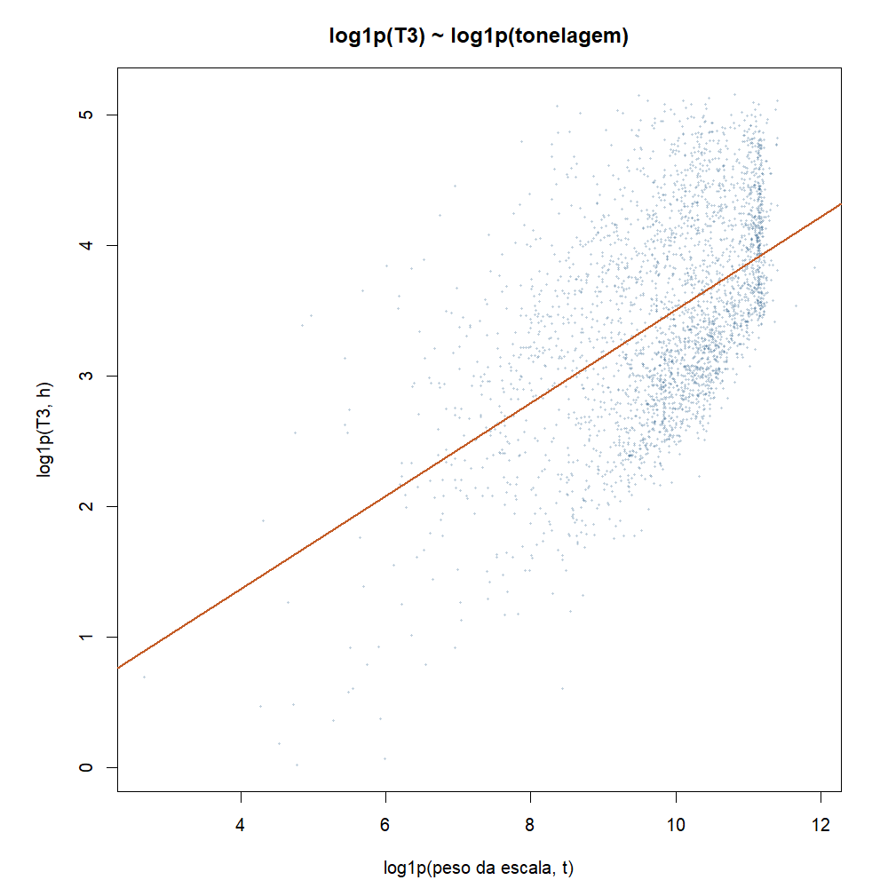
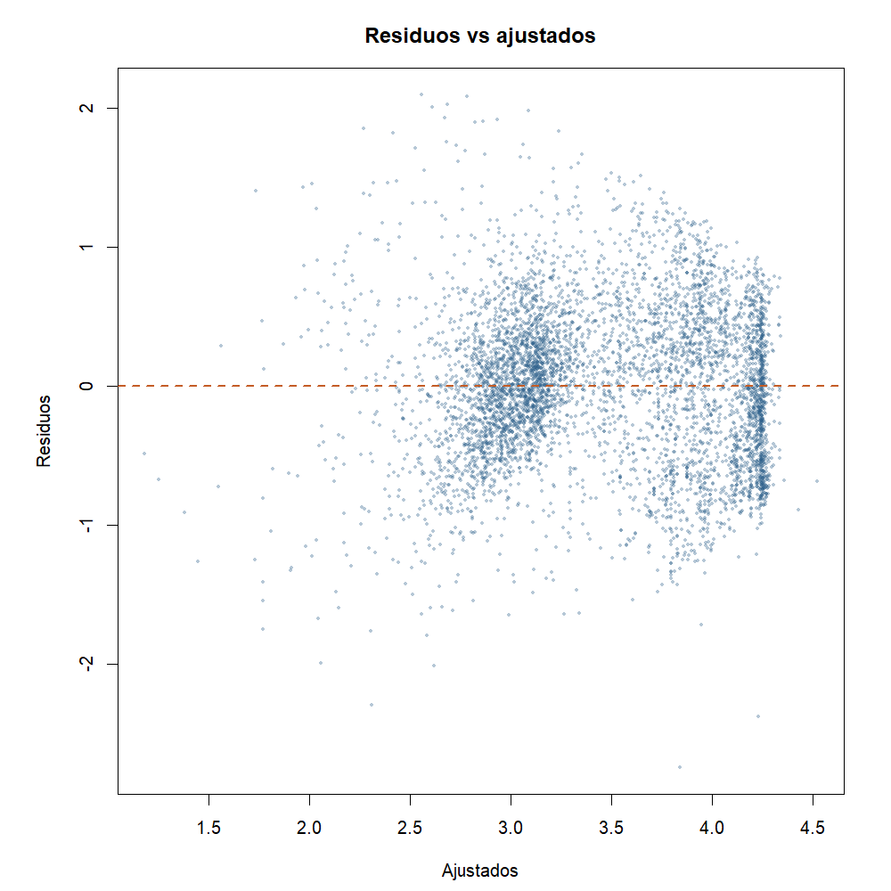
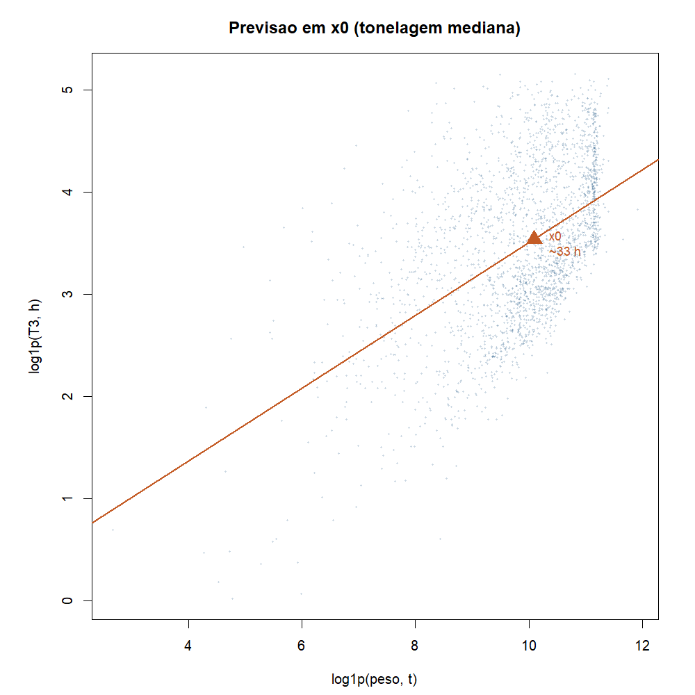

# Atividade 03a - Regressao linear de T3

**Team Shannon · Teoria do Aprendizado Estatistico · Fatec Rubens Lara · Aula 04**

Continua a Analise Exploratoria segmentada em Santos:
[02b](02b-analise-exploratoria-segmentada.md).

Pergunta: da para estimar T3 olhando a tonelagem e o TEU da escala?

Script: [`03a-regressao-linear-t3.R`](../estrutura/codigos/03a-regressao-linear-t3.R).
Números: [`03a-numeros.txt`](../estrutura/codigos/03a-numeros.txt).
Pacote da aula: base (`lm`, `summary`, `plot`, `predict`, `cor`);
`data.table` so na leitura.

A mesma reta e reaplicada na fila em
[03b](03b-previsao-fila-t3.md).

---

## Recorte

- Santos, 2024, movimentacao de carga
- T3 preenchido, peso da escala > 0
- T3 acima do P99 cortado
- n = 5.681 escalas

| Papel | Variavel |
|---|---|
| Y | `log1p(T3)` |
| X1 | `log1p(peso)` |
| X2 | `log1p(teu)` |

T1, T2, T4, TA e TE nao entram como preditores. Fazem parte do mesmo
relogio da escala.

---

## Modelo simples (so tonelagem)

```r
m.simples <- lm(log1p(T3) ~ log1p(peso), data = esc.m)
```

\[
\widehat{\log(1+\mathrm{T3})} \approx -0{,}06 + 0{,}36 \cdot \log(1+\mathrm{peso})
\]

- R2 cerca de 0,26
- Mais toneladas tendem a dar mais tempo de operacao.



## Tonelagem e TEU se repetem?

| | log(peso) | log(TEU) |
|---|---:|---:|
| log(peso) | 1,00 | 0,01 |
| log(TEU) | 0,01 | 1,00 |


r cerca de 0,01. Quase independentes, da para colocar os dois juntos.

## Modelo multiplo

```r
m.multi <- lm(log1p(T3) ~ log1p(peso) + log1p(teu), data = esc.m)
```

\[
\widehat{\log(1+\mathrm{T3})} \approx 0{,}22 + 0{,}36\,\log(1+\mathrm{peso}) - 0{,}11\,\log(1+\mathrm{TEU})
\]

| Preditor | Coef. | Leitura |
|---|---:|---|
| Tonelagem | +0,36 | mais peso, mais T3 |
| TEU | -0,11 | com o mesmo peso, mais conteiner puxa T3 um pouco para baixo |

| Modelo | R2 |
|---|---:|
| So tonelagem | 0,26 |
| Tonelagem + TEU | 0,51 |

Incluir TEU ajuda bastante, mas metade da variacao ainda fica de fora. A
Analise Exploratoria (02b) ja tinha mostrado cauda longa.



Os residuos ficam em torno de zero, sem padrao forte, mas espalhados. Serve
como primeiro modelo, nao como horario fechado.

## Previsao escrita

Marco um x0 (peso), subo na reta, leio y chapéu e volto para horas com `expm1()`.



| Cenario | Peso | TEU | T3 previsto |
|---|---:|---:|---:|
| Mediano, sem conteiner | ~24.283 t | 0 | ~47 h |
| Leve com conteiner (P25) | ~11.362 t | moderado | ~14 h |
| Pesado (P90) | ~66.396 t | alto | ~28 h |

Com peso e TEU da para ter uma ordem de grandeza do T3. O intervalo continua
largo porque a distribuicao e assimetrica.

---

## Conclusao

1. T3 se explica em parte com tonelagem e TEU (R2 de 0,26 para 0,51).
2. Tres cenarios escritos mostram como usar a reta na pratica.
3. A reta segue para a previsao na fila em [03b](03b-previsao-fila-t3.md).

---

## Como reproduzir

```r
Rscript estrutura/codigos/03a-regressao-linear-t3.R
```

*Fonte: ANTAQ, Santos 2024.*
