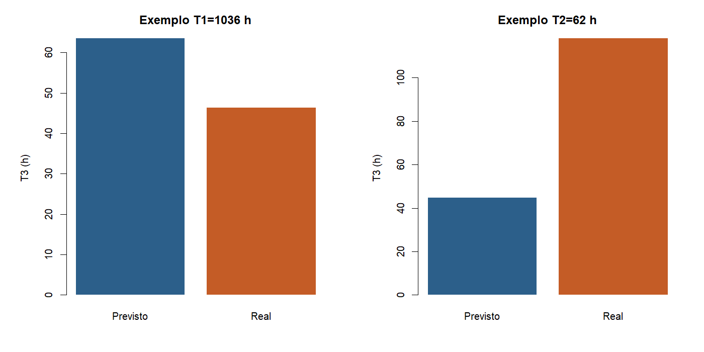

# Atividade 03b - Previsao de T3 na fila

**Team Shannon · Teoria do Aprendizado Estatistico · Fatec Rubens Lara · Aula 04**

Continua a regressao de T3:
[03a](03a-regressao-linear-t3.md).

Pergunta: navio ainda em T1 (fila) ou T2 (berco), da para antecipar T3
so com peso e TEU?

Script: [`03b-previsao-fila-t3.R`](../estrutura/codigos/03b-previsao-fila-t3.R).
Números: [`03b-numeros.txt`](../estrutura/codigos/03b-numeros.txt).

Na chegada ao porto costuma-se saber peso e TEU, mas ainda nao se sabe T3.
Aqui reaplicamos a mesma reta da 03a. T1 e T2 nao entram na formula. So
recortam o grupo, como no caderno: marca o ponto no eixo, sobe na reta e le
a previsao.

---

## Recorte

- Mesmo modelo e mesmo n da 03a (5.681 escalas, Santos 2024, carga)
- T1 alto: T1 maior ou igual a mediana (~28 h), n = 2.802
- T2 alto: T2 maior ou igual a mediana (~2,3 h), n = 2.501

Modelo da 03a:

\[
\widehat{\log(1+\mathrm{T3})} = 0{,}22 + 0{,}36\,\log(1+\mathrm{peso}) - 0{,}11\,\log(1+\mathrm{TEU})
\]

```r
m <- lm(log1p(T3) ~ log1p(peso) + log1p(teu), data = esc.m)
esc[, T3.prev := expm1(predict(m, newdata = esc))]
```

---

## Navios com T1 alto


| | Mediana |
|---|---:|
| T3 observado | ~36 h |
| T3 previsto | ~44 h |
| Erro medio absoluto | ~20 h |

O modelo superestima um pouco quem ficou muito tempo na fila. T1 nao entra
na conta, mas anda junto com atrasos que peso e TEU nao pegam sozinhos.

Exemplo: navio com T1 cerca de 1.036 h, peso ~56 mil t. Previsao ~63 h,
real ~46 h. A ordem de grandeza bate, mas nao daria para prometer horario
so com a carga.

## Navios com T2 alto


| | Mediana |
|---|---:|
| T3 observado | ~32 h |
| T3 previsto | ~38 h |
| Erro medio absoluto | ~19 h |

Exemplo: T2 cerca de 62 h, peso ~21,5 mil t. Previsao ~45 h, real ~118 h.
Ajuda como estimativa grossa, nao como agenda.



---

## Conclusao

1. A mesma reta da 03a antecipa T3 para navios em T1 ou T2.
2. O erro medio fica perto de 20 h.
3. Serve como ordem de grandeza antes do T3 comecar, nao como cronograma do porto.

---

## Como reproduzir

```r
Rscript estrutura/codigos/03b-previsao-fila-t3.R
```

*Fonte: ANTAQ, Santos 2024.*
