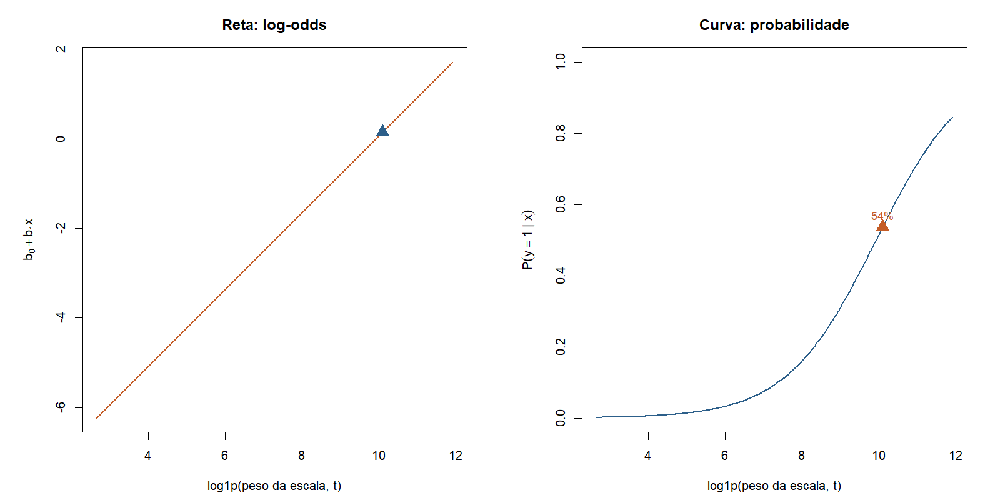
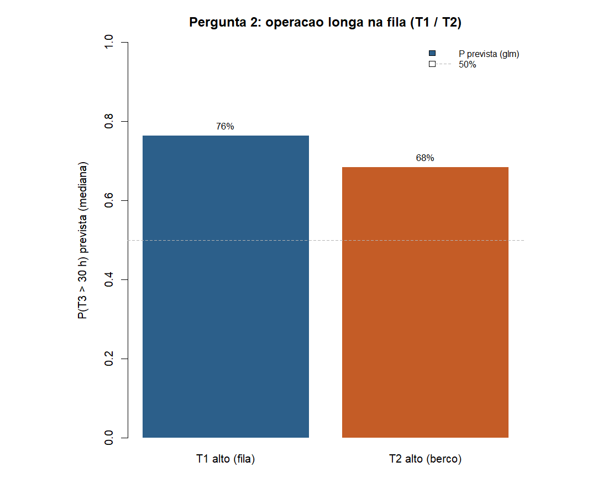

# Atividade 04 - Regressão logística

**Team Shannon · Teoria do Aprendizado Estatístico · Fatec Rubens Lara · Aula 05**

Continua a [03a](03a-regressao-linear-t3.md) e a [03b](03b-previsao-fila-t3.md):
as **mesmas duas perguntas**, agora com resposta **sim ou não**
(probabilidade), como pede a
[Aula 05](../materiais-aulas/Aula%2005%20-%20Classificação%20e%20Regressão%20Logística.PDF).

Script: [`04-regressao-logistica.R`](../estrutura/codigos/04-regressao-logistica.R).
Números: [`04-numeros.txt`](../estrutura/codigos/04-numeros.txt).

---

## O funil: do macro ao micro


| #   | Etapa            | O que fizemos                                                                                                                                                                         |
| --- | ---------------- | ------------------------------------------------------------------------------------------------------------------------------------------------------------------------------------- |
| 01  | Base inteira     | [Dicionário](01-dicionario-variaveis.md): tipos, joins, unidade amostral                                                                                  |
| 02a | Exploração ampla | [Análise Exploratória larga](02a-analise-exploratoria-ampla.md): inventário, carga, geografia                                                                                     |
| 02b | Tempos do navio  | [Análise Exploratória segmentada](02b-analise-exploratoria-segmentada.md): T1, T2, **T3**, T4                                                                                      |
| 03a | Só T3 (contínuo) | [Regressão T3 ~ peso + TEU](03a-regressao-linear-t3.md) |
| 03b | Previsão na fila | [Previsão T3 em T1/T2](03b-previsao-fila-t3.md) |
| 04  | Só T3 (binário)  | **Esta entrega**: [duas perguntas](#as-duas-perguntas) em sim/não                                                                                                                     |


---


## As duas perguntas

Na Atividade 03 usamos `lm` e a resposta vinha em **horas**. Aqui usamos
`glm` e a resposta vira **sim ou não**: Y = 1 se T3 > 30 h, Y = 0 caso contrário.


| #   | Atividade 03 (horas)                                                                                      | Atividade 04 (sim/não)                   | Onde está abaixo          |
| --- | --------------------------------------------------------------------------------------------------------- | ---------------------------------------- | ------------------------- |
| 1   | [Dá para estimar T3 com peso e TEU?](03a-regressao-linear-t3.md) | **A operação vai passar de 30 h?** | [Pergunta 1](#pergunta-1) |
| 2   | [Dá para antecipar T3 na fila (T1/T2)?](03b-previsao-fila-t3.md) | **Antes de operar, vai passar de 30 h?** | [Pergunta 2](#pergunta-2) |


**Pergunta 1.** Sabendo peso e TEU, a operação será longa (T3 > 30 h)?

**Pergunta 2.** Navio ainda em T1 (fila) ou T2 (berço): quando operar, passará
de 30 h? Mesmo Y e mesma fórmula (peso + TEU). T1 e T2 só recortam o grupo,
como na previsão linear.

---

## Recorte e notação

Igual à Atividade 03:

- Santos, 2024, movimentação de carga
- T3 preenchido, peso > 0, T3 acima do P99 cortado
- n = 5.681 escalas


| Papel | Variável      |
| ----- | ------------- |
| Y = 1 | T3 > 30 h     |
| Y = 0 | T3 ≤ 30 h     |
| X₁    | `log1p(peso)` |
| X₂    | `log1p(teu)`  |


```r
esc_m[, y_op_longa := as.integer(T3 > 30)]
m <- glm(y_op_longa ~ log_peso + log_teu, data = esc_m, family = binomial)
```

### O que muda em relação à reta (Aula 05)


| Atividade 03 (`lm`)   | Atividade 04 (`glm`)               |
| --------------------- | ---------------------------------- |
| T3 em horas           | P(T3 > 30 h)                       |
| Nuvem + reta          | Curva sigmoide (0 a 1)             |
| \hat{y} = b_0 + b_1 x | Reta nos log-odds, depois sigmoide |


P(Y=1 \mid X) = \frac{1}{1 + e^{-(b_0 + b_1 X_1 + b_2 X_2)}}


---


## Pergunta 1: a operação vai passar de 30 h?

Equivalente binária de: *dá para estimar T3 com peso e TEU?* (Atividade 03,
[03a](03a-regressao-linear-t3.md)).

### Curva sigmoide (1 preditor, desenho do caderno)

Para montar o gráfico da Aula 05, primeiro ajusto só com tonelagem:

```r
m_simples <- glm(y_op_longa ~ log_peso, data = esc_m, family = binomial)
```


No peso mediano (~24 mil t): P(sim) ≈ **54%**, P(não) ≈ **46%**.


\text{logit}\bigl(P(Y{=}1)\bigr) = -8{,}52 + 0{,}86 \cdot \log(1+\text{peso})




Esquerda: reta nos log-odds. Direita: curva sigmoide.

### Peso + TEU (mesmo modelo da Atividade 03)

```r
m_multi <- glm(y_op_longa ~ log_peso + log_teu, data = esc_m, family = binomial)
```


| Preditor  | Coef. (log-odds) | Leitura                                         |
| --------- | ---------------- | ----------------------------------------------- |
| Tonelagem | +1,04            | mais peso, mais chance de T3 longo              |
| TEU       | −0,37            | com o mesmo peso, mais contêiner reduz a chance |


Três cenários (os mesmos da Atividade 03):


| Cenário                  | Peso      | TEU      | P(T3 > 30 h) |
| ------------------------ | --------- | -------- | ------------ |
| Mediano, sem contêiner   | ~24.283 t | 0        | ~80%         |
| Leve com contêiner (P25) | ~11.362 t | moderado | ~8%          |
| Pesado (P90)             | ~66.396 t | alto     | ~36%         |


**Resposta escrita:** no mediano sem TEU, operação longa é **provável** (~80%).
No leve com contêiner, é **improvável** (~8%).

### Odds no peso mediano


| Passo           | Conta                                 | Resultado |
| --------------- | ------------------------------------- | --------- |
| Reta (log-odds) | -8{,}52 + 0{,}86 \times \log(1+24283) | ≈ 0,15    |
| P(sim)          | 1/(1+e^{-0{,}15})                     | ≈ 54%     |
| Odds            | 0{,}54 / 0{,}46                       | ≈ 1,16    |


```r
x0  <- log1p(median(esc_m$peso_t))
p0  <- plogis(coef(m_simples)[1] + coef(m_simples)[2] * x0)
odds <- p0 / (1 - p0)
```

---


## Pergunta 2: antes de operar, vai passar de 30 h?

Equivalente binária de: *dá para antecipar T3 na fila (T1/T2)?* (Atividade 03,
[03b](03b-previsao-fila-t3.md)).

Na chegada ao porto sabemos peso e TEU, mas ainda não sabemos T3. Reaplico
o **mesmo** `glm` da Pergunta 1. T1 e T2 entram só para escolher o grupo,
como na previsão linear.


| Grupo           | Critério              | n     |
| --------------- | --------------------- | ----- |
| T1 alto (fila)  | T1 ≥ mediana (~28 h)  | 2.802 |
| T2 alto (berço) | T2 ≥ mediana (~2,3 h) | 2.501 |


Para cada grupo, calculo P(T3 > 30 h) prevista pelo modelo (mediana do grupo)
e comparo com a proporção observada no histórico:




| Grupo           | % observado (T3 > 30 h) | P(sim) prevista (mediana) |
| --------------- | ----------------------- | ------------------------- |
| T1 alto (fila)  | ~61%                    | ~76%                      |
| T2 alto (berço) | ~52%                    | ~68%                      |


**Resposta escrita:** navios que ficaram muito tempo na fila (T1) ou no berço
(T2) tendem a ter **operação longa** com probabilidade acima de 50%. O modelo
reforça isso: mediana prevista ~76% (T1) e ~68% (T2). Não cravo horário; digo
se operação longa é **provável ou não** antes do T3 começar.

---

## Conclusão

1. Funil macro→micro termina em T3: horas (Ativ. 03) e sim/não (Ativ. 04).
2. **Pergunta 1:** peso + TEU explicam P(T3 > 30 h); cenários e odds (Aula 05).
3. **Pergunta 2:** mesma `glm` aplicada a navios em T1/T2; resposta binária
  antes da operação.
4. Próximo passo: matriz de confusão e limiar de decisão.

---

## Como rodar

```r
Rscript estrutura/codigos/04-regressao-logistica.R
```

Números em `04-numeros.txt`. Fonte: ANTAQ, Santos 2024.