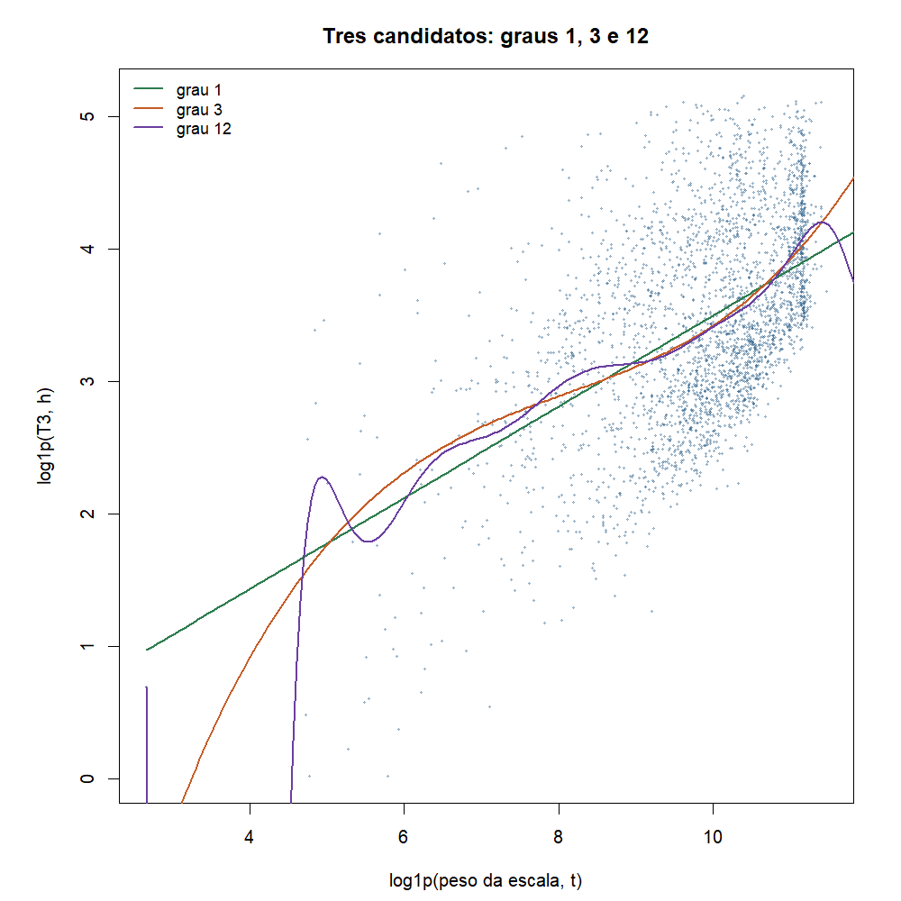
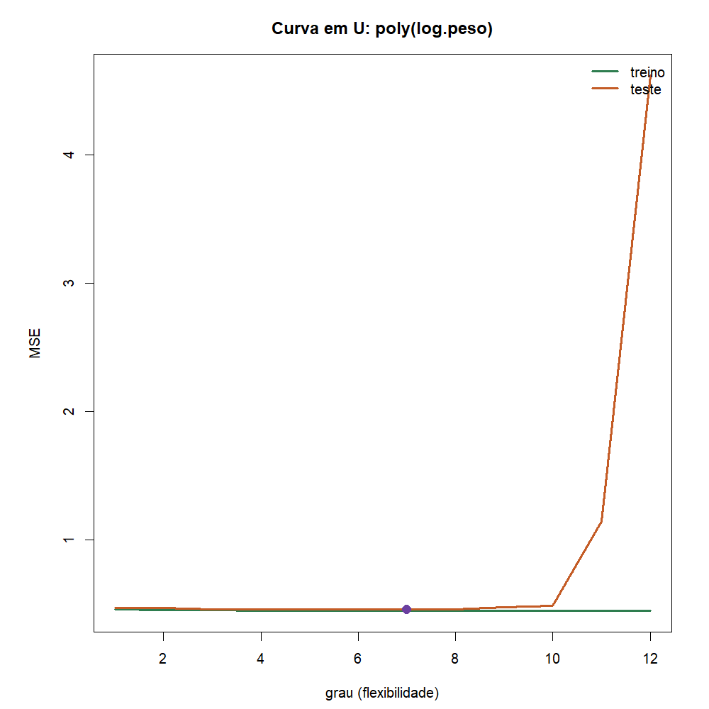

# Atividade 05 - Avaliação e seleção de modelos

**Team Shannon · Teoria do Aprendizado Estatístico · Fatec Rubens Lara · Aula 06**

Continua a [03a](03a-regressao-linear-t3.md): já ajustamos dois `lm` de T3.
Agora a pergunta da
[Aula 06](../materiais-aulas/Aula%2006%20-%20Avaliação%20e%20Seleção%20de%20Modelos.PDF)
é: **qual candidato generaliza melhor?**

Script: [`05-avaliacao-selecao-modelos.R`](../estrutura/codigos/05-avaliacao-selecao-modelos.R).
Números: [`05-numeros.txt`](../estrutura/codigos/05-numeros.txt).

---

## O funil

| # | Etapa | O que fizemos |
|---|---|---|
| 03a | T3 em horas | reta com peso e TEU |
| 04 | T3 sim/não | regressão logística |
| 05 | Escolher o modelo | **esta entrega**: treino / teste + RMSE |

---

## 1. Recorte (Santos 2024)

Mesmo recorte da 03a:

- Complexo Santos, movimentação de carga
- peso da escala > 0, T3 preenchido, T3 até o P99
- \(n = 5681\) escalas

| Papel | Variável no banco | No modelo |
|---|---|---|
| Resposta \(Y\) | `TOperacao` (T3, horas) | \(\log(1+\mathrm{T3})\) |
| Preditor \(X_1\) | tonelagem da escala | \(\log(1+\mathrm{peso})\) |
| Preditor \(X_2\) | TEU da escala | \(\log(1+\mathrm{TEU})\) |

---

## 2. Três polinômios nos nossos dados (molde do slide)

A aula mostra graus 1, 3 e 12 em cima de uma nuvem. Fizemos o **mesmo
desenho** com Santos: eixo \(x = \log(1+\mathrm{peso})\), eixo
\(y = \log(1+\mathrm{T3})\), ajuste só no treino.

Equações (ainda regressão linear nos \(\beta\)):

$$
\begin{aligned}
\text{grau 1:}&\quad
\hat{y} = \hat{\beta}_0 + \hat{\beta}_1 x \\[0.4em]
\text{grau 3:}&\quad
\hat{y} = \hat{\beta}_0 + \hat{\beta}_1 x + \hat{\beta}_2 x^2 + \hat{\beta}_3 x^3 \\[0.4em]
\text{grau 12:}&\quad
\hat{y} = \hat{\beta}_0 + \hat{\beta}_1 x + \cdots + \hat{\beta}_{12} x^{12}
\end{aligned}
$$

```r
lm(y ~ poly(log.peso, 1), data = tr)
lm(y ~ poly(log.peso, 3), data = tr)
lm(y ~ poly(log.peso, 12), data = tr)
```



Verde = grau 1 (reta). Laranja = grau 3 (curva suave). Roxo = grau 12
(persegue a nuvem e oscila nas bordas).

Com a divisão 70/30 (`set.seed(1)`):

| Grau | MSE treino | MSE teste |
|---:|---:|---:|
| 1 | 0,457 | 0,470 |
| 3 | 0,449 | 0,459 |
| 12 | 0,445 | **4,617** |

Treino só cai. Teste cai do 1 ao 3 e **explode** no 12: sobreajuste, igual
à ideia do slide, agora com T3 e tonelagem.

Forma matricial (grau \(g\)): \(\mathbf{y} = X\boldsymbol{\beta} + \boldsymbol{\varepsilon}\),
onde cada linha de \(X\) é \((1,\ x_i,\ x_i^2,\ \ldots,\ x_i^g)\). O
estimador é o mesmo da Aula 04. Usamos `poly(..., )` ortogonal (padrão do R)
para estabilidade em grau alto.

---

## 3. Erro de treino e erro de teste

| Conceito | Onde mede | Analogia da aula |
|---|---|---|
| Treino | nos mesmos dados do `lm` | lista com gabarito |
| Teste | em escalas que o modelo **não viu** | prova inédita |

Só o teste mede generalização. O grau 12 tira nota alta na lista e vai mal
na prova (MSE teste 4,62).

---

## 4. Protocolo do laboratório (pedido do PDF)

O professor pede, no **nosso** banco, dois modelos das aulas passadas:

1. Dividir 70/30 **antes** de qualquer ajuste
2. Ajustar **só no treino**
3. Comparar no **teste** com RMSE
4. Escolher um e traduzir o erro para o dono do problema (porto)

```r
set.seed(1)
itr <- sample(nrow(dados), round(0.7 * nrow(dados)))
tr <- dados[itr, ]
te <- dados[-itr, ]

m1 <- lm(y ~ log.peso, data = tr)              # so tonelagem (03a)
m2 <- lm(y ~ log.peso + log.teu, data = tr)    # tonelagem + TEU (03a)

mse <- function(m, d) mean((d$y - predict(m, d))^2)
sqrt(c(m1 = mse(m1, te), m2 = mse(m2, te)))
```

| Conjunto | \(n\) | Papel |
|---|---:|---|
| Treino | 3977 (70%) | ajusta |
| Teste | 1704 (30%) | reporta **uma** vez |

Quando há muitos candidatos, a aula recomenda treino / validação / teste
(validação escolhe; teste só reporta). Aqui são **dois** candidatos, como
no laboratório do PDF: comparamos direto no teste (seed fixa, uma vez).

---

## 5. Resultado: m1 versus m2


| Modelo | Fórmula | RMSE treino | RMSE teste | MAE teste (horas) |
|---|---|---:|---:|---:|
| m1 | \(Y \sim X_1\) | 0,676 | 0,685 | 22,5 h |
| m2 | \(Y \sim X_1 + X_2\) | 0,552 | **0,550** | **18,3 h** |

**Vencedor: m2 (tonelagem + TEU).**

Incluir TEU baixa o erro de teste. Treino e teste ficam próximos: com
\(n = 5681\) estes dois modelos não estão decorando a amostra.

Coeficientes do m2 no treino:

$$
\widehat{\log(1+\mathrm{T3})}
=
0{,}297 + 0{,}353\,\log(1+\mathrm{peso}) - 0{,}107\,\log(1+\mathrm{TEU})
$$


### Frase para o porto

No teste, o modelo com peso e TEU erra o tempo de operação, em média
absoluta, cerca de **18 horas**. Melhor que olhar só a tonelagem (~22 h),
mas ainda é ordem de grandeza, não horário fechado.

---

## 6. Viés, variância e curva em U

- **Viés alto:** modelo rígido (grau 1) não acompanha a curvatura.
- **Variância alta:** modelo flexível demais (grau 12) muda com o ruído.

Decomposição do erro esperado em um ponto \(x_0\):

$$
\mathrm{E}\bigl[(y_0 - \hat{f}(x_0))^2\bigr]
=
\mathrm{Var}\bigl(\hat{f}(x_0)\bigr)
+
\bigl[\mathrm{Bias}\bigl(\hat{f}(x_0)\bigr)\bigr]^2
+
\mathrm{Var}(\varepsilon)
$$

Exemplo numérico da aula (conta completa):

$$
0{,}04 + (0{,}3)^2 + 0{,}02 = 0{,}04 + 0{,}09 + 0{,}02 = 0{,}15
$$

Domina o viés \(\Rightarrow\) aumentar um pouco a flexibilidade.

No Santos, variamos o grau de 1 a 12 em `poly(log.peso, g)`:



Treino (verde) só desce. Teste (laranja) desce até cerca do grau 7 e depois
sobe com força no grau 12 (MSE 4,62) - o U da aula, medido nas nossas
escalas.

---

## 7. Métricas

| Métrica | Uso aqui |
|---|---|
| MSE | comparar graus / candidatos na escala de \(Y\) |
| RMSE \(=\sqrt{\mathrm{MSE}}\) | erro típico na escala \(\log(1+\mathrm{T3})\) |
| MAE | erro médio em **horas** de T3 (língua do porto) |

Conta rápida (exercício da aula): \(y=(10,12,15)\), \(\hat{y}=(11,11,16)\).

$$
\mathrm{MSE}
=
\frac{(1)^2 + (-1)^2 + (1)^2}{3}
=
1
\quad;\quad
\mathrm{RMSE}=\sqrt{1}=1
$$

---

## 8. Vazamento: o que evitamos

Vazamento = informação do teste (ou do futuro) entrando no ajuste ou na
escolha.

| Errado | Correto |
|---|---|
| Escolher o grau olhando o teste várias vezes | Escolher e reportar **uma** vez (seed fixa) |
| Imputar / cortar P99 misturando treino e teste na avaliação | Dividir **antes**; ajustar só no treino |
| Mesma escala nos dois lados | Um `IDAtracacao` em treino **ou** teste |

Se o número parecer bom demais, procurar vazamento.

---

## 9. Conclusão

1. Nos nossos dados, grau 12 **sobreajusta** (MSE teste 4,62); grau 3 é
   mais estável que o 12.
2. No laboratório do PDF, entre m1 e m2 vence **tonelagem + TEU**
   (RMSE teste 0,55; MAE ≈ 18 h).
3. Protocolo: treino ajusta, teste reporta uma vez; métrica na língua do
   porto.
4. Próximo passo: [06 - reamostragem](06-metodos-reamostragem.md) (CV e
   bootstrap).

---

## Como reproduzir

```r
Rscript estrutura/codigos/05-avaliacao-selecao-modelos.R
```

| Arquivo | Conteúdo |
|---|---|
| `01-tres-polinomios.png` | nuvem Santos + graus 1, 3, 12 (molde do slide) |
| `02-rmse-treino-teste.png` | m1 vs m2 (laboratório do PDF) |
| `03-previsto-vs-real-teste.png` | nuvem no teste (vencedor) |
| `04-curva-u-grau.png` | MSE × grau 1..12 |

*Fonte: ANTAQ, Santos 2024.*
