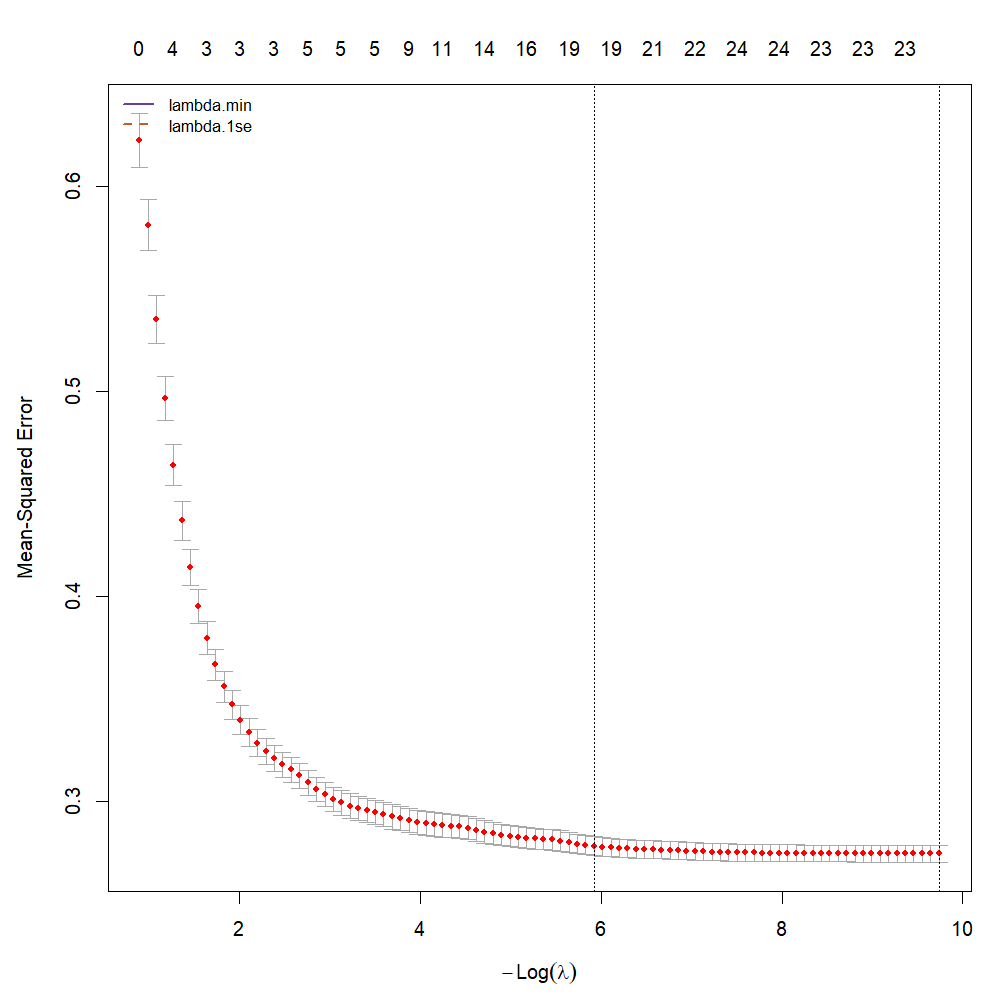
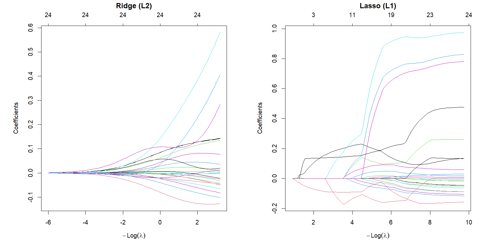
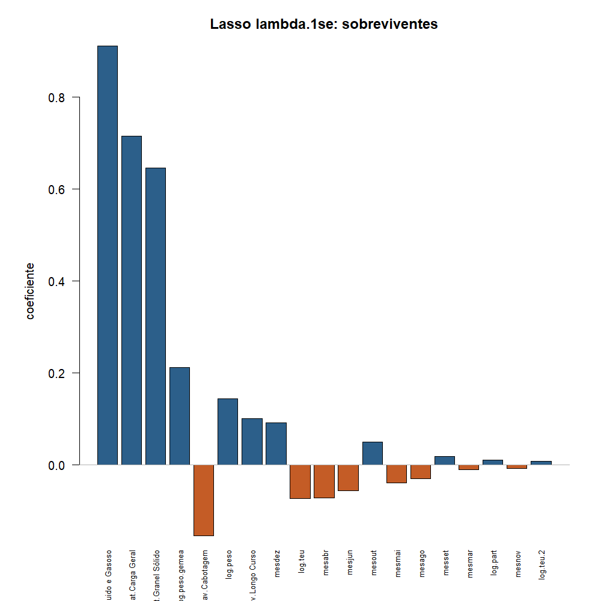
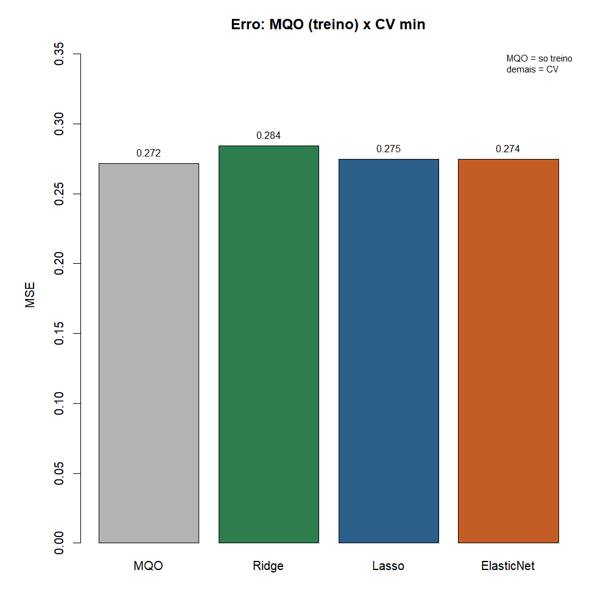

# Atividade 07 - Expansão e regularização

**Team Shannon · Teoria do Aprendizado Estatístico · Fatec Rubens Lara · Aula 08**

Continua a [06](06-metodos-reamostragem.md): a CV já mede excesso de
flexibilidade. Aqui a
[Aula 08](../materiais-aulas/Aula%2008%20-%20Expansão%20e%20Regularização.PDF)
traz o **acelerador** (expansão de atributos) e o **freio** (Ridge, Lasso,
Elastic Net).

Script: [`07-expansao-regularizacao.R`](../estrutura/codigos/07-expansao-regularizacao.R).
Números: [`07-numeros.txt`](../estrutura/codigos/07-numeros.txt).
Pacote novo: `glmnet` (além de `data.table` na leitura).

---

## O funil

| # | Etapa | O que fizemos |
|---|---|---|
| 03a | Reta MQO | peso + TEU |
| 05 / 06 | Avaliar | teste e CV |
| 07 | Expandir e frear | **esta entrega**: `glmnet` + λ por CV |

---

## 1. Recorte e expansão (acelerador)

Santos 2024, movimentação de carga, peso > 0, T3 até P99.
Y = log(1 + T3). Depois da expansão:

| | Valor |
|---|---:|
| n (escalas) | 5.681 |
| p (colunas em X) | 24 |

O que entrou em X (além do intercepto):

| Tipo | Preditores |
|---|---|
| Base | `log.peso`, `log.teu`, `log.part` (nº de partidas) |
| Potências | `log.peso.2`, `log.teu.2` |
| Interação | `peso.x.teu` = log.peso × log.teu |
| Gêmea colinear | `log.peso.gemea` ≈ log.peso + ruído (cor ≈ 0,9998) |
| Qualitativas → 0/1 | mês, navegação, natureza da carga (top) |

É o mesmo movimento da aula: fabricar colunas (`poly`, `I(x^2)`, `*`,
`factor`) e pagar o preço em variância. Daí o freio.

```r
X <- model.matrix(y ~ ., data = dados)[, -1]
yv <- dados$y
```

---

## 2. MQO sem freio (ponto de partida)

O MQO (Aula 04) minimiza só o RSS:

$$
\hat{\beta}_{\mathrm{MQO}}
=
\arg\min_{\beta}
\sum_{i=1}^{n}(y_i - \hat{y}_i)^2
$$

Na expansão completa, no **treino**: R² ≈ 0,56; RMSE ≈ 0,52.
Bonito no papel, mas com p = 24 o modelo tem liberdade demais - a aula
pede regularização e CV, não só o R² de treino.

---

## 3. Ridge (L2) e Lasso (L1)

**Ridge** - pedágio pelo quadrado dos coeficientes:

$$
\mathrm{RSS} + \lambda \sum_{j=1}^{p} \beta_j^{2}
$$

Encolhe tudo; **não zera** ninguém. Cura colinearidade
($\hat{\beta} = (X^{\top}X + \lambda I)^{-1}X^{\top}y$).

**Lasso** - pedágio pelo módulo:

$$
\mathrm{RSS} + \lambda \sum_{j=1}^{p} |\beta_j|
$$

Zera coeficientes: faz **seleção** de preditores.

**Elastic Net** mistura os dois ($\alpha = 0{,}5$ no `glmnet`):

$$
\mathrm{RSS} + \lambda \Big[(1-\alpha)\sum_j \beta_j^{2} + \alpha\sum_j |\beta_j|\Big]
$$

Padronizar é obrigatório antes de comparar $\beta_j$; o `glmnet` já faz
isso por dentro (`standardize = TRUE`).

```r
set.seed(1)
cvl <- cv.glmnet(X, yv, alpha = 1)   # Lasso
cvr <- cv.glmnet(X, yv, alpha = 0)   # Ridge
cve <- cv.glmnet(X, yv, alpha = 0.5) # Elastic Net
```

---

## 4. Escolha de λ (Aula 07 embutida)

`cv.glmnet` percorre uma grade de λ e mede MSE por validação cruzada.



| Candidato | λ | MSE (CV) | RMSE (CV) | Preditores ≠ 0 |
|---|---:|---:|---:|---:|
| `lambda.min` | ≈ 0,000059 | 0,275 | 0,524 | 24 |
| `lambda.1se` | ≈ 0,0027 | 0,278 | 0,528 | **19** |

Regra de um erro padrão (aula): se o MSE de `lambda.1se` cabe em
MSE(min) + EP(min), preferimos o modelo **mais simples**.

$$
0{,}278 \le 0{,}275 + 0{,}004 = 0{,}279
$$

Cabe. Escolhemos **`lambda.1se`**: perdemos quase nada de CV e zeramos
5 preditores (24 → 19).



No Ridge as curvas se aproximam de zero sem chegar. No Lasso encostam e
ficam - o eixo de cima conta os sobreviventes.

---

## 5. Quem o Lasso guardou (`lambda.1se`)



| Sinal | Preditores que restaram (leitura) |
|---|---|
| + forte | natureza Granel Líquido/Gasoso, Carga Geral, Granel Sólido |
| + | `log.peso`, `log.peso.gemea`, Longo Curso, alguns meses (dez, out, set) |
| − | Cabotagem, `log.teu`, meses abr/mai/jun/ago/… |

**Zerados** (entre outros): `log.peso.2`, `peso.x.teu`, alguns meses e
níveis de navegação/natureza de referência.

### Frase para o porto (pedido do laboratório)

O Lasso diz que o sinal de T3, nesta expansão, carrega sobretudo a
**natureza da carga** (granéis e carga geral puxam o log-tempo para cima
em relação à base), o **tipo de navegação** (cabotagem para baixo; longo
curso para cima) e a **tonelagem** (peso positivo; TEU um pouco negativo,
como na 03a). Mês entra como ajuste fino. Seleção **não é causa**: sobreviver
na lista não prova efeito causal.

Sobre as gêmeas `log.peso` / `log.peso.gemea` (cor ≈ 1): as duas
sobreviveram no `1se`, repartindo o efeito - com n grande o Lasso nem
sempre joga uma fora; o Ridge faria o mesmo de propósito.

---

## 6. Placar: MQO × Ridge × Lasso × Elastic Net



| Método | MSE | Observação |
|---|---:|---|
| MQO (só treino) | 0,271 | otimista; não é CV |
| Ridge (CV min) | 0,284 | encolhe tudo, nada zera |
| Lasso (CV min) | 0,275 | seleção + encolhimento |
| Elastic Net (CV min) | 0,274 | meio-termo |

No nosso banco o Lasso e o Elastic Net ficam perto; o Ridge um pouco
acima. A aula lembra: se a verdade for “muitos efeitos pequenos”, o Ridge
ganha; se for esparsa, o Lasso. Por isso se testam os dois por CV.

---

## 7. Contas rápidas (exercícios da aula)

Penalidades com $\beta = (3,\ -4,\ 0{,}5)$, $\lambda = 2$:

$$
L_2 = 3^{2} + (-4)^{2} + 0{,}5^{2} = 9 + 16 + 0{,}25 = 25{,}25
\quad\Rightarrow\quad
\lambda L_2 = 50{,}5
$$

$$
L_1 = |3| + |-4| + |0{,}5| = 7{,}5
\quad\Rightarrow\quad
\lambda L_1 = 15
$$

Com $\lambda \to \infty$: coeficientes → 0, erro de treino sobe, viés sobe,
variância cai.

---

## 8. Conclusão

1. Expansão comprou flexibilidade (p = 24); regularização é o freio.
2. λ saiu da CV: escolhemos **`lambda.1se` ≈ 0,0027** (19 preditores).
3. O Lasso aponta natureza da carga, navegação e tonelagem como o miolo
   do sinal para T3.
4. Ridge estabiliza; Lasso seleciona; Elastic Net agrupa correlacionados.

---

## Como reproduzir

```r
Rscript estrutura/codigos/07-expansao-regularizacao.R
```

| Arquivo | Conteúdo |
|---|---|
| `01-cv-lasso-curva-u.png` | U do Lasso + lambda.min / 1se |
| `02-caminhos-ridge-lasso.png` | caminhos dos coeficientes |
| `03-coeficientes-lasso-1se.png` | quem sobreviveu |
| `04-cv-mse-metodos.png` | placar MQO / Ridge / Lasso / EN |

*Fonte: ANTAQ, Santos 2024.*
