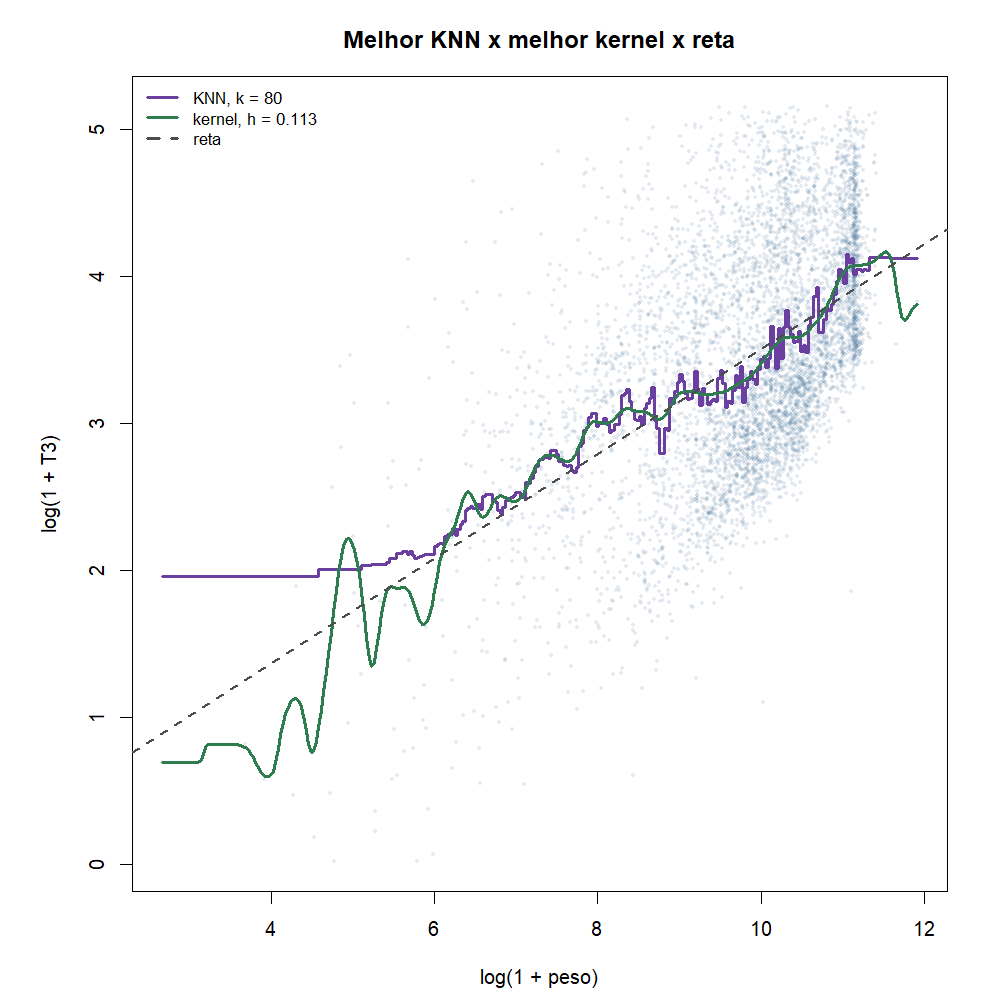
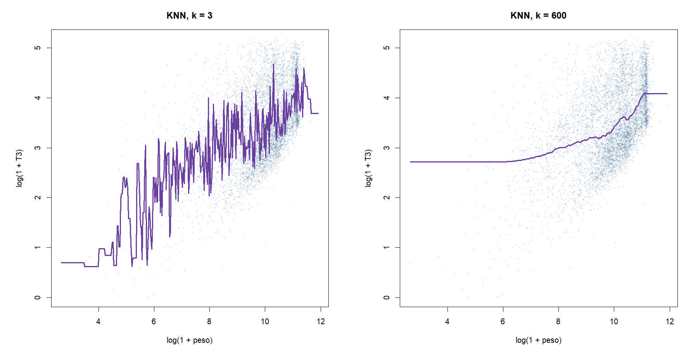
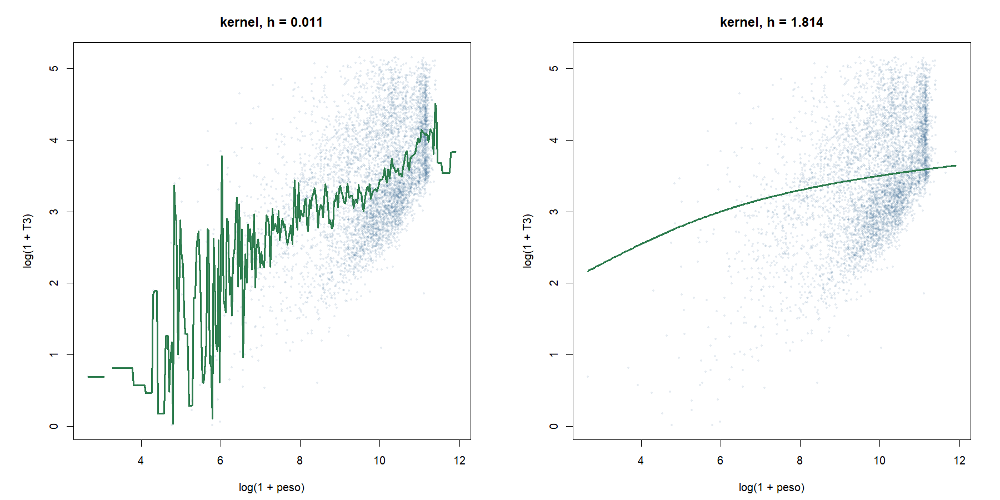
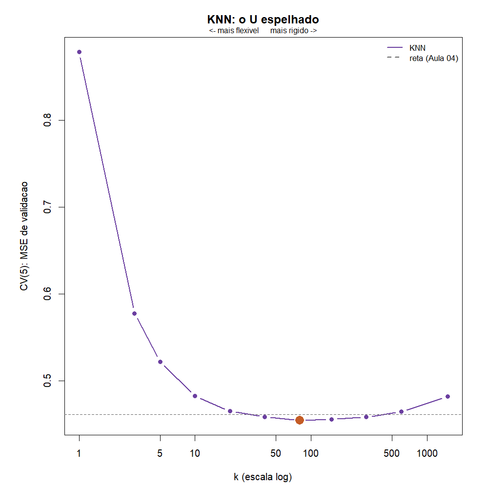
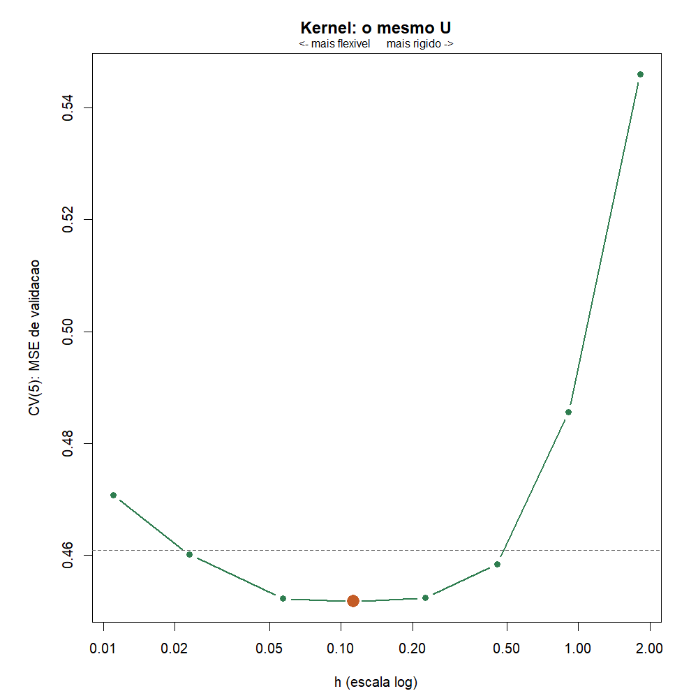
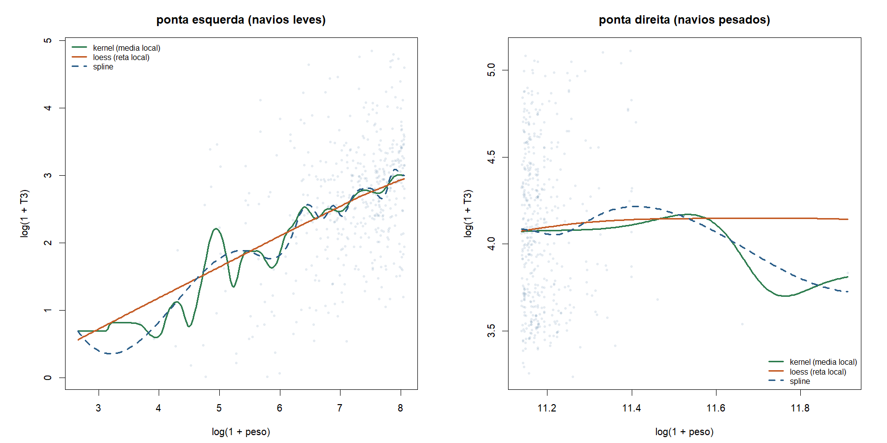
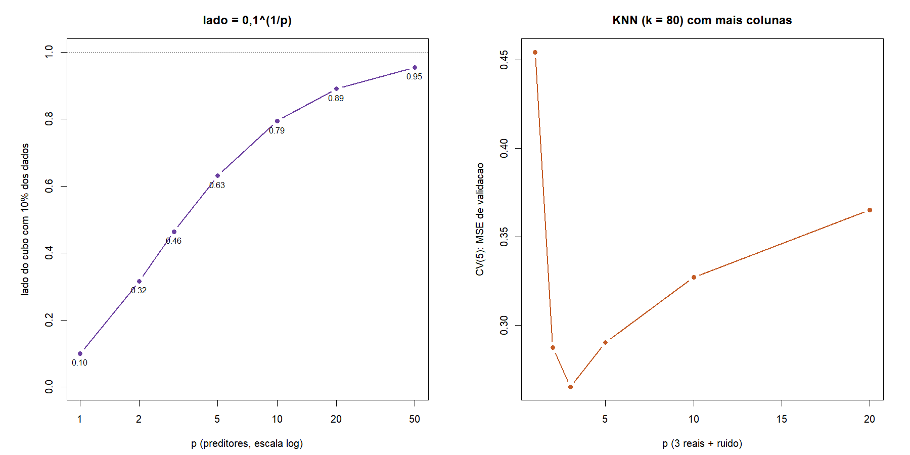

# Atividade 08 - Métodos de suavização

**Team Shannon · Teoria do Aprendizado Estatístico · Fatec Rubens Lara · Aula 09**

Continua a [07](07-expansao-regularizacao.md): até aqui todo modelo tinha
forma escolhida de antemão (reta, polinômio, logística) e aprendemos a
avaliá-lo (05, 06) e a freá-lo (07). A
[Aula 09](../materiais-aulas/Aula%2009%20-%20Métodos%20de%20Suavização.PDF)
vira a chave: modelos que **não supõem forma** e decidem olhando só a
vizinhança do ponto.

Script: [`08-metodos-suavizacao.R`](../estrutura/codigos/08-metodos-suavizacao.R).
Números: [`08-numeros.txt`](../estrutura/codigos/08-numeros.txt).
Pacotes: só R base (`data.table` na leitura). KNN e kernel escritos à mão,
como na aula; `loess` e `smooth.spline` do R base.

---

## O funil

| # | Etapa | O que fizemos |
|---|---|---|
| 03a | Reta MQO | peso + TEU |
| 05 / 06 | Avaliar | teste e CV |
| 07 | Expandir e frear | `glmnet` + λ por CV |
| 08 | Suavizar | **esta entrega**: KNN e kernel, k e h por CV |

Mesmo recorte: Santos 2024, movimentação de carga, peso > 0, T3 até P99,
**n = 5.681 escalas**. Como pede o laboratório, um só preditor numérico, o
mais importante do funil:

| Papel | Variável |
|---|---|
| x | `log.peso` = log(1 + peso bruto em t) |
| y | log(1 + T3), T3 = tempo de operação em horas |

As mesmas 5 dobras (semente 1) servem para todos os métodos.

---

## 1. Por que os não-paramétricos "decidem localmente"

A reta da 03a é **global**: o mesmo par $(\beta_0, \beta_1)$ vale para um
navio de 500 t e para um de 80 mil t. Para dobrar a curva num lugar ela
precisa de grau alto, e grau alto oscila nas pontas (vimos na 05, grau 12).

A saída da aula: para prever em $x_0$, olhe só os navios de peso parecido e
tire a média. Não se supõe forma, só **suavidade**: navios de peso parecido
têm tempos parecidos.

### KNN-regressão e o papel de k

```math
\hat{f}(x_0) = \frac{1}{k} \sum_{i \in N_k(x_0)} y_i
```

$N_k(x_0)$ são as $k$ escalas com `log.peso` mais perto de $x_0$. Não há
coeficientes: o modelo é a própria base. O único botão é $k$:

- $k = 1$ copia o vizinho mais próximo (segue o ruído);
- $k = n$ devolve a média geral para todo navio.

```r
knn.reg <- function(x0, x, y, k) mean(y[order(abs(x - x0))[1:k]])
```

### Kernel (Nadaraya-Watson) e o papel da banda h

Todos entram na conta, com peso que **decai com a distância** (sino
gaussiano de largura $h$):

```math
\hat{f}(x_0) = \frac{\sum_{i=1}^{n} K_h(x_0, x_i)\, y_i}{\sum_{i=1}^{n} K_h(x_0, x_i)},
\qquad
K_h(x_0, x) = \exp\!\left[-\frac{1}{2}\left(\frac{x - x_0}{h}\right)^{2}\right]
```

O denominador faz os pesos somarem 1. A 1 banda de $x_0$ um navio pesa 61%
do peso de um em cima de $x_0$; a 2 bandas, 14%; a 3 bandas, 1%. O botão é
$h$: sino estreito = poucos vizinhos de fato = flexível.

```r
nw <- function(x0, x, y, h) { w <- dnorm((x - x0) / h); sum(w * y) / sum(w) }
```

### A diferença entre os dois

| | KNN | Kernel |
|---|---|---|
| Quem conta | os k mais próximos, peso igual | todos, peso do sino |
| Janela | **adaptativa**: alarga até juntar k | **fixa**: largura h |
| Onde os dados rareiam | busca vizinhos longe (viés) | sobram poucos vizinhos (variância) |
| Curva | em **degraus** (vizinho entra ou sai de uma vez) | **contínua** (peso muda aos poucos) |
| Botão (maior = mais rígido) | k | h |

No nosso banco a diferença de janela aparece de verdade, porque o peso é
assimétrico: há muitos navios entre 10 e 70 mil t e poucos abaixo de 400 t
(log.peso < 6). Na figura 05, à esquerda, o KNN vira um patamar plano (foi
buscar vizinhos pesados para completar 80) e o kernel oscila (sobram poucos
navios leves dentro do sino).



---

## 2. Viés e variância nos dois botões





| Botão | Pequeno | Grande |
|---|---|---|
| k | k = 3: curva serrilhada, segue cada escala e o ruído dela (**variância**) | k = 600: curva lisa, achata a subida e vira patamar nas pontas (**viés**) |
| h | h = 0,011: sino cobre poucos navios, a curva treme | h = 1,814: sino cobre quase toda a base, a curva vira rampa (**viés**) |

Quem escolhe o botão é a validação cruzada (Aula 07): o erro de
treino só cai com mais flexibilidade (k = 1 tem erro de treino quase zero),
então só um erro **fora da amostra** mostra o fundo do U. Os vizinhos de cada
ponto de validação são buscados **só no treino** da dobra.



| k | 1 | 3 | 5 | 10 | 20 | 40 | **80** | 150 | 300 | 600 | 1500 |
|---|---:|---:|---:|---:|---:|---:|---:|---:|---:|---:|---:|
| CV(5) | 0,878 | 0,578 | 0,522 | 0,482 | 0,465 | 0,459 | **0,454** | 0,456 | 0,458 | 0,464 | 0,482 |



| h | 0,011 | 0,023 | 0,057 | **0,113** | 0,227 | 0,454 | 0,907 | 1,814 |
|---|---:|---:|---:|---:|---:|---:|---:|---:|
| CV(5) | 0,471 | 0,460 | 0,452 | **0,452** | 0,452 | 0,458 | 0,486 | 0,546 |

É o U das atividades 05 e 06, **espelhado**: aqui a flexibilidade cresce
para a esquerda (k e h pequenos = modelo flexível).

### Placar do laboratório (mesmas dobras)

| Método | Botão escolhido | CV(5) MSE |
|---|---|---:|
| Reta (Aula 04) | - | 0,4609 |
| KNN | k = 80 | 0,4542 |
| Kernel | h = 0,113 | 0,4517 |
| Loess (reta local) | span = 0,2 | **0,4502** |
| Spline suavizante | GCV | 0,4539 |

Os suavizadores ganham da reta, mas por pouco (2%). A maior parte do erro
não vem da forma da curva: vem da dispersão vertical (para o mesmo peso,
granel e contêiner operam em tempos muito diferentes, como a 07 mostrou).

**Onde a relação não é uma reta:** nas duas pontas. Acima de
log.peso ≈ 11 (cerca de 60 mil t) a curva para de subir, e a reta, que
continua subindo, erra o nível dos maiores navios (viés médio de +0,12 nos
2% mais pesados, tabela da seção 3). No miolo, entre 7 e 11, a reta serve
bem. Como pede a aula: onde é reta, fique com a reta.

---

## 3. A borda: por que a média local achata nas pontas

Numa relação crescente, em $x_0$ no meio os vizinhos da esquerda puxam a
média para baixo e os da direita para cima, e os dois se compensam. **Na
ponta só há vizinhos de um lado**: na ponta direita todos são mais leves
(a média fica baixa demais); na esquerda todos são mais pesados (a média fica
alta demais). Trocar KNN por kernel muda o peso, não a conta.



Viés médio (y - previsto, predições de CV) nos 2% de cada ponta
(114 escalas de cada lado):

| Método | Ponta esquerda | Ponta direita | CV(5) |
|---|---:|---:|---:|
| KNN, k = 80 | **-0,191** | +0,031 | 0,4542 |
| Kernel, h = 0,113 | -0,031 | +0,001 | 0,4517 |
| Loess (reta local) | -0,002 | -0,035 | 0,4502 |
| Spline | +0,006 | -0,013 | 0,4539 |
| Reta global | +0,015 | **+0,122** | 0,4609 |

Leitura:

- O KNN prevê alto demais para os navios leves (-0,19): a janela adaptativa
  foi buscar vizinhos pesados, que operam mais tempo. É o efeito de borda
  somado à assimetria do peso.
- O kernel quase não tem viés médio nas pontas aqui, porque o sino estreito
  (h = 0,113) quase não "vê" o outro lado. O preço é a oscilação: na
  figura, a curva verde treme onde há poucos navios. Viés trocado por
  variância.
- **Loess** corrige trocando a média por uma **reta local** ajustada em cada
  vizinhança: a reta acompanha a inclinação até a ponta em vez de puxar para
  o centro. Tem o menor viés na esquerda e o menor CV.
- **Splines** (Aula 10) ajustam polinômios por pedaços com uma penalidade de
  curvatura, e também seguem a tendência até a borda.

---

## 4. A maldição da dimensionalidade

Com $p$ preditores, "vizinho" é quem está perto **em todas as coordenadas
ao mesmo tempo**. Dados uniformes no cubo $[0,1]^p$: para uma vizinhança
cúbica capturar 10% das observações, o lado precisa ser

```math
\ell(p) = 0{,}1^{1/p}
```

| p | 1 | 2 | 3 | 5 | 10 | 20 | 50 |
|---|---:|---:|---:|---:|---:|---:|---:|
| lado | 0,10 | 0,32 | 0,46 | 0,63 | 0,79 | 0,89 | 0,95 |
| n para 10 vizinhos numa caixa de lado 0,1 | 10² | 10³ | 10⁴ | 10⁶ | 10¹¹ | 10²¹ | 10⁵¹ |

Com 10 preditores, os "10% mais próximos" cobrem 79% de cada eixo: já não é
local, é quase a média geral. E, pelas nossas 5.681 escalas, nem p = 3
chega aos 10⁴ necessários.



No nosso banco (KNN, k = 80, colunas padronizadas):

| p | Colunas | CV(5) |
|---:|---|---:|
| 1 | log.peso | 0,454 |
| 2 | + log.teu | 0,288 |
| 3 | + log.part | **0,265** |
| 5 | + 2 de ruído | 0,290 |
| 10 | + 7 de ruído | 0,327 |
| 20 | + 17 de ruído | 0,365 |

As três primeiras colunas trazem informação, e o erro cai. Daí em diante
cada coluna de ruído espalha a vizinhança e o erro sobe: com 17 colunas
inúteis o KNN perde quase todo o ganho do TEU.

**Duas saídas** (o resto do Bloco III):

1. **GAM** (Aula 10): impor estrutura aditiva, um suavizador por preditor,
   somados, $\hat{y} = \beta_0 + f_1(x_1) + \dots + f_p(x_p)$. Cada $f_j$ é
   suavizado em uma dimensão só, onde vizinho ainda existe.
2. **Árvores** (Aula 11): o próprio método escolhe em quais preditores olhar
   e onde cortar, em vez de medir distância em todos ao mesmo tempo.

(E a 07 dá uma terceira: selecionar colunas com o Lasso **antes** do KNN.)

---

## 5. Exercícios novos (com gabarito)

Os números dos exercícios 1 e 2 são pequenos de propósito, para fazer à
mão, mas imitam o nosso banco: peso em mil t, T3 em horas.

Seis escalas:

| Escala | A | B | C | D | E | F |
|---|---:|---:|---:|---:|---:|---:|
| peso (mil t) | 10 | 14 | 20 | 26 | 35 | 50 |
| T3 (h) | 18 | 22 | 30 | 28 | 44 | 60 |

### Exercício 1 (cálculo): KNN

Preveja T3 de um navio de **24 mil t** com k = 1, 3, 5 e 6. Para onde a
predição caminha quando k cresce?

**Gabarito.**

Passo 1, distâncias até 24:

| Escala | A | B | C | D | E | F |
|---|---:|---:|---:|---:|---:|---:|
| \|x - 24\| | 14 | 10 | 4 | **2** | 11 | 26 |

Passo 2, ordem de proximidade: D (2), C (4), B (10), E (11), A (14), F (26).

Passo 3, médias:

```math
k=1:\ 28
\qquad
k=3:\ \frac{28 + 30 + 22}{3} = 26{,}67
\qquad
k=5:\ \frac{28 + 30 + 22 + 44 + 18}{5} = 28{,}4
```

```math
k=6:\ \frac{18 + 22 + 30 + 28 + 44 + 60}{6} = 33{,}67
```

Com k = n a predição é a **média geral** (33,67 h), igual para qualquer
navio: o KNN mais rígido possível. Repare que k = 3 cai e k = 5 sobe: com
poucos vizinhos a predição pula conforme quem entra (variância).

### Exercício 2 (cálculo): kernel

Mesmo navio de 24 mil t, núcleo gaussiano. Calcule pesos, normalize e
preveja com **h = 5**. Repita com **h = 2**: quem ainda pesa?

**Gabarito.**

Passo 1, peso de cada escala, $w_i = \exp[-\tfrac{1}{2}(d_i/h)^2]$, com h = 5:

| Escala | d | (d/5)²/2 | w | w normalizado |
|---|---:|---:|---:|---:|
| A | -14 | 3,92 | 0,0198 | 0,0105 |
| B | -10 | 2,00 | 0,1353 | 0,0715 |
| C | -4 | 0,32 | 0,7261 | 0,3835 |
| D | 2 | 0,08 | 0,9231 | 0,4876 |
| E | 11 | 2,42 | 0,0889 | 0,0470 |
| F | 26 | 13,52 | 0,0000013 | 0,0000 |
| soma | | | 1,8932 | 1 |

Passo 2, média ponderada:

```math
\hat{f}(24) = 0{,}0105 \cdot 18 + 0{,}0715 \cdot 22 + 0{,}3835 \cdot 30 + 0{,}4876 \cdot 28 + 0{,}0470 \cdot 44 = 28{,}99\ \text{h}
```

Passo 3, h = 2: só C (d = 4, (4/2)²/2 = 2, w = 0,1353) e D (d = 2,
(2/2)²/2 = 0,5, w = 0,6065) pesam; os outros ficam abaixo de 0,000004.
Normalizando: C = 0,182 e D = 0,818.

```math
\hat{f}(24) = 0{,}182 \cdot 30 + 0{,}818 \cdot 28 = 28{,}37\ \text{h}
```

Com h pequeno o kernel vira quase o vizinho mais próximo (k = 1 deu 28):
flexível. O navio F, a 26 mil t de distância, nunca pesa nada.

### Exercício 3 (cálculo): maldição e regra de um erro padrão

a) Com p = 3 e p = 6 preditores uniformes, que lado precisa ter a
vizinhança cúbica que captura 10% dos dados? Quantas escalas manteriam 10
vizinhos numa caixa de lado 0,1 com p = 3, e o nosso banco tem isso?

b) Na seção 2, o KNN teve mínimo em k = 80 (CV = 0,4542; erro padrão 0,0090).
Que k a regra de um erro padrão (Aula 08) escolhe?

**Gabarito.**

a)

```math
0{,}1^{1/3} = 0{,}464
\qquad
0{,}1^{1/6} = 0{,}681
```

Com 6 preditores, a "vizinhança" já cobre 68% de cada eixo. Para 10
vizinhos numa caixa de lado 0,1 com p = 3: $10 / 0{,}1^{3} = 10.000$
escalas. Temos 5.681: não basta nem para 3 preditores.

b) Limite: $0{,}4542 + 0{,}0090 = 0{,}4632$. Os k com CV abaixo do limite
são 40 a 300 (k = 300 tem 0,4581; k = 600, com 0,4642, passa). A regra
escolhe o **mais simples** dentro do limite, e no KNN mais simples é **k
maior** (média de mais navios, curva mais lisa): **k = 300**.

### Exercício 4 (conceitual): a janela no porto

Na figura 05, à esquerda (navios abaixo de 400 t), o KNN de k = 80 vira um
patamar plano perto de 1,96 e o kernel de h = 0,113 sobe e desce. Explique
cada comportamento com viés e variância e diga como corrigir.

**Gabarito.**

1. Há poucas escalas leves. O **KNN** precisa sempre de 80 vizinhos: a janela
   alarga até alcançar navios bem mais pesados, que operam mais tempo. A
   predição fica alta demais e quase igual para todos os leves: **viés**
   (medimos -0,19 de viés médio na ponta esquerda).
2. O **kernel** tem janela fixa: nos navios leves o sino de largura 0,113
   alcança só um punhado de escalas, e a curva segue o ruído delas:
   **variância**. Se não houver nenhuma dentro do sino, a conta dá 0/0 = NaN.
3. Correções: o loess (reta local) tira o viés de borda; uma banda maior só
   nas regiões ralas reduz a oscilação; e, como sempre, quem decide é a CV.

### Exercício 5 (conceitual): qual método responde

A Autoridade Portuária faz duas perguntas: (a) "Se a carga de um navio
aumenta 10%, quanto aumenta o tempo de operação?" (b) "Quanto tempo vai
operar um navio de 200 mil t, maior que todos de 2024?" Qual responde
melhor, a reta da 03a ou o kernel?

**Gabarito.**

a) A **reta**. Em escala log-log o coeficiente de `log.peso` é uma
elasticidade: na 06 o bootstrap deu β ≈ 0,36 (IC 95% 0,345 a 0,378), ou
seja, 10% mais carga dá cerca de 3,5% mais (1 + T3). O kernel não tem
coeficiente: a "inclinação" muda em cada ponto, e não há um número único
para responder.

b) Nenhum responde bem, porque é **extrapolação**. O kernel e o KNN devolvem
a média dos navios mais pesados que existem (a curva fica plana além dos
dados), o que provavelmente subestima. A reta continua subindo, mas na
seção 3 ela já errava o nível dos maiores navios (+0,12). O honesto é dizer
que a base não tem informação para 200 mil t.

---

## 6. Conclusão

1. Suavizar = prever em $x_0$ olhando a vizinhança de $x_0$: sem supor forma,
   supondo suavidade.
2. Botões escolhidos por CV(5): **k = 80** (KNN) e **h = 0,113** (kernel);
   o loess (span 0,2) teve o menor erro, 0,4502, contra 0,4609 da reta.
3. O ganho sobre a reta é pequeno: no miolo a relação log-log é quase reta;
   a curvatura está nas pontas, onde a média local tem viés de borda.
4. Com mais preditores o KNN degrada (ruído de 3 para 20 colunas: 0,265 para
   0,365). As saídas são GAM (Aula 10) e árvores (Aula 11).

---

## Como reproduzir

```r
Rscript estrutura/codigos/08-metodos-suavizacao.R
```

| Arquivo | Conteúdo |
|---|---|
| `01-knn-k-pequeno-grande.png` | KNN com k = 3 e k = 600 |
| `02-cv-knn.png` | U espelhado do KNN |
| `03-kernel-h-pequeno-grande.png` | kernel com h pequeno e grande |
| `04-cv-kernel.png` | U do kernel |
| `05-knn-x-kernel-x-reta.png` | melhor KNN, melhor kernel e reta |
| `06-efeito-borda.png` | kernel x loess x spline nas pontas |
| `07-maldicao-dimensionalidade.png` | lado da vizinhança e KNN com p crescente |

*Fonte: ANTAQ, Santos 2024.*
